# Projektdokumentation - TripTales

## Inhaltsverzeichnis

1. [Ausgangslage](#1-ausgangslage)
2. [Lösungsidee](#2-lösungsidee)
3. [Vorgehen & Artefakte](#3-vorgehen--artefakte)
    1. [Understand & Define](#31-understand--define)
    2. [Sketch](#32-sketch)
    3. [Decide](#33-decide)
    4. [Prototype](#34-prototype)
    5. [Validate](#35-validate)
4. [Erweiterungen [Optional]](#4-erweiterungen-optional)
5. [Projektorganisation [Optional]](#5-projektorganisation-optional)
6. [KI-Deklaration](#6-ki-deklaration)
7. [Anhang [Optional]](#7-anhang-optional)

> **Hinweis:** Massgeblich sind die im **Unterricht** und auf **Moodle** kommunizierten Anforderungen.

<!-- WICHTIG: DIE KAPITELSTRUKTUR DARF NICHT VERÄNDERT WERDEN! -->

<!-- Diese Vorlage ist für eine README.md im Repository gedacht. Abschnitte mit [Optional] können weggelassen werden, wenn in den Übungen nichts anderes verlangt wird. -->

## 1. Ausgangslage
Kurz beschreiben, welches Problem adressiert wird und welches Ergebnis angestrebt ist. Wem nützt die Lösung, wer ist beteiligt oder betroffen?
- **Problem:** Während eines Auslandssemesters entstehen viele Pläne und Erinnerungen parallel in Kalendern, Gruppenchats, Google Maps, Instagram und Notizen. Dadurch gehen Details zu Events, Orten, eingeladenen Freunden und persönlichen Eindrücken schnell verloren.
- **Ziele:** TripTales soll Aktivitäten in San Diego zentral planbar machen, Orte und Freunde mit Events verknüpfen und vergangene Erlebnisse als Journey dokumentieren. Die App soll als interaktiver, weiterführbarer SvelteKit-Prototyp mit echter Datenhaltung umgesetzt werden.
- **Primäre Zielgruppe:** Studierende im Ausland, Reisende und junge Erwachsene, die mit Freunden Aktivitäten planen und Erinnerungen später wieder ansehen möchten.
- **Weitere Stakeholder [Optional]:** Dozierende und Mitstudierende im Modul Prototyping, da sie Umsetzung, Vorgehen, Evaluation und Dokumentation beurteilen.

## 2. Lösungsidee
Beschreibt die Lösungsidee.
- **Kernfunktionalität:** Nutzerinnen und Nutzer erstellen Events mit Datum, Location, Kategorie, Beschreibung, Freunden und optionalem Event-Bild. Events können als Einzeltermin oder als wiederkehrende Serie für tägliche, wöchentliche oder monatliche Termine erstellt werden, z. B. für Lectures oder Studienwochen in der Kategorie `Education`. Events können bearbeitet, als erlebt markiert und mit Erinnerungstext sowie optionalem Memory-Bild in eine Journey überführt werden. Ergänzend gibt es Dashboard, Event-Liste, OpenStreetMap-/Pinpoint-Ansicht und Reiseideen mit Umwandlung in Events.
- **Annahmen [Optional]:** Eine kombinierte Planungs- und Erinnerungsansicht reduziert die Streuung von Reiseinformationen. Eine echte interaktive OpenStreetMap-Ansicht ist für den Prototyp geeigneter als eine Google-Maps-Abhängigkeit mit API-Key und Billing. Studierende profitieren von wenigen klaren Workflows statt vielen isolierten Tools.
- **Abgrenzung [Optional]:** Login und private Benutzerbereiche sind umgesetzt, jedoch ohne Rollenmodell, E-Mail-Verifikation oder Passwort-Reset. Keine echten Einladungsnachrichten und kein Chat. Bild-Uploads sind als Prototyp-Funktion auf kleine Bilddateien begrenzt; zusätzlich nutzt die App lizenzierte Fallback-Bilder, damit Urheberrecht und Storage-Komplexität kontrollierbar bleiben.

## 3. Vorgehen & Artefakte
Die Durchführung erfolgt phasenbasiert; dokumentieren Sie die wichtigsten Ergebnisse je Phase.

### 3.1 Understand & Define
- **Zielgruppenverständnis:** Zwei priorisierte Personas leiten Feature-Entscheidungen — **Dario, 24, Wirtschaftsinformatik-Student vor Austauschsemester in San Diego** (Primary, definiert den MVP) und **Marco, 29, Berufseinsteiger mit Reise-Affinität** (Secondary, motiviert die Erweiterungen 4.1, 4.9 und 4.10). Detaillierte Persona-Profile mit Hintergrund, Zielen, Pain Points und Zitaten siehe [`docs/personas.md`](docs/personas.md).
- **Problemraumanalyse:** Planung, Location-Infos, soziale Abstimmung und persönliche Erinnerungen sind normalerweise über Google Calendar, Maps, Instagram, Notion und WhatsApp verteilt. TripTales bündelt diese vier Bereiche in einer App. Die End-to-End-Lebenszyklus-Analyse mit As-Is- vs. To-Be-Mapping liegt unter [`docs/methods/user-journey-map.md`](docs/methods/user-journey-map.md); der Vergleich gegen existierende Lösungen (Polarsteps, Google Calendar, Notion, Wanderlog) unter [`docs/methods/competitive-analysis.md`](docs/methods/competitive-analysis.md). Aus den Pain Points der Journey Map wurden zusätzlich How-Might-We-Fragen abgeleitet, die den Übergang von der Problem- in die Lösungsphase strukturieren: [`docs/methods/hmw-fragen.md`](docs/methods/hmw-fragen.md).
- **Wesentliche Erkenntnisse:** Zentrale Workflows müssen schnell erreichbar sein. Events brauchen Status, Freunde und Location. Erinnerungen sollen direkt nach dem Event ergänzt werden können. Eine visuelle Ortsübersicht erzeugt Mehrwert, darf aber den Prototyp nicht destabilisieren.

### 3.2 Sketch
- **Variantenüberblick:** Variante A war dashboard-zentriert mit schnellen Kennzahlen. Variante B war map-zentriert mit Orten als Einstieg. Variante C war journey-zentriert mit Erinnerungen als Hauptnavigation. Entschieden wurde eine kombinierte App: Dashboard als Einstieg, Events als Arbeitsbereich, Journey und Map als Rückblick/Orientierung.
- **Methode Crazy-8s:** Als Ideenfindungstechnik wurde die Crazy-8s-Methode aus dem Design Sprint (Jake Knapp) verwendet — acht Skizzen einer Lösungsidee in acht Minuten. Ziel ist nicht Polish, sondern Variantenbreite. Die handgezeichneten Ergebnisse liegen unter [`docs/sketches/Crazy8s.pdf`](docs/sketches/Crazy8s.pdf).
- **Inhalt der 8 Panels:** 1) Hamburger-Navigation mit Home/Map/Events/Create-New. 2) Dashboard mit vier grossen Einstiegs-Kacheln (Calendar, Map, Events, New). 3) Map-Ansicht mit Pinpoints und Datumsfilter. 4) Kalender-Tagesansicht mit Zeitslots. 5) Event-Erstellungs-Formular mit Typ (School/Private/Work), Beschreibung, Zeitraum und Zusatzinfo. 6) Event-Dokumentation als Life-/Travel-Journey mit Bildern. 7) Event-History mit Ortsfilter und Eventliste. 8) Einladungs-Flow direkt aus dem Event heraus. Bereits hier wurde die zentrale Designentscheidung sichtbar: Freunde-Einladung als integrierter Schritt des Event-Erstellens, nicht als separater Workflow.
- **Übergang zum Mockup:** Aus den Crazy-8s entstand parallel eine KI-promptbasierte High-Fidelity-Variante (Seite 2 der PDF), die die Sketches in eine konkrete Bildsprache übersetzte und die Brücke zum [Figma-Mockup in §3.3](#33-decide) schlug.

### 3.3 Decide
- **Gewählte Variante & Begründung:** Gewählt wurde eine Workflow-App mit klarer Navigation: Dashboard, Events, Journey, Map und Ideas. Diese Struktur erfüllt die Anforderungen an mehrere Pages, echte Workflows, Datenbankzugriff und Erweiterbarkeit.
- **End-to-End-Ablauf:** Neues Event erstellen, Freunde hinzufügen, Location speichern, Event später bearbeiten, als completed markieren, Erinnerung und optionales Memory-Bild ergänzen, Journey ansehen, Ort auf Map prüfen. Reiseideen können separat gesammelt und in Events umgewandelt werden.
- **Mockup:** <a href="https://www.figma.com/proto/QjCqbU6N3ms9HmgKBY52by/Untitled?node-id=0-1&t=T9Gqfs193p5fLFTv-1" target="_blank" rel="noopener noreferrer">Figma Mockup öffnen ↗</a>. Das Figma-Mockup zeigt die initialen Wireframes für Dashboard, Event-Erstellung und Journey-Ansicht. Die finale UI folgt dieser Struktur und weicht in Detailebene auf Basis der Usability-Test-Erkenntnisse ab (siehe [§3.5](#35-validate)). Screenshots der fertigen App sind im Kapitel [§3.4](#34-prototype) sowie pro Erweiterung in [§4](#4-erweiterungen-optional) eingebettet.

- **Entscheidungsmatrix Technologie & Datenhaltung:** Drei realistische Umsetzungsvarianten wurden gewichtet bewertet (Skala 0–3 pro Kriterium, Score = Wert × Gewicht).

  | Kriterium (Gewicht) | A: Mock-App ohne Backend | B: SvelteKit + LocalStorage | C: SvelteKit + MongoDB |
  |---|:---:|:---:|:---:|
  | Datenpersistenz über Sessions (3) | 1 (3) | 2 (6) | 3 (9) |
  | Multi-User-Fähigkeit für Friend-Invites (3) | 0 (0) | 0 (0) | 3 (9) |
  | Erweiterbarkeit für 11 Erweiterungen (2) | 1 (2) | 2 (4) | 3 (6) |
  | Time-to-MVP (2) | 3 (6) | 3 (6) | 2 (4) |
  | Lernkurve / Setup-Aufwand (1) | 3 (3) | 2 (2) | 2 (2) |
  | **Gewichteter Score** | **14** | **18** | **30** |

  Variante C wurde gewählt, weil Multi-User-Fähigkeit (Friend-Invitations, Share-Links) und persistente Daten zentrale Anforderungen sind und Varianten A und B daran scheitern. Der höhere Setup-Aufwand wurde durch die echten Sessions, das Owner-Scoping pro `userId` und die freie Erweiterbarkeit kompensiert.

- **Navigationsdiagramm:** Das folgende Mermaid-Diagramm beschreibt die zentrale Navigation und die wichtigsten Page-Wechsel.

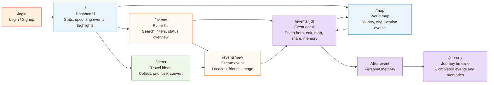
```mermaid
flowchart LR
    Login["/login<br/>Login / Signup"] --> Dashboard["/<br/>Dashboard<br/>Stats, upcoming events, highlights"]
    Dashboard --> Events["/events<br/>Event list<br/>Search, filters, status overview"]
    Dashboard --> Map["/map<br/>World map<br/>Country, city, location, events"]
    Dashboard --> Ideas["/ideas<br/>Travel ideas<br/>Collect, prioritize, convert"]
    Events --> NewEvent["/events/new<br/>Create event<br/>Location, friends, image"]
    Events --> Detail["/events/[id]<br/>Event detail<br/>Photo hero, edit, map, share, memory"]
    NewEvent --> Detail
    Detail --> Map
    Map --> Detail
    Detail --> AfterEvent["After event<br/>Personal memory"]
    AfterEvent --> Journey["/journey<br/>Journey timeline<br/>Completed events and memories"]
    Ideas --> NewEvent

    classDef auth fill:#fff0dc,stroke:#e75f43,color:#33251d
    classDef main fill:#eaf6fb,stroke:#2385b8,color:#33251d
    classDef event fill:#fffaf2,stroke:#ef8f38,color:#33251d
    classDef memory fill:#eadcf8,stroke:#8b5cf6,color:#33251d
    classDef idea fill:#edf8e9,stroke:#4f8f57,color:#33251d

    class Login auth
    class Dashboard,Map main
    class Events,NewEvent event
    class Detail,AfterEvent,Journey memory
    class Ideas idea
```

### 3.4 Prototype

#### 3.4.1. Entwurf (Design)
Beschreibt die Gestaltung und Interaktion.
> **Hinweis:** Hier wird der **Prototyp** beschrieben, nicht das **Mockup**.
- **Informationsarchitektur:** `/login` öffentlicher Einstieg mit Login/Signup, danach geschützte Bereiche: `/` Dashboard mit Einladungs-Hinweisstreifen für ausstehende Einladungen, `/events` Listen- und Filteransicht, `/events/new` Erstellung, `/events/[id]` Detail/Bearbeitung/Memory, `/journey` Timeline, `/map` Orte, `/ideas` Reiseideen und `/profile` als Account-Überblick. Eine Benachrichtigungs-Glocke in der Navigation bündelt offene Einladungen und vergangene Events ohne gespeicherte Memory in einem Dropdown und ist auf jeder geschützten Seite erreichbar; die bestehenden Dashboard-Sektionen bleiben als Landing-CTA erhalten.
- **User Interface Design:** Das UI nutzt kompakte Cards, klare Formulare, Status-Badges, Kategorie-Badges, Filterleisten, leere Zustände und passende Event-/Location-Bilder. Wiederkehrende Events zeigen Serienhinweise wie `Weekly series 3/14`; beim Löschen eines Serienevents erscheint ein eigenes Dialogformular mit Auswahl zwischen einzelnem Termin und ganzer Serie. Formulare zeigen Pflichtfeldfehler direkt am betroffenen Feld und leere Zustände erklären die nächste sinnvolle Aktion. Der Login-Screen nutzt denselben Warm-Travel-Stil wie die App und bietet Login sowie Signup als direkten Einstieg. Die Bildwelt basiert bewusst nur auf echten, lizenzierten Wikimedia-Commons-Fotos, damit Orte und Events visuell glaubwürdig wirken.
- **Usability-Iteration:** Die Listenansichten wurden um klarere Filter- und Sortiermöglichkeiten erweitert. Events können nach Suche, Status, Kategorie und Zeitraum eingegrenzt sowie nach Datum oder letzter Bearbeitung sortiert werden. Journey-Memories können nach Suche, Kategorie und Zeitraum gefiltert sowie chronologisch gruppiert werden. Filteränderungen werden direkt angewendet; die Suche nutzt eine kurze Verzögerung, damit die Liste nicht bei jedem Tastendruck sofort neu lädt. Zur Klärung des Begriffssystems erklärt ein einklappbarer In-App-Konzept-Guide auf der Journey- und Ideas-Seite den Zusammenhang von Idea → Event → Memory → Journey samt Trip-Gruppierung; die Navigation stellt „Ideas" prominent an zweite Stelle und das Event-Formular bietet einen „Save as idea"-Einstieg für noch datumslose Einträge.
- **Designentscheidungen:** Nach einem ersten Review wurde der zunächst eher kühle und funktionale Look in Richtung **Warm Travel** weiterentwickelt. Die Gestaltung nutzt San-Diego-inspirierte Sunset-, Sand-, Ocean- und Palm-Farben, wärmere Flächen, Kategorie-Akzente sowie Postcard-/Ticket-Anmutungen für Journey, Events und Reiseideen. In einer weiteren Designiteration wurde das Dashboard bildreicher gestaltet: Hero-Collage, visueller Journey-Streifen und ein dezenter statischer Map-/Postcard-Hintergrund machen die App emotionaler. San Diego bleibt der konkrete Semester-Kontext, die Sprache und Timeline sind aber bewusst globaler formuliert, damit Events weltweit möglich sind. Die Map wurde anschliessend von einer flachen Ortsliste zu einer strukturierten Reiseübersicht weiterentwickelt: Land, Stadt, konkrete Location und die zugehörigen Events sind nun gemeinsam sichtbar. Vergangene Events ohne gespeicherte Memory werden ab dem Folgetag in einer „Add memories"-Sektion oben auf dem Dashboard angeboten — sowohl noch nicht als besucht markierte als auch bereits abgeschlossene ohne Memory; ein Klick öffnet das Event mit fokussiertem Memory-Feld, und das Speichern markiert das Event in einem Schritt als besucht und legt die Memory an.

- **Screenshots der fertigen App:** Die folgenden Screenshots zeigen die Kern-Workflows aus dem Mindestumfang. Erweiterungs-spezifische Screens sind jeweils in der entsprechenden Sektion in [§4](#4-erweiterungen-optional) eingebettet.

  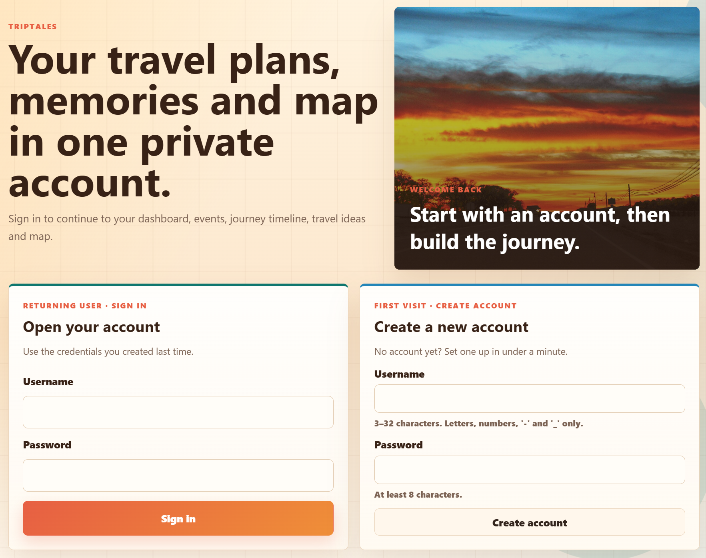
  **Login & Registrierung.** Hinter dem Hero-Visual stehen zwei parallele Formulare. Anmeldungen prüfen Username und Passwort gegen scrypt-Hashes, neue Accounts werden mit minimaler Validierung (3–32 Zeichen Username, 8+ Zeichen Passwort) angelegt. Sessions werden als HttpOnly-Cookies geführt.

  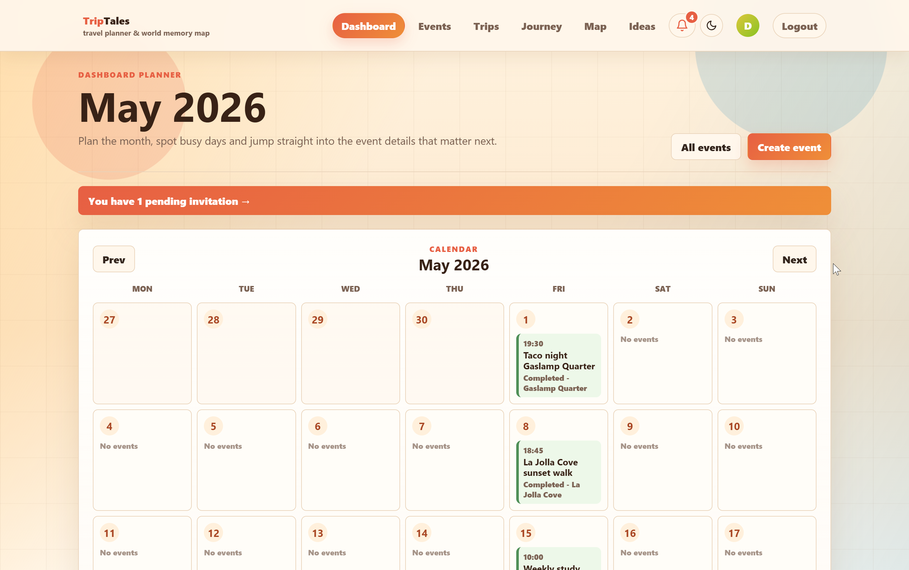
  **Dashboard — oberer Bereich.** Einstiegsseite nach dem Login. Der orange Streifen "You have 1 pending invitation →" weist auf eine offene Einladung hin. Der Monatskalender (May 2026) zeigt alle Events des aktuellen Monats farblich nach Kategorie inklusive Status, Titel und Ort. Über "Next/Prev" navigiert man zwischen Monaten.

  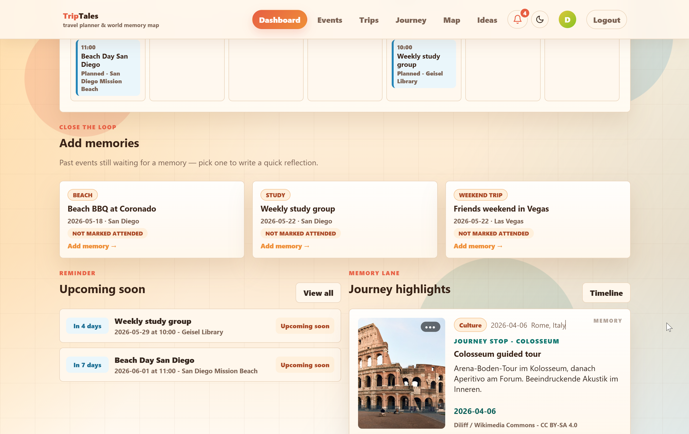
  **Dashboard — Aktionsbereich.** Direkt unter dem Kalender erinnert „Add memories" an vergangene Events ohne gespeicherte Erinnerung, „Upcoming soon" zeigt die nächsten geplanten Termine, und „Journey highlights" die zuletzt festgehaltenen Memories mit Vorschau-Bild und Auszug.

  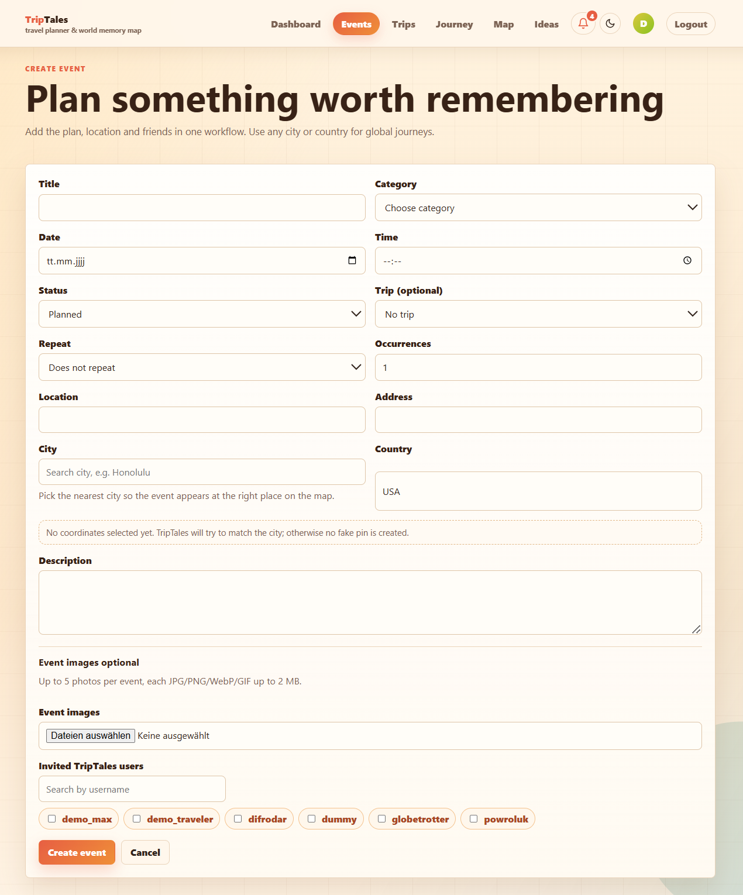
  **Event erstellen — Formular mit Wiederholungen.** Pflichtfelder Titel, Kategorie und Datum stehen oben. Die City-Combobox liefert echte Koordinaten für die Kartenpins. Im aufgeklappten Wiederholungs-Block lässt sich z. B. eine wöchentliche Serie über 4 Termine anlegen, die beim Speichern als verknüpfte Einzeltermine entstehen (Erweiterung [§4.9](#49-wiederkehrende-events)).

  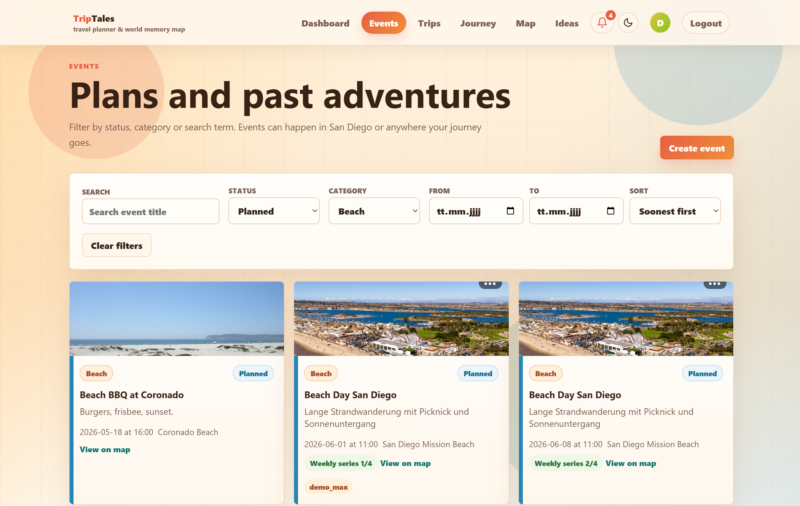
  **Event-Liste mit Filtern.** Volltextsuche, Status- und Kategorie-Dropdown sowie Datumsbereich filtern die Karten live. Jede Karte zeigt Cover, Kategorie-Badge, Datum, Ort und Status; ein Klick führt zur Detailansicht.

  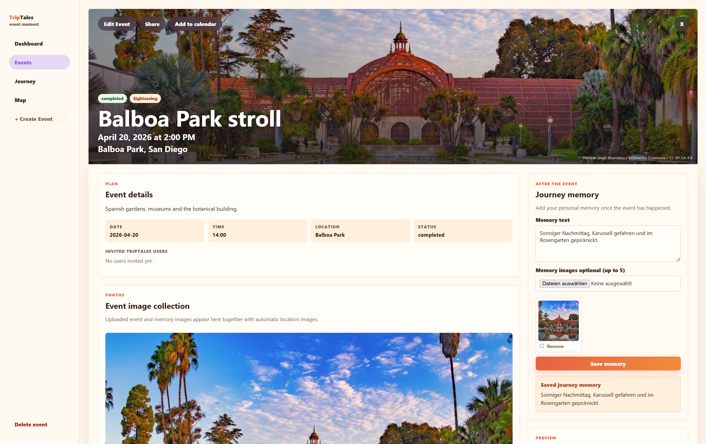
  **Event-Detail mit Hero-Bild und Aktionen.** Der Hero zeigt das erste Foto in voller Breite. Darunter befinden sich Status- und Kategorie-Badges, Titel, Datum und Ort, ein Beschreibungsblock sowie Aktionen für Bearbeiten, Teilen und Kalender-Export. Bei mehreren Bildern erscheint eine Galerie als horizontaler Swipe-Streifen.

  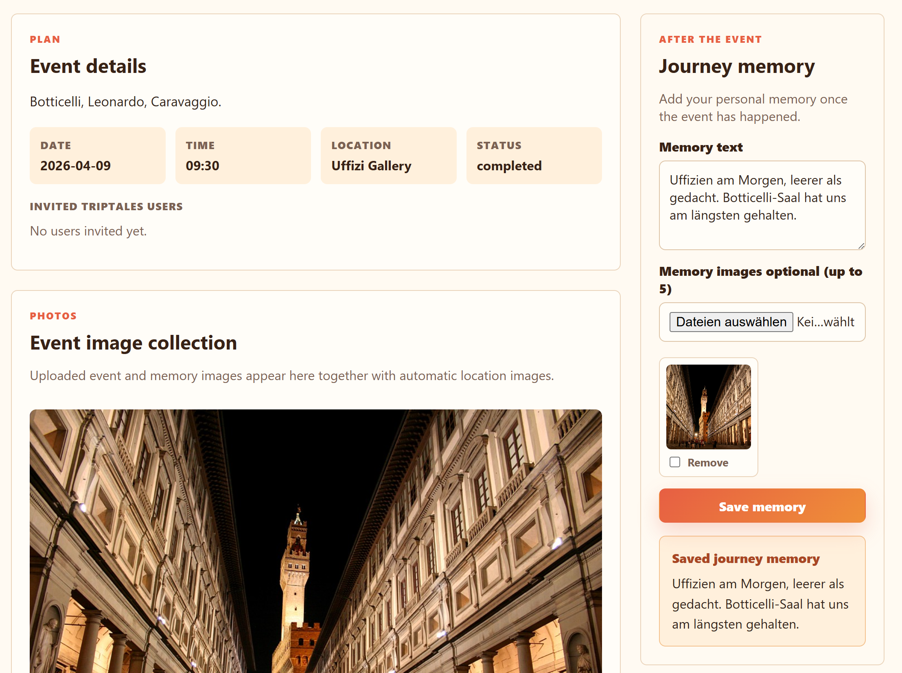
  **Memory-Formular nach abgeschlossenem Event.** Im Bereich „After the event" trägt man Erinnerungstext und bis zu fünf weitere Fotos ein. Beim Speichern wechselt der Event-Status auf „Completed" und der Eintrag wird Teil der persönlichen Journey.

  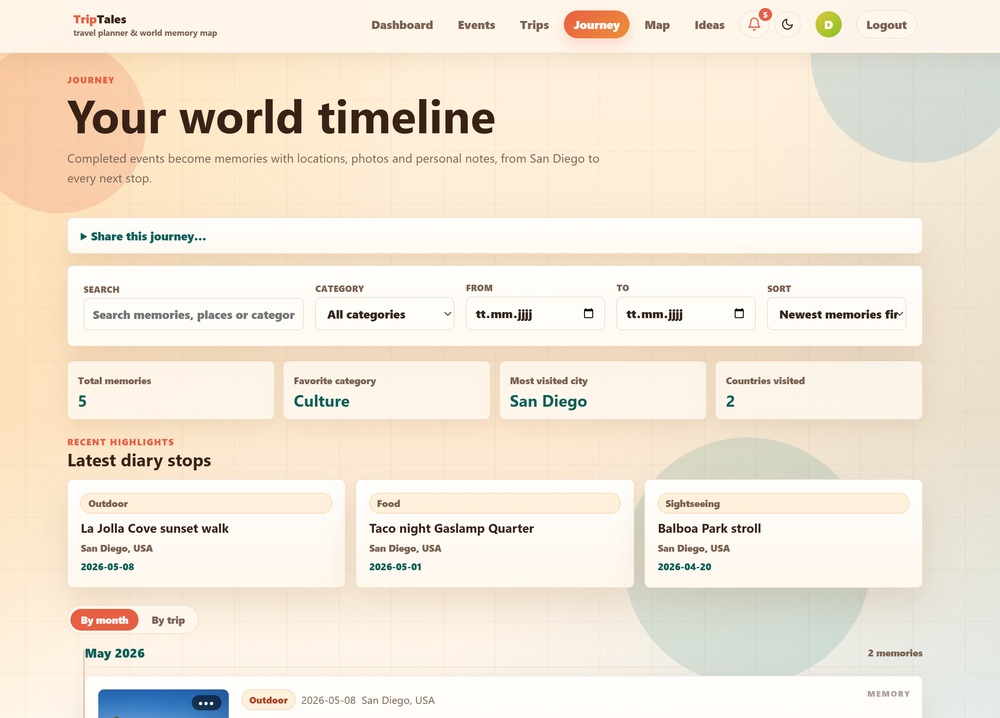
  **Journey-Timeline mit Memory-Cards.** Alle abgeschlossenen Events mit Erinnerungen erscheinen als visuelle Zeitleiste — wahlweise nach Monat oder nach Reise gruppiert. Such-, Kategorie- und Datumsfilter wirken hier identisch zur Event-Liste.

#### 3.4.2. Umsetzung (Technik)
Fasst die technische Realisierung zusammen.
- **Technologie-Stack:** SvelteKit mit Svelte 5, JavaScript/TypeScript-nahe Modulstruktur, MongoDB Atlas mit offiziellem Node.js Driver, Netlify Adapter, Leaflet mit OpenStreetMap-Kartenkacheln.
- **Tooling:** Visual Studio Code, Git/GitHub, Netlify, MongoDB Atlas, Codex/ChatGPT als Planungs- und Entwicklungsassistenz.
- **Struktur & Komponenten:** Zentrale Komponenten sind `Navigation`, `NotificationBell`, `EventCard`, `EventForm`, `CityCombobox`, `FriendPicker`, `JourneyCard`, `LeafletMapView`, `LocationPinGrid`, `EventMapPanel`, `TravelIdeaCard` und `SharePreview`.
- **Daten & Schnittstellen:** MongoDB Collections: `users`, `sessions`, `events`, `locations`, `friends` als Legacy-Collection, `journeyEntries`, `travelIdeas`, `shares` (öffentliche Read-Only-Links auf die eigene Journey), `trips` (mehrtägige Reise-Gruppe oberhalb von Events). Datenzugriff erfolgt serverseitig in `src/lib/server`. SvelteKit Server Loads und Form Actions übernehmen Lesen, Erstellen, Aktualisieren, Löschen und Umwandeln. Alle fachlichen Daten werden über `userId` dem eingeloggten Account zugeordnet, sodass Accounts nur ihre eigenen Events, Locations, Journey Entries und Travel Ideas sehen. Events können optional über `tripId` einer Trip-Entität zugeordnet werden; ohne `tripId` verhalten sich Events unverändert. Event-Einladungen referenzieren keine Freitext-Friends mehr, sondern nur noch echte Login-Accounts aus `users` über `invitedUserIds` und `invitations` mit Status `invited` oder `accepted`. Eingeladene User sehen diese Events in `/events`, auf dem Dashboard und können sie auf der Detailseite annehmen oder ablehnen. Angenommene abgeschlossene Events können später mit einer eigenen Journey Memory gespeichert werden. Wiederkehrende Events werden als normale Einzel-Events gespeichert und über `recurrenceGroupId`, `recurrenceFrequency`, `recurrenceIndex` und `recurrenceCount` verbunden. Dadurch funktionieren Kalender, Listen, Map, Einladungen und einzelne Bearbeitung ohne separates Serienmodell; nur Journey bündelt passende Memories zu einer Serienkarte. Event- und Memory-Formulare werden serverseitig validiert; Pflichtfeldfehler werden strukturiert an die UI zurückgegeben und dort feldnah angezeigt. Bilddaten werden als Array `images: [{ url, alt, credit?, license?, sourceUrl? }]` (bis zu 5 Einträge pro Event/Memory) gespeichert; hochgeladene Event- und Memory-Bilder werden als Base64-Data-URLs in MongoDB abgelegt. Locations behalten ihre einzelnen `imageUrl`/`imageAlt`-Felder, da sie auf automatische Wikimedia-Fallbacks zurückgreifen. Die Migration `npm run normalize:multi-image` überführt bestehende Einzelbild-Felder idempotent in den neuen `images[]`-Aufbau. Zusätzlich sorgt ein Media-Katalog für automatische Fallback-Bilder. Travel Ideas speichern neben dem konkreten Location-Namen auch optionale `city`- und `country`-Felder, damit die Umwandlung in Events nicht auf falsche Standardorte zurückfällt. Events tragen optional ein `reminderLeadHours`-Feld für native In-App-Reminder (Erweiterung [§4.12](#412-in-app-reminder-mit-konfigurierbarer-lead-time)), serverseitig gegen eine Whitelist validiert.
- **Filter & Sortierung:** Die Event- und Journey-Listen nutzen serverseitige Query-Filter für Kategorie, Status, Suche und Zeitraum. Sortierungen nach Datum und letzter Bearbeitung werden im Repository gekapselt; für `updatedAt` existiert ein zusätzlicher MongoDB-Index. Die Journey gruppiert Erinnerungen monatlich, bündelt Memories aus wiederkehrenden Serien und zeigt aktuelle Highlights sowie kleine Reisetagebuch-Statistiken.
- **Authentifizierung:** Der Zugriff auf Dashboard, Events, Journey, Map, Ideas und Profile ist geschützt. `src/hooks.server.js` prüft die Session und leitet nicht eingeloggte Besucher nach `/login` weiter. Accounts werden mit eindeutigen kleingeschriebenen Usernames angelegt. Passwörter werden mit Salt gehasht gespeichert, Session Tokens werden zufällig erzeugt, als HttpOnly-Cookie gesetzt und in MongoDB nur gehasht abgelegt. Logout löscht Cookie und Session. Die Route `/profile` zeigt den eingeloggten Usernamen, abgeleitete Account-Statistiken, Quick Actions und Events, zu denen der Account eingeladen wurde, enthält aber bewusst keine Passwort-, E-Mail- oder Rollenverwaltung.
- **Deployment:** Netlify URL: https://triptales-difrodar.netlify.app/. Benötigte Netlify Environment Variables: `MONGODB_URI`, `MONGODB_DB=triptales`. Lokal kann dieselbe Verbindung über eine nicht versionierte `.env` gesetzt werden; `.env.example` dokumentiert die benötigten Variablen.
- **Dark Mode & Theming:** Die App nutzt eine Token-basierte Theming-Strategie. Sämtliche Farben sind in `src/app.css` als CSS-Custom-Properties unter `:root` definiert; ein paralleler `:root[data-theme="dark"]`-Block überschreibt sie für den dunklen Modus. Das `data-theme`-Attribut sitzt am `<html>`-Element (`src/app.html`) und wird serverseitig in `src/hooks.server.js` per `transformPageChunk` aus dem User-Feld `themePreference` injiziert — dadurch entsteht beim ersten Paint kein Flash. Persistiert wird die Wahl pro Account in der `users`-Collection; der Toggle (`ThemeToggle.svelte`) ruft den POST-Endpoint `/api/theme` auf und aktualisiert die DOM-Wurzel optimistisch. Die Leaflet-Karte wechselt im dunklen Modus auf einen passenden CARTO-Tile-Layer und beobachtet das `data-theme`-Attribut per `MutationObserver`.
- **Besondere Entscheidungen:** Der MongoDB Connection String wird nicht im Repository gespeichert. Die Map nutzt Leaflet und OpenStreetMap, damit keine Google-Maps-Lizenz oder kein API-Key notwendig ist. Die Map gruppiert Orte nach Land und Stadt und zeigt darunter die verknüpften Events, damit konkrete Locations wie Golden Gate Bridge oder Griffith Observatory klarer sind als reine Stadtmarker. Überlappende Pins werden über `leaflet.markercluster` zu einem Cluster mit Anzahl-Badge zusammengefasst, der beim Klick aufklappt; Filteränderungen passen den Kartenausschnitt automatisch an die gefilterten Events an. Beim ersten Serverstart werden die Prototype-Accounts `difrodar`/`difrodar` und `dummy`/`dummy` angelegt; bestehende Daten ohne `userId` werden `difrodar` zugewiesen, während `dummy` leer startet. Falls die Datenbank leer ist, werden Demo-Daten nur für `difrodar` erzeugt. Bestehende MongoDB-Daten können non-destruktiv per Upsert-Script ergänzt oder präzisiert werden. Für Bilder nutzt die App einerseits echte, lizenzierte Wikimedia-Commons-Fotos als Fallback und andererseits eigene Uploads für Event-Cover und Journey-Memories. Uploads sind bewusst auf JPG, PNG, WebP oder GIF bis 2 MB pro Bild begrenzt; pro Event/Memory können bis zu 5 Bilder mit insgesamt höchstens 9 MB hinzugefügt werden, damit die Dokumente sicher unter dem MongoDB BSON-Limit von 16 MB bleiben. Falls für einen unbekannten Ort kein spezifisches Bild vorhanden ist, nutzt die App einen neutralen Travel-/Roadtrip-Fallback statt ein falsches Stadtbild. Auch Kategorie-Fallbacks wie `Sightseeing` sind bewusst neutral gehalten, damit konvertierte Travel Ideas nicht fälschlich ein San-Francisco-/Golden-Gate-Bild erhalten.

- **Architektur-Übersicht:** Das folgende Diagramm zeigt die Schichten der Anwendung und wie Routes, Form Actions, Repository-Funktionen und MongoDB-Collections zusammenspielen. Server-Code (`src/lib/server/**`) ist strikt vom Client getrennt; die Repositories kapseln jede Datenoperation hinter `userId`-Scoping.

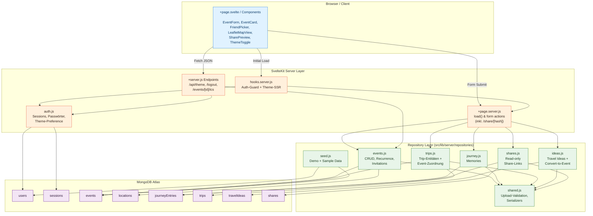
```mermaid
flowchart TB
    subgraph Client["Browser / Client"]
        Pages["+page.svelte / Components<br/><br/>EventForm, EventCard,<br/>FriendPicker, LeafletMapView,<br/>SharePreview, ThemeToggle"]
    end

    subgraph SvelteKit["SvelteKit Server Layer"]
        Hooks["hooks.server.js<br/>Auth-Guard + Theme-SSR"]
        Loads["+page.server.js<br/>load() & form actions<br/>(inkl. /share/[hash])"]
        API["+server.js Endpoints<br/>/api/theme, /logout,<br/>/events/[id]/ics"]
        Auth["auth.js<br/>Sessions, Passwörter,<br/>Theme-Preference"]
    end

    subgraph Repos["Repository Layer (src/lib/server/repositories)"]
        Shared["shared.js<br/>Upload-Validation,<br/>Serializers"]
        Events["events.js<br/>CRUD, Recurrence,<br/>Invitations"]
        Journey["journey.js<br/>Memories"]
        Trips["trips.js<br/>Trip-Entitäten +<br/>Event-Zuordnung"]
        Ideas["ideas.js<br/>Travel Ideas +<br/>Convert-to-Event"]
        Shares["shares.js<br/>Read-only<br/>Share-Links"]
        Seed["seed.js<br/>Demo + Sample Data"]
    end

    subgraph DB["MongoDB Atlas"]
        Users["users"]
        Sessions["sessions"]
        EventsC["events"]
        Locations["locations"]
        JourneyC["journeyEntries"]
        TripsC["trips"]
        IdeasC["travelIdeas"]
        SharesC["shares"]
    end

    Pages -->|Form Submit| Loads
    Pages -->|Fetch JSON| API
    Pages -->|Initial Load| Hooks
    Hooks --> Auth
    Hooks --> Loads
    Loads --> Events
    Loads --> Journey
    Loads --> Trips
    Loads --> Ideas
    Loads --> Shares
    API --> Auth
    API --> Events
    Events --> Shared
    Journey --> Shared
    Trips --> Shared
    Ideas --> Shared
    Shares --> Shared
    Auth --> Users
    Auth --> Sessions
    Events --> EventsC
    Events --> Locations
    Journey --> JourneyC
    Trips --> TripsC
    Trips --> EventsC
    Ideas --> IdeasC
    Shares --> SharesC
    Shares --> JourneyC
    Seed --> Users
    Seed --> EventsC

    classDef client fill:#e0f2ff,stroke:#1d76db,color:#0a3a66
    classDef server fill:#fff0dc,stroke:#e75f43,color:#33251d
    classDef repo fill:#e8f5e9,stroke:#2e7d32,color:#1b3c1e
    classDef db fill:#f3e5f5,stroke:#6a1b9a,color:#311b3b
    class Pages client
    class Hooks,Loads,API,Auth server
    class Shared,Events,Journey,Trips,Ideas,Shares,Seed repo
    class Users,Sessions,EventsC,Locations,JourneyC,TripsC,IdeasC,SharesC db
```

Die strikte Schichtung garantiert, dass kein Client-Code direkt auf MongoDB zugreift und dass jede Repository-Funktion `userId` als Pflichtparameter führt. Form Actions liefern strukturierte Fehler-Envelopes zurück, die das Frontend feldnah anzeigt.

### 3.5 Validate
- **URL der getesteten Version** (separat deployt): https://triptales-difrodar.netlify.app/
- **Ziele der Prüfung:** Prüfen, ob Nutzende sich einloggen oder registrieren können, danach ein Event erstellen, Freunde hinzufügen, das Event als erlebt markieren und die Erinnerung in Journey/Map wiederfinden können.
- **Vorgehen:** Moderierter szenariobasierter Usability-Test mit lautem Denken, schriftliche Notizen pro Aufgabe und kurzem Abschlussinterview. Die Testleitung gab keine UI-Hinweise und stellte bei Unsicherheit nur neutrale Rückfragen. Drei vorbereitete Accounts (`demo_anna` für die Aufgaben 1-6, `demo_max` als Statisten-Account für die Einladungs-Aufgabe, `demo_traveler` für die Aufgaben 7-8) wurden vor jeder Session über die Skripte [`scripts/seed-walkthrough.js`](scripts/seed-walkthrough.js), [`scripts/seed-usability-test-account.js`](scripts/seed-usability-test-account.js) und [`scripts/reset-test-state.js`](scripts/reset-test-state.js) aufgesetzt. Das vollständige Aufgabenblatt der Testpersonen liegt unter [docs/validate/Usability-Test/Aufgabe_User/TripTales_Usability-Test_Aufgaben_Testperson.pdf](docs/validate/Usability-Test/Aufgabe_User/TripTales_Usability-Test_Aufgaben_Testperson.pdf).
- **Stichprobe:** 2 Testpersonen (Lukas, Sandra). Beide ohne aktive Vorerfahrung mit Reise-, Kalender- oder Tagebuch-Apps, beide vertraut mit englischen Benutzeroberflächen. Ausgefüllte Moderationsbögen: [Moderationsbogen Lukas](docs/validate/Usability-Test/Moderationsbogen/Moderationsbogen_Testbenutzer_Lukas.pdf), [Moderationsbogen Sandra](docs/validate/Usability-Test/Moderationsbogen/Moderationsbogen_Testbenutzer_Sandra.pdf).
- **Aufgaben/Szenarien:** Acht szenariobasierte Aufgaben, neutral formuliert, ohne Lösungsweg: 1. Zugang zur App verschaffen. 2. Einen spontanen Brunch für die Zukunft festhalten. 3. Einen wöchentlichen Töpferkurs über sechs Wochen anlegen. 4. Eine Erinnerung mit Foto zu einem vergangenen Sonnenuntergangsspaziergang festhalten. 5. Einen Café-Tipp ohne Datum als Idee sichern. 6. Eine andere Person (`demo_max`) zu einem Tagesausflug einladen. 7. Drei einzelne Mailand-Aktivitäten zu einer Reise gruppieren (auf `demo_traveler`). 8. Eine abgeschlossene Italien-Reise ohne Account-Zwang mit der Familie teilen (Ablauf nach zwei Wochen).
- **Kennzahlen & Beobachtungen:** Erfolgsquote 16/16 — alle acht Aufgaben wurden von beiden Testpersonen schlussendlich erfolgreich abgeschlossen. Testdauer wurde bewusst nicht als Bewertungsfaktor erhoben. Der Fokus der Auswertung liegt auf Reibungen, Begriffskonfusion, Umwegen und Datenschutzverständnis. Insgesamt **18 dokumentierte Issues**, davon **2 mit Schweregrad 4** (kritisch) und **10 mit Schweregrad 3** (hohe Priorität). Schweregrad-Skala 0-4: 0 kein Problem · 1 kosmetisch · 2 kleines Problem · 3 hohe Priorität · 4 Usability-Katastrophe.
- **Zusammenfassung der Resultate:** Gut funktioniert haben Registrierung, das Festhalten einer Erinnerung mit Foto und das Einladen einer anderen Person. Wiederkehrend reibungsreich waren Sharing (kein zentraler Bereich, 14-Tage-Ablauf nicht möglich, Label irreführend), Event-Erfassung (keine direkte Erfassung aus dem Kalender, Suche/Filter mit Erstellen verwechselt, Formular wirkt überladen, Ende/Dauer fehlt, Reminder unklar) sowie das Begriffssystem Idea/Trip/Journey/Memory trotz hoher Englischkompetenz beider Testpersonen. Beide würden TripTales nutzen — Lukas besonders für ein Auslandsemester, Sandra als Alternative zu Excel-Reiseplanung. Vollständiger Analyse-Report mit Issue Map, alternativen Lösungsansätzen und Metriken-Vorschlag für die nächste Iteration: [TripTales_Usability_Analyse_Report.pdf](docs/validate/Usability-Test/Analyse/TripTales_Usability_Analyse_Report.pdf).
- **Issue Map nach zwei Usability-Tests:**

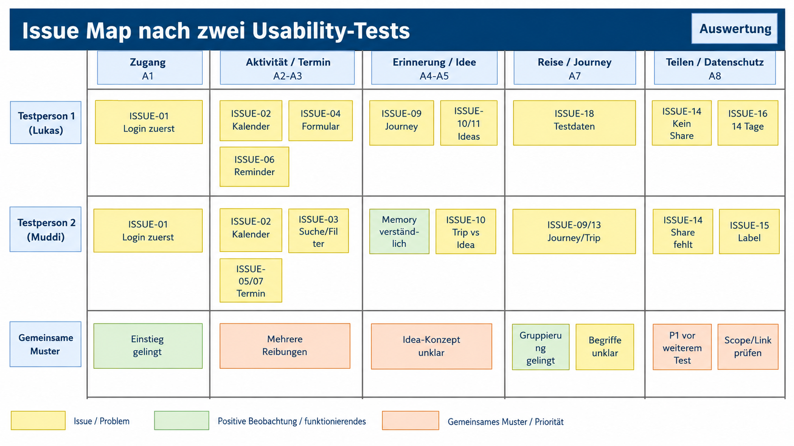

- **Abgeleitete Verbesserungen:** Alle 18 Issues sind im Repository als GitHub-Issues mit Schweregrad, Aufgabenbezug, Originalzitaten der Testpersonen und konkreten Empfehlungen angelegt (Label [`usability-test`](https://github.com/difrodar/traveljourneyapp/issues?q=label%3Ausability-test)). Umsetzungsstatus: **18 von 18 umgesetzt** (#31, #32, #33, #34, #35, #36, #37, #38, #39, #40, #41, #42, #43, #44, #45, #46, #47 und #48 — in der Tabelle mit ✅ markiert); Vorher-/Nachher-Belege der umgesetzten Fixes siehe [§3.5.1](#351-vorher-nachher-belege). Alle 18 Issues aus dem Usability-Test sind in der aktuellen Version umgesetzt. Übersicht sortiert nach Schweregrad absteigend, dann nach ID:

| Issue-ID | SG | Aufgabe(n) | Problem | Empfehlung (Kurz) | GitHub |
|---|:---:|:---:|---|---|---|
| ISSUE-14 | 4 | 8 | Sharing fehlt als zentraler Bereich für Events, Trips und Journey | Zentralen Sharing-Bereich einführen; Kontextlinks aus Event/Trip/Journey — ✅ **umgesetzt** | [#44](https://github.com/difrodar/traveljourneyapp/issues/44) |
| ISSUE-16 | 4 | 8 | Ablaufdatum von zwei Wochen nicht möglich | Presets 7/14/30 Tage ergänzen — ✅ **umgesetzt** | [#46](https://github.com/difrodar/traveljourneyapp/issues/46) |
| ISSUE-02 | 3 | 2 | Direkte Eventerstellung aus Kalender fehlt | Click-to-Create im Kalender; alternativ globaler Create-Button mit Datumsvorbelegung — ✅ **umgesetzt** | [#32](https://github.com/difrodar/traveljourneyapp/issues/32) |
| ISSUE-04 | 3 | 2, 3, 5 | Event-Formular wirkt überladen, Felder/Layout unklar | Formular in Abschnitte gliedern (Basics, Ort, Termin, Optionen); Pflichtfelder eindeutig — ✅ **umgesetzt** | [#34](https://github.com/difrodar/traveljourneyapp/issues/34) |
| ISSUE-05 | 3 | 3 | Ende bzw. Dauer fehlt | Von-bis-Feld oder optionales Ende-Feld ergänzen — ✅ **umgesetzt** | [#35](https://github.com/difrodar/traveljourneyapp/issues/35) |
| ISSUE-06 | 3 | 2 | Reminder/Benachrichtigung unklar oder nicht möglich | Native Reminder-Funktion innerhalb TripTales ergänzen — ✅ **umgesetzt** | [#36](https://github.com/difrodar/traveljourneyapp/issues/36) |
| ISSUE-09 | 3 | 4, 5, 7, 8 | Journey/Memory/Trip/Event/Idea-Beziehungen unklar | Kurzer Guide/Onboarding plus konsistente Microcopy — ✅ **umgesetzt** | [#39](https://github.com/difrodar/traveljourneyapp/issues/39) |
| ISSUE-10 | 3 | 5 | Idea-Bereich schwer auffindbar, mit Trip/Event verwechselt | Navigation neu ordnen; Save-as-Idea im Erfassungsflow — ✅ **umgesetzt** | [#40](https://github.com/difrodar/traveljourneyapp/issues/40) |
| ISSUE-11 | 3 | 5 | Idea-Konvertierung erzeugt unerwartete Daten, nicht rückgängig | Review-Step und Undo; Idea archivieren statt löschen — ✅ **umgesetzt** | [#41](https://github.com/difrodar/traveljourneyapp/issues/41) |
| ISSUE-13 | 3 | 7 | Trip-Gruppierung funktioniert, aber Journey/Trip-Zusammenhang unklar | Guide aus ISSUE-09 anwenden; in-page Erklärung „planned activities" vs. „memories" — ✅ **umgesetzt** | [#43](https://github.com/difrodar/traveljourneyapp/issues/43) |
| ISSUE-15 | 3 | 8 | Share-Button/Benennung schlecht sichtbar und missverständlich | Präzise Labels („Share event/trip/journey") plus Scope-Vorschau — ✅ **umgesetzt** | [#45](https://github.com/difrodar/traveljourneyapp/issues/45) |
| ISSUE-17 | 3 | 8 | Sharing-Verständnis (Öffentlichkeit/Scope) nicht ausreichend validiert | Explizite Scope- und Ablaufanzeige vor Linkerstellung; in nächster Iteration explizit prüfen — ✅ **umgesetzt** | [#47](https://github.com/difrodar/traveljourneyapp/issues/47) |
| ISSUE-03 | 2 | 2, 3 | Suche/Filter werden mit Erstellung verwechselt | Create-Aktion visuell primär platzieren; Such-/Filterbereiche klarer abgrenzen — ✅ **umgesetzt** | [#33](https://github.com/difrodar/traveljourneyapp/issues/33) |
| ISSUE-07 | 2 | 2, 3 | Begriff „Occurrences" wird missverstanden | Label durch „Number of dates" / „Repeat count" ersetzen oder Tooltip ergänzen — ✅ **umgesetzt** | [#37](https://github.com/difrodar/traveljourneyapp/issues/37) |
| ISSUE-08 | 2 | 3 | Kategorien zu starr bzw. unvollständig | Kategorie „Other" und optional eigene Kategorie hinzufügen — ✅ **umgesetzt** | [#38](https://github.com/difrodar/traveljourneyapp/issues/38) |
| ISSUE-18 | 2 | 7, 8 | Testdaten/Bilder fehlen oder sind falsch | Seed-Daten bereinigen, Bilder validieren, Setup-Checkliste erweitern — ✅ **umgesetzt** | [#48](https://github.com/difrodar/traveljourneyapp/issues/48) |
| ISSUE-01 | 1 | 1 | Login/Registrierung wird zunächst verwechselt | Register/Login visuell klarer trennen, primären CTA hervorheben — ✅ **umgesetzt** | [#31](https://github.com/difrodar/traveljourneyapp/issues/31) |
| ISSUE-12 | 1 | 6 | Einladungsfeedback und Einladungstext ausbaufähig | Toast mit Empfänger, Status und optionaler Nachricht ergänzen — ✅ **umgesetzt** | [#42](https://github.com/difrodar/traveljourneyapp/issues/42) |

#### 3.5.1 Vorher-Nachher-Belege
Für die umgesetzten Issues belegen die folgenden Vorher-/Nachher-Paare die konkrete Verbesserung. Der „Vorher"-Stand stammt aus einem separaten Deploy des Branches `pre_usability` (Stand vor allen Usability-Fixes), der „Nachher"-Stand aus der aktuellen Version. Sortiert nach Schweregrad absteigend.

**ISSUE-16 · 14-Tage-Ablauf für Share-Links** (Schweregrad 4, [#46](https://github.com/difrodar/traveljourneyapp/issues/46))

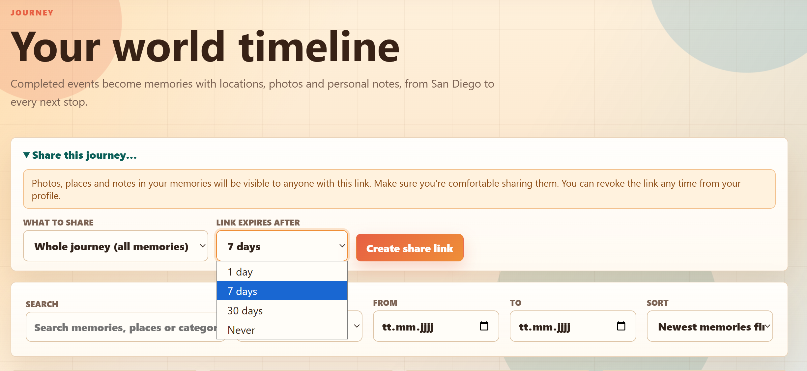
**Vorher:** Der Link-Ablauf bot nur 1/7/30 Tage und „Never" — der in Aufgabe 8 gewünschte 14-Tage-Ablauf war nicht möglich.

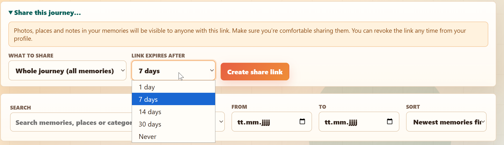
**Nachher:** „14 days" steht jetzt als Preset zur Verfügung.

**ISSUE-14 + ISSUE-15 + ISSUE-17 · Sharing-Cluster** (Schweregrade 4 + 3 + 3, [#44](https://github.com/difrodar/traveljourneyapp/issues/44) + [#45](https://github.com/difrodar/traveljourneyapp/issues/45) + [#47](https://github.com/difrodar/traveljourneyapp/issues/47)) — *gemeinsam umgesetzt, weil die drei Issues sich gegenseitig bedingen.*

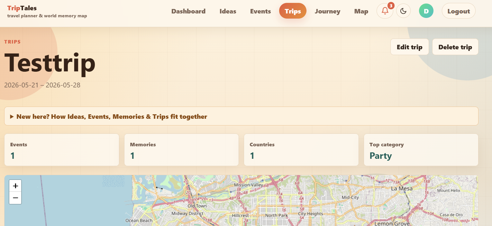
**Vorher (Trip-Detail, ISSUE-14):** Auf der Trip-Detail-Seite gab es ausser „Edit trip" und „Delete trip" keinen Share-Einstieg. Sharing war nur über `/journey` zugänglich — Testpersonen suchten vergeblich auf der Trip-Seite.

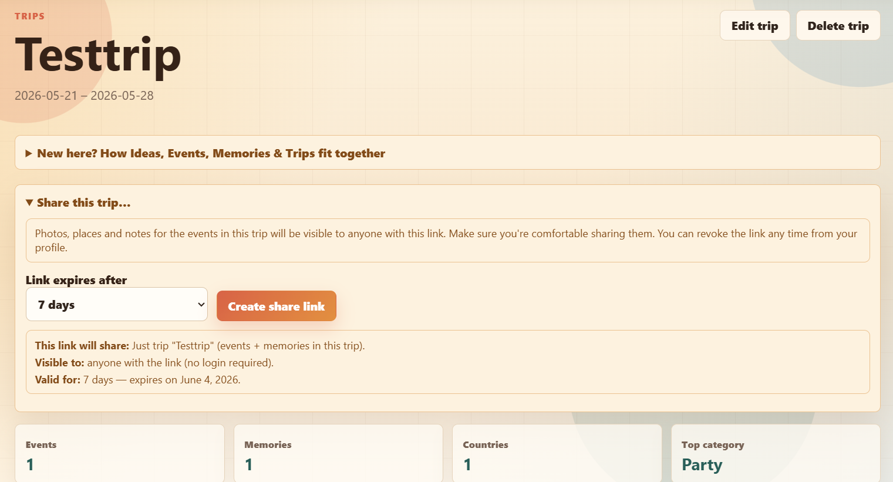
**Nachher (Trip-Detail, ISSUE-14):** Direkt unter dem ConceptGuide steht jetzt eine aufklappbare „Share this trip…"-Sektion. Der Trip ist durch den Route-Param fix; nur Ablaufzeit ist editierbar. Server-Action `?/share` ruft `createShare(userId, { tripId: params.id, expiresIn })` auf.

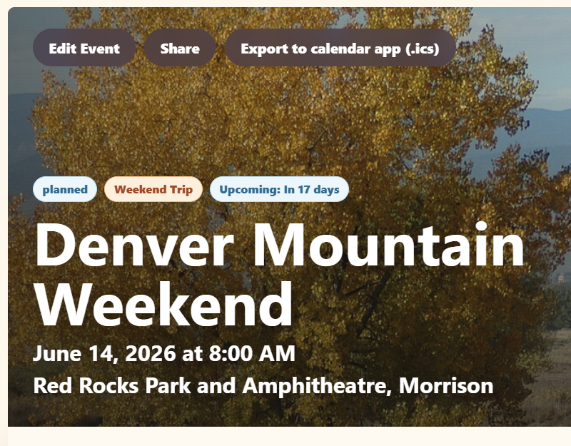
**Vorher (Event-Detail, ISSUE-15):** Der „Share"-Link in den Hero-Actions scrollte nur zur SharePreview-Komponente (eine Social-Media-Karte zum Kopieren) — Testpersonen erwarteten dort einen Public-Link.

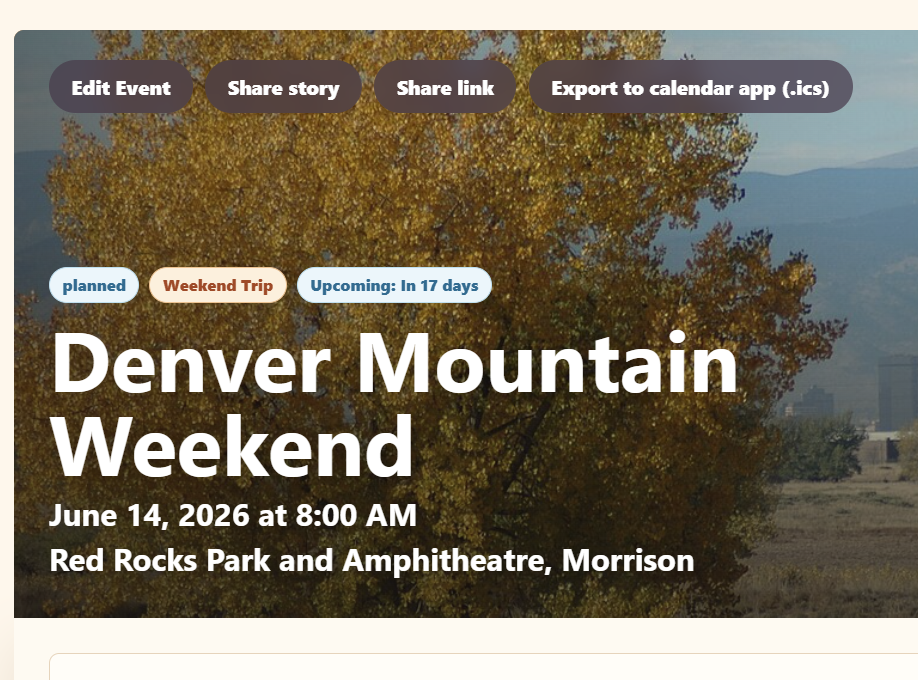
**Nachher (Event-Detail, ISSUE-15):** Zwei klar getrennte Buttons: **„Share story"** scrollt zur Social-Media-Karten-Vorschau (unverändert), **„Share link"** springt smart zur Share-Form — bei Events in einem Trip zu `/trips/<tripId>#share-section`, sonst zu `/journey#share-section`. Eindeutige Erwartung pro Klick.

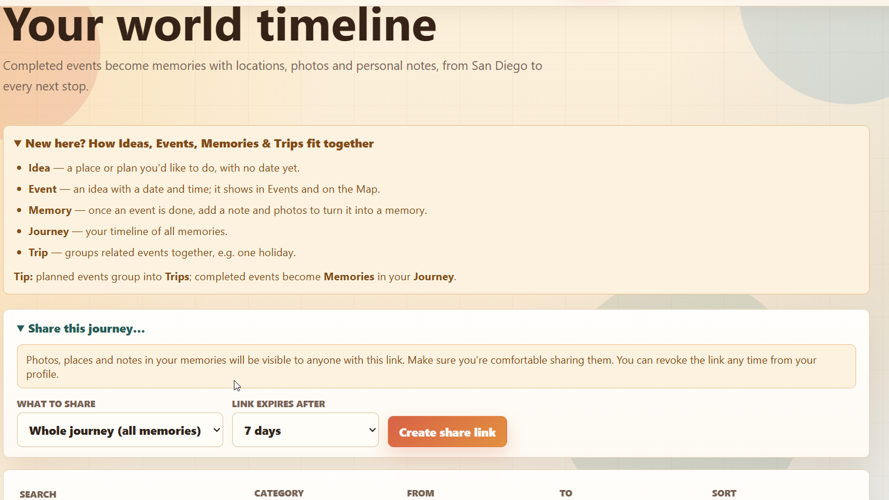
**Vorher (Share-Form, ISSUE-17):** Die Share-Form auf `/journey` zeigte vor dem Klick nur die zwei Select-Controls — keine Vorab-Information über Scope, Sichtbarkeit oder das tatsächliche Ablaufdatum.

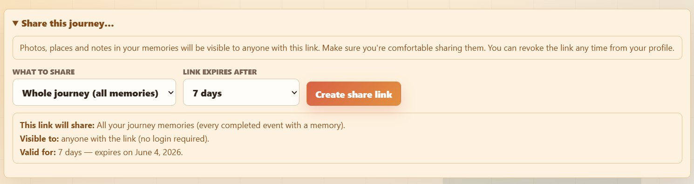
**Nachher (Share-Form, ISSUE-17):** Die neue `ShareScopePreview`-Komponente zeigt live (reagiert auf Dropdown-Änderungen) was der Link teilen wird, an wen, und für wie lange — inklusive berechnetem konkreten Ablauf-Datum. Wird sowohl in der Journey- als auch der Trip-Share-Form eingesetzt.

**ISSUE-02 · Direkte Eventerstellung aus Kalender** (Schweregrad 3, [#32](https://github.com/difrodar/traveljourneyapp/issues/32))

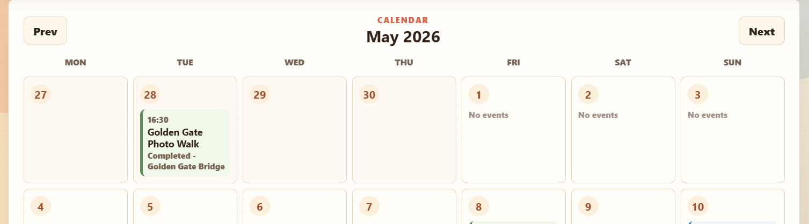
**Vorher:** Kalendertage auf dem Dashboard waren passive Anzeigeflächen — Events anlegen ging nur über den globalen „Create event"-Button im Header, das Datum musste danach manuell erneut eingegeben werden.

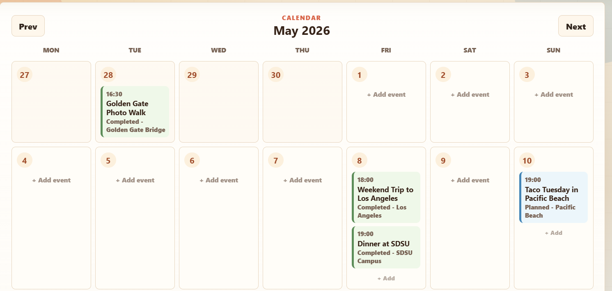
**Nachher:** Jeder Kalendertag des aktuellen Monats zeigt einen „+ Add event"-Link (volle Zeile bei leeren Tagen, dezenter „+ Add"-Knopf bei Tagen mit Events). Der Link führt zu `/events/new?date=YYYY-MM-DD` und füllt das Datumsfeld im Formular vor.

**ISSUE-04 · Event-Formular in Abschnitte gliedern** (Schweregrad 3, [#34](https://github.com/difrodar/traveljourneyapp/issues/34))

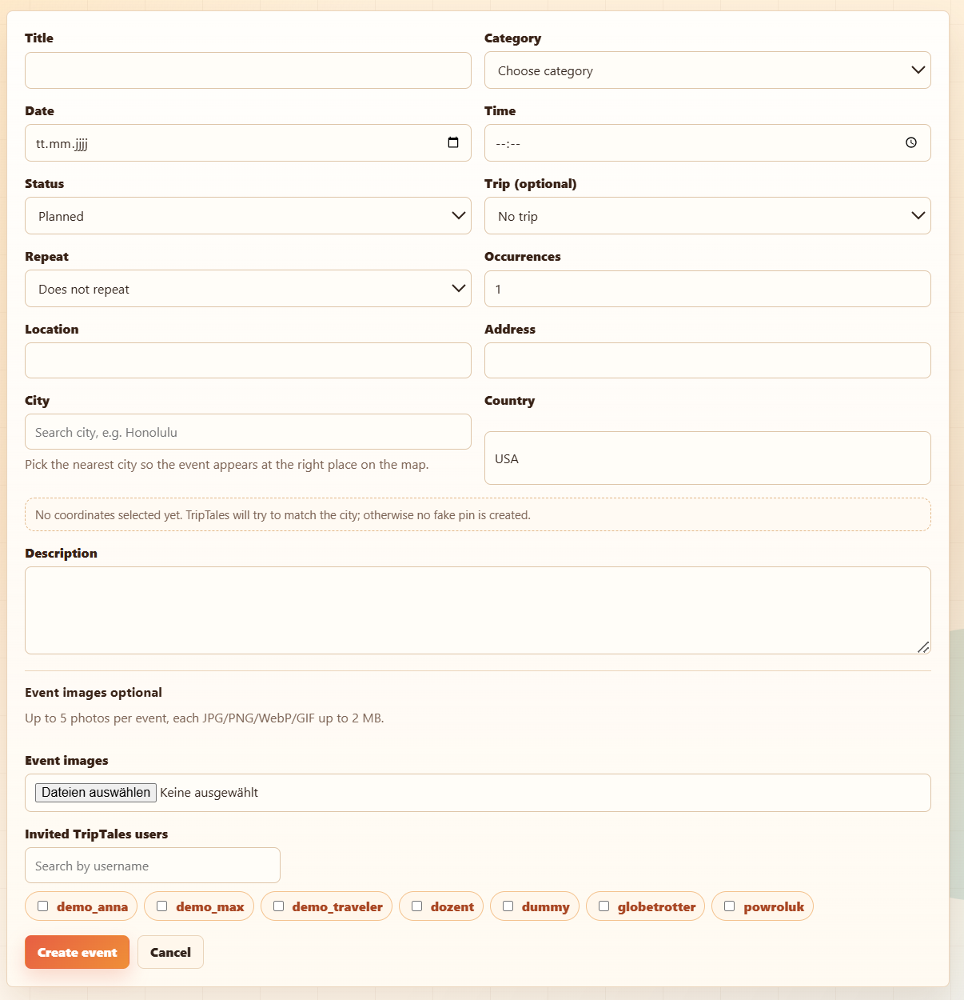
**Vorher:** Alle Felder standen als eine einzige dichte Liste untereinander.

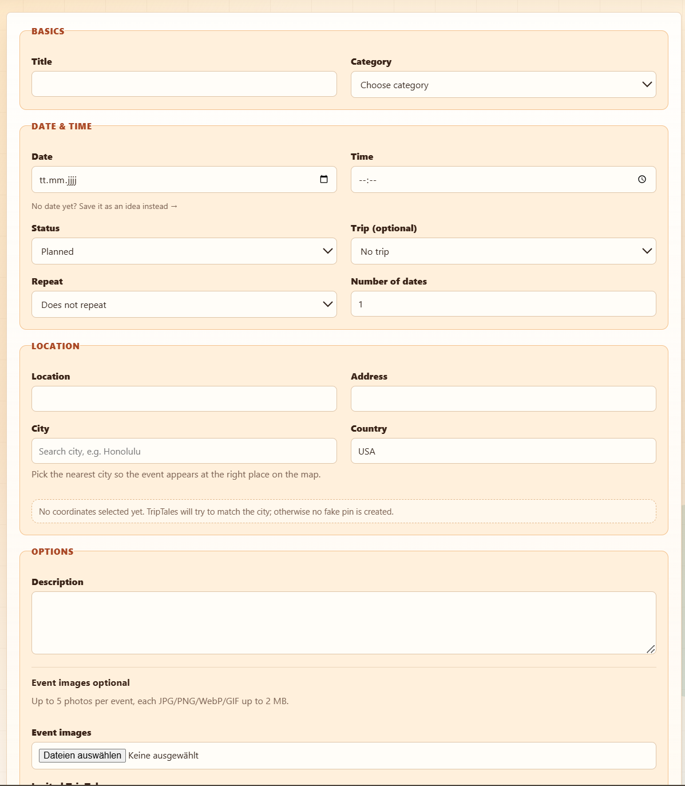
**Nachher:** Vier abgesetzte Abschnitte (Basics, Date & time, Location, Options) gruppieren die Felder mit klaren Überschriften und mehr Abstand.

**ISSUE-05 · Ende-Zeit für Events** (Schweregrad 3, [#35](https://github.com/difrodar/traveljourneyapp/issues/35))

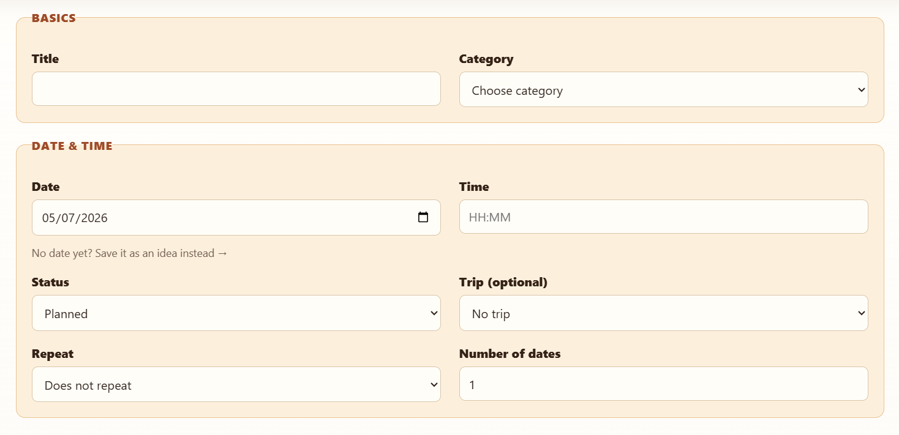
**Vorher:** Das Event-Formular kannte nur eine Start-Zeit; Dauer oder Endzeit waren nicht abbildbar. ICS-Exporte nahmen pauschal 2 Stunden Dauer an.

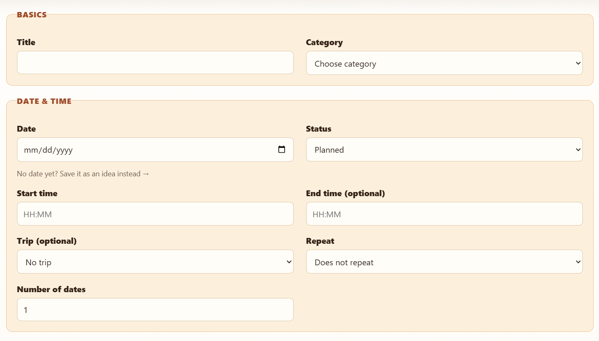
**Nachher:** Neben „Start time" steht jetzt ein optionales „End time"-Feld (24-Stunden, gleicher Eingabestil mit Auto-`:`). Kalender, Reminder-Liste und Event-Detail zeigen die Spanne als `HH:MM–HH:MM` an; der ICS-Export verwendet die echte Endzeit für `DTEND`, sofern gesetzt.

**ISSUE-06 · Native In-App-Reminder mit konfigurierbarer Lead-Time** (Schweregrad 3, [#36](https://github.com/difrodar/traveljourneyapp/issues/36))

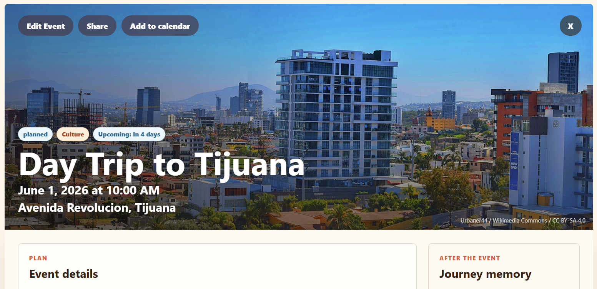
**Vorher (Event-Detail):** Die einzige Reminder-Funktion war ein „Add to calendar"-Button, der eine `.ics`-Datei herunterlud — mehrdeutig zwischen „in-App-Reminder" und „Datei in mein Kalender-App importieren". Im Detail-Grid gab es keine Zeile zum Reminder-Status; eine Testperson fand die Funktion gar nicht.

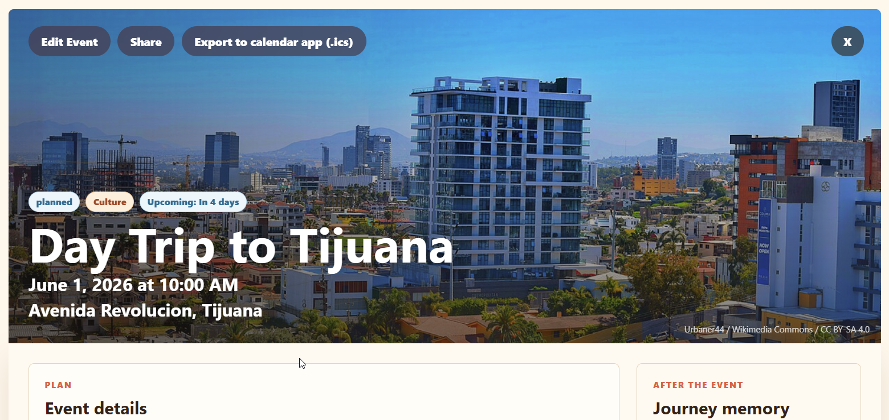
**Nachher (Event-Detail):** Detail-Grid zeigt eine neue Zeile „Reminder: 1 day before" (bzw. „No reminder set"). Der ehemalige Button heisst jetzt **„Export to calendar app (.ics)"** und ist klar als sekundäre Export-Option gekennzeichnet. Wenn der Reminder-Zeitpunkt erreicht ist, erscheint zusätzlich ein „⏰ Coming up — this event starts …"-Banner oben.

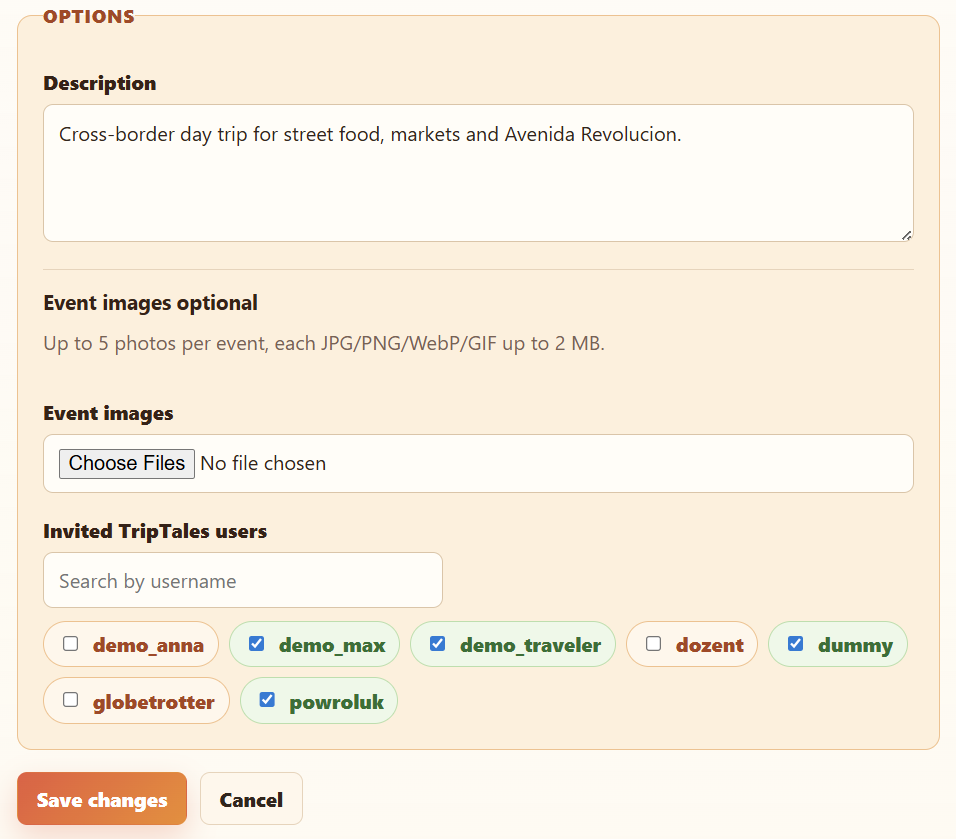
**Vorher (EventForm):** Im Options-Fieldset existierten nur Description, Bild-Upload und Friends. Es gab keinen Weg, eine Lead-Time pro Event zu setzen — die ehemalige „Reminder"-Sektion auf dem Dashboard war eine hartcodierte 7-Tage-Box ohne Bezug zu einer User-Wahl.

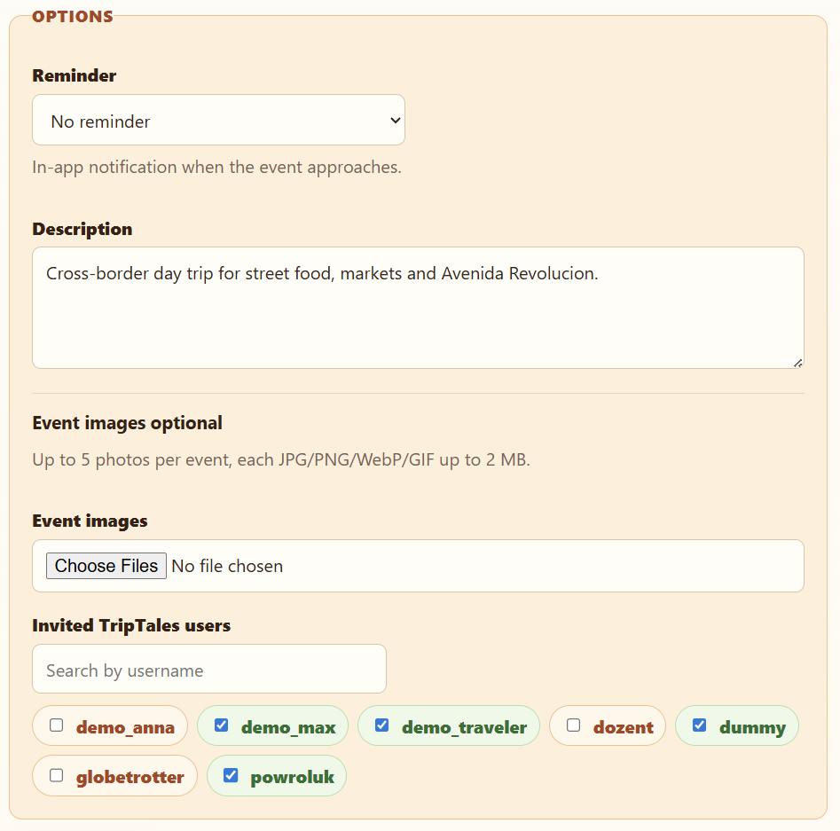
**Nachher (EventForm):** Neues „Reminder"-Select mit sechs Lead-Time-Presets (No reminder, 1h, 3h, 12h, 1 day, 1 week before). Default `No reminder` (opt-in). Server-seitig per Whitelist validiert; persistiert in einem neuen `reminderLeadHours`-Feld am Event-Dokument.

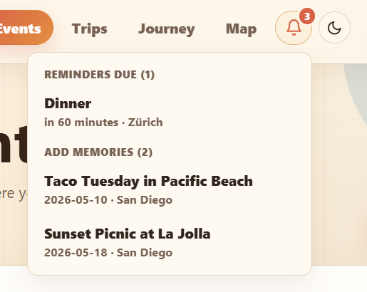
**Nachher (Notification-Bell):** Die Bell hat jetzt eine dritte Section „Reminders due" zusätzlich zu „Invitations" und „Add memories". Sie listet Events, deren Lead-Time-Fenster bereits begonnen hat und die noch nicht gestartet sind, mit einer dynamischen Countdown-Anzeige (z.B. „in 30 minutes", „in 2 hours", „in 3 days"). Klick führt direkt zum Event-Detail.

**ISSUE-09 · Begriffssystem Idea → Event → Memory → Journey erklären** (Schweregrad 3, [#39](https://github.com/difrodar/traveljourneyapp/issues/39))

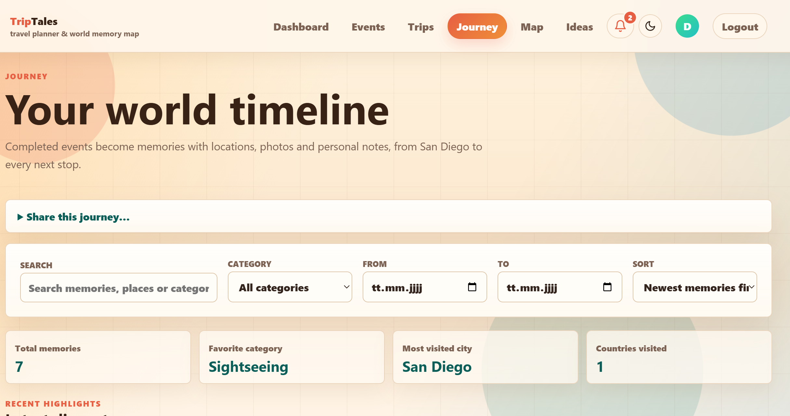
**Vorher:** Der Zusammenhang von Idea, Event, Memory und Journey wurde nirgends erklärt.

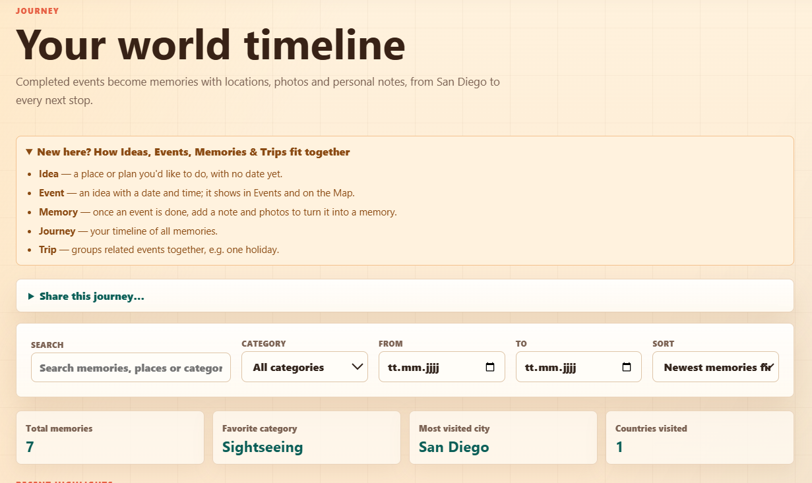
**Nachher:** Ein einklappbarer In-App-Konzept-Guide auf Journey und Ideas macht das Modell explizit.

**ISSUE-10 · Ideas auffindbar machen** (Schweregrad 3, [#40](https://github.com/difrodar/traveljourneyapp/issues/40))

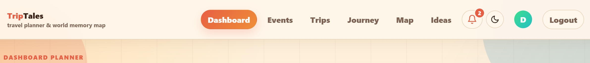
**Vorher:** Der Ideas-Bereich war schwer zu finden und wurde mit Trip/Event verwechselt.

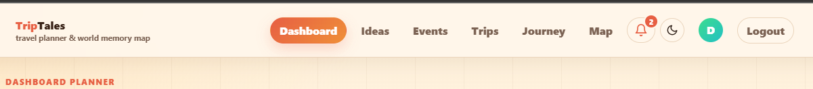
**Nachher:** „Ideas" steht prominent an zweiter Stelle der Navigation (zusätzlich ein „Save as idea"-Einstieg im Event-Formular).

**ISSUE-11 · Idea-Konvertierung mit Review-Step + Cancel-Möglichkeit** (Schweregrad 3, [#41](https://github.com/difrodar/traveljourneyapp/issues/41))

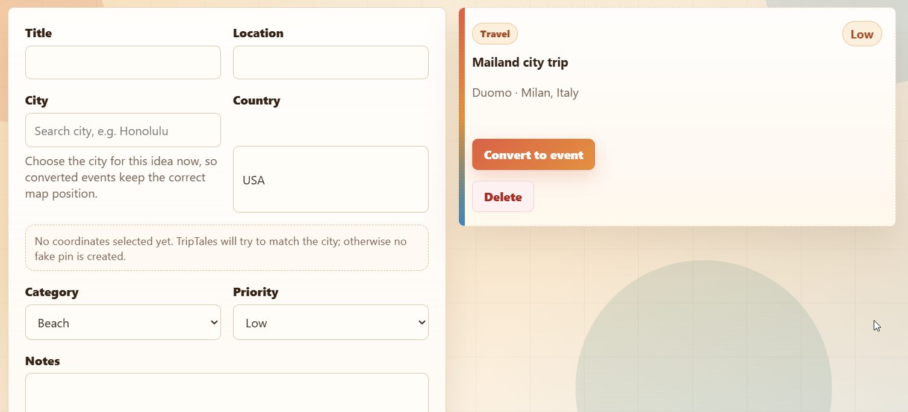
**Vorher (Idea-Formular):** Im Idea-Formular war Country wegen `align-items: stretch` und dem zusätzlichen Help-Text unter City vertikal versetzt — analog zum Problem, das in Event-Form schon mit #34 behoben wurde.

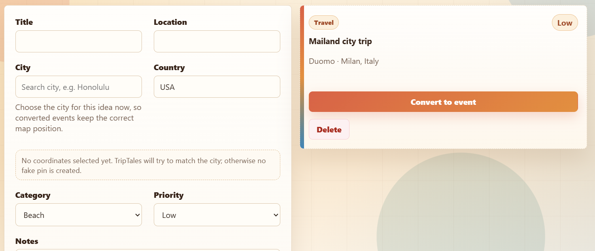
**Nachher (Idea-Formular):** Dieselbe Grid-Regel wie in der Event-Form (`align-items: start`, einheitliche Gaps) ist nun auch im Idea-Formular aktiv; City und Country stehen bündig.

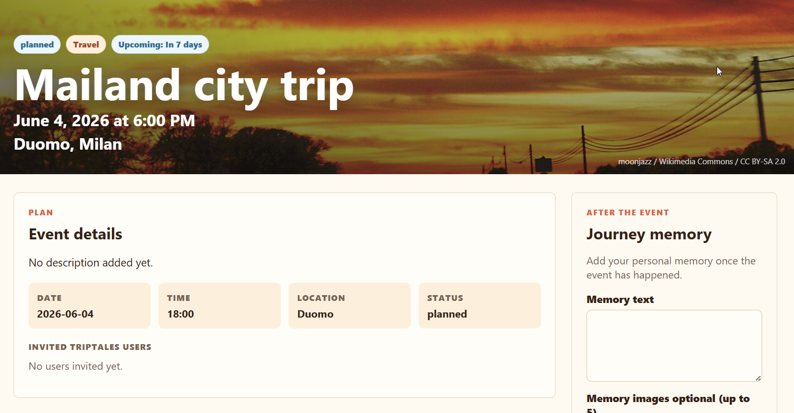
**Vorher (Konvertierungs-Flow):** Klick auf „Convert to event" → Server erstellt sofort ein Event mit stillen Defaults (Datum = heute+7, Time = 18:00, evtl. generisches Fallback-Bild). Die Idee verschwand aus der Liste, ohne dass der User die Werte je gesehen hatte; Cancel war nicht möglich.

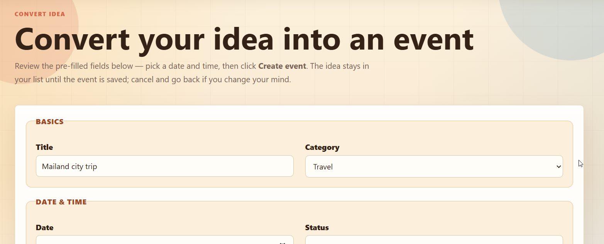
**Nachher (Konvertierungs-Flow):** „Convert to event" navigiert nun zu `/events/new?fromIdeaId=<id>`. Die EventForm ist mit den Idea-Werten vorbefüllt (Titel, Kategorie, Ort, Beschreibung); Datum und Time sind **leer** und müssen vom User selbst gewählt werden. Ein „Cancel — back to ideas"-Button führt zurück zu `/ideas`, die Idee bleibt unverändert. Erst beim erfolgreichen Speichern wird die Idea als konvertiert markiert.

**ISSUE-13 · Trip ↔ Journey-Beziehung im Concept-Guide** (Schweregrad 3, [#43](https://github.com/difrodar/traveljourneyapp/issues/43))

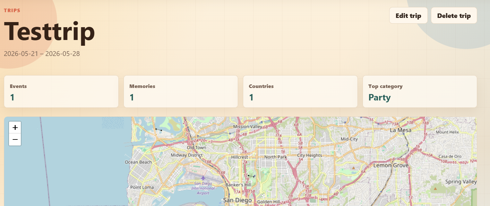
**Vorher (Trip-Detail):** Auf der Trip-Detail-Seite gab es keinen Concept-Guide; der Zusammenhang Trip ↔ Journey ↔ Memory musste durch Trial-and-Error erschlossen werden.

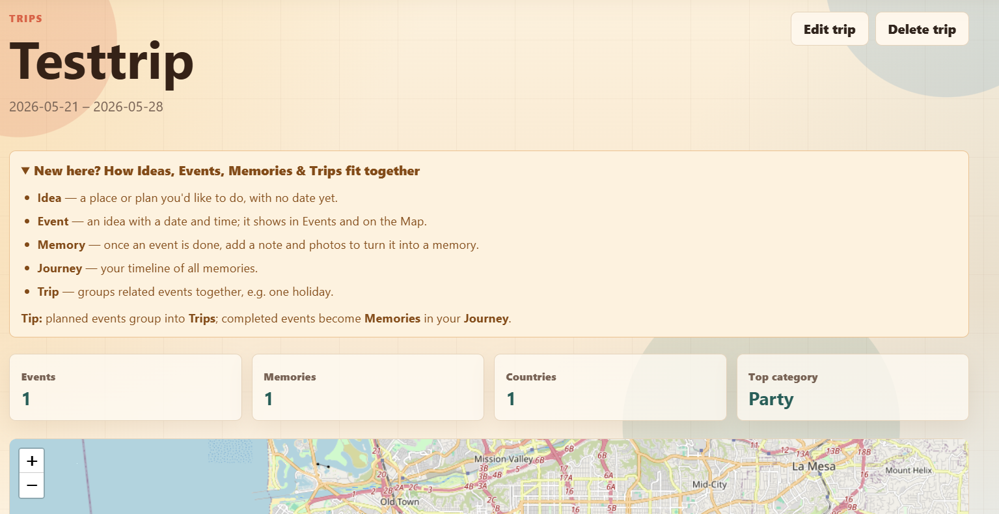
**Nachher (Trip-Detail):** Der bestehende Concept-Guide (aus ISSUE-09 / #39) wird nun auch oben auf der Trip-Detail-Seite eingebunden und um eine Tipp-Zeile ergänzt: „planned events group into Trips; completed events become Memories in your Journey." Dieselbe Zeile erscheint auch im Concept-Guide auf Journey und Ideas.

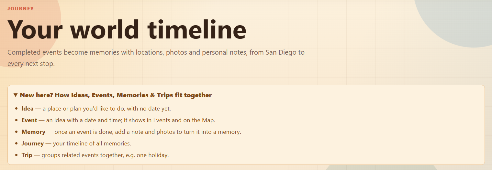
**Vorher (Journey):** Der Concept-Guide listete Idea / Event / Memory / Journey / Trip, erklärte aber nicht explizit die Trip ↔ Journey-Verbindung.

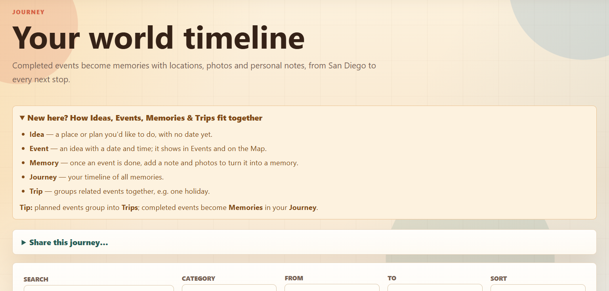
**Nachher (Journey):** Die neue Tipp-Zeile macht die Beziehung explizit; der gleiche Guide trägt sie auf jeder Seite, auf der er eingebunden ist.

**ISSUE-03 · Erstellen vs. Suchen/Filtern abgrenzen** (Schweregrad 2, [#33](https://github.com/difrodar/traveljourneyapp/issues/33))

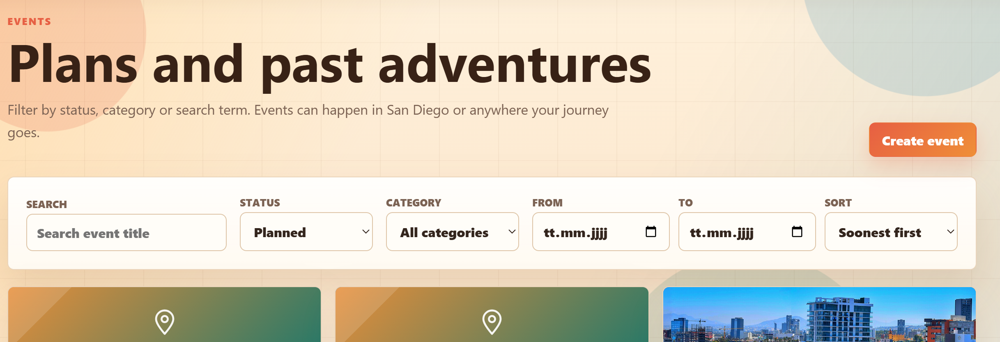
**Vorher:** Die unbeschriftete Filterleiste wurde mit dem Erstellen verwechselt.

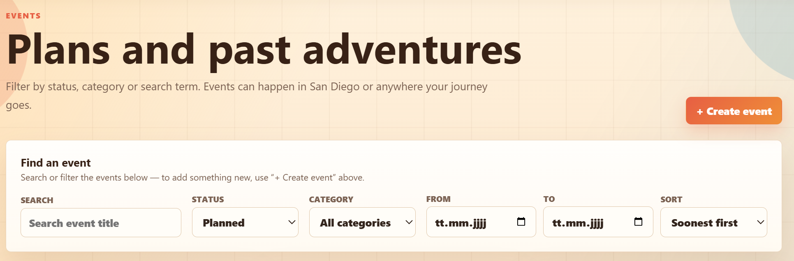
**Nachher:** Die Überschrift „Find an event" grenzt Suche/Filter ab, „+ Create event" ist als Primäraktion erkennbar.

**ISSUE-07 · Verständliches Label statt „Occurrences"** (Schweregrad 2, [#37](https://github.com/difrodar/traveljourneyapp/issues/37))

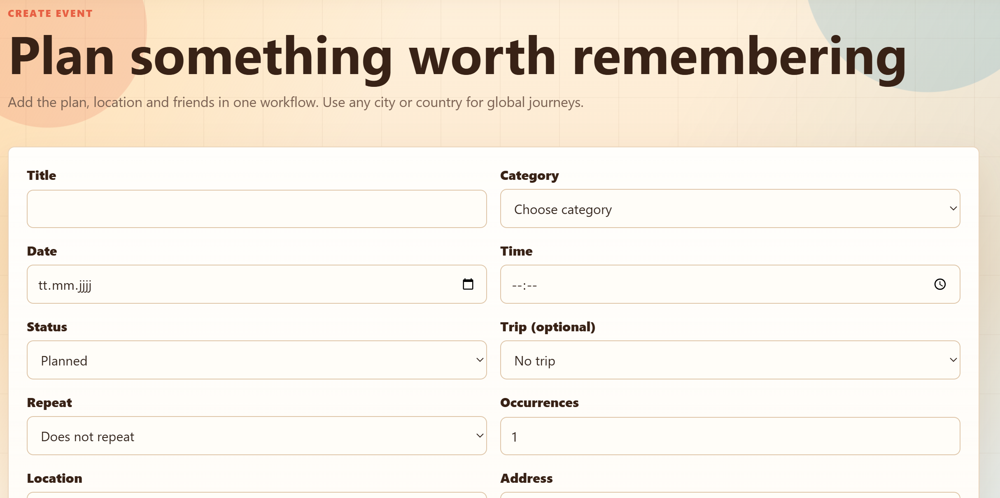
**Vorher:** Der Begriff „Occurrences" wurde missverstanden.

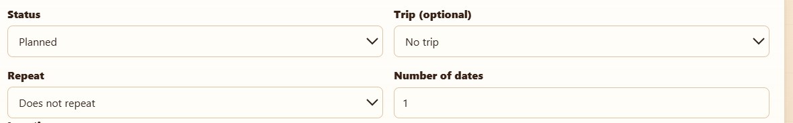
**Nachher:** Das Feld heißt jetzt „Number of dates".

**ISSUE-08 · Kategorie „Other" ergänzen** (Schweregrad 2, [#38](https://github.com/difrodar/traveljourneyapp/issues/38))

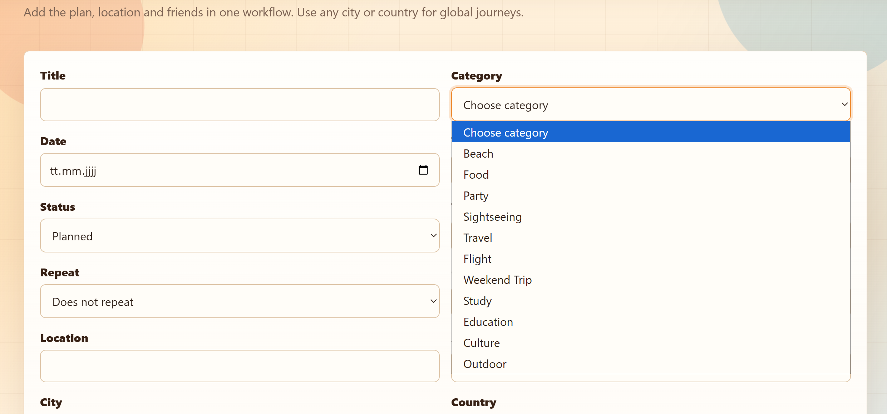
**Vorher:** Die Kategorien waren zu starr; nicht abgedeckte Fälle hatten keinen Platz.

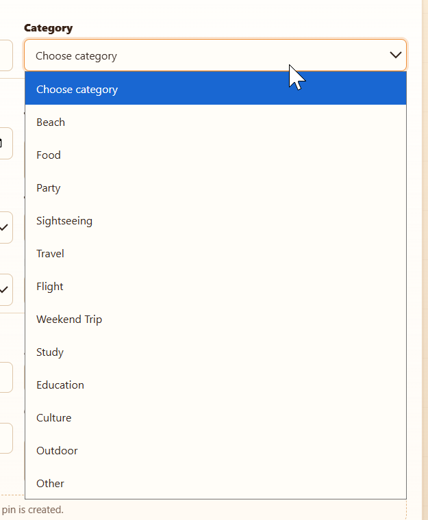
**Nachher:** Die Liste enthält jetzt „Other".

**ISSUE-01 · Login und Registrierung trennen** (Schweregrad 1, [#31](https://github.com/difrodar/traveljourneyapp/issues/31))

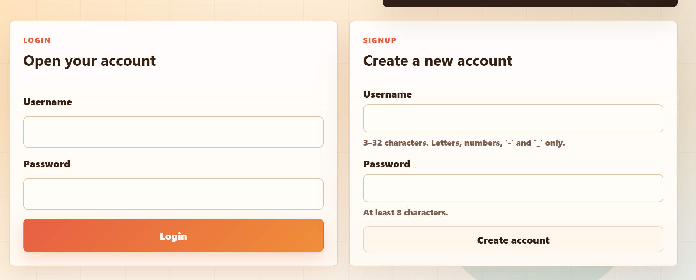
**Vorher:** Login und Registrierung wurden zunächst verwechselt.

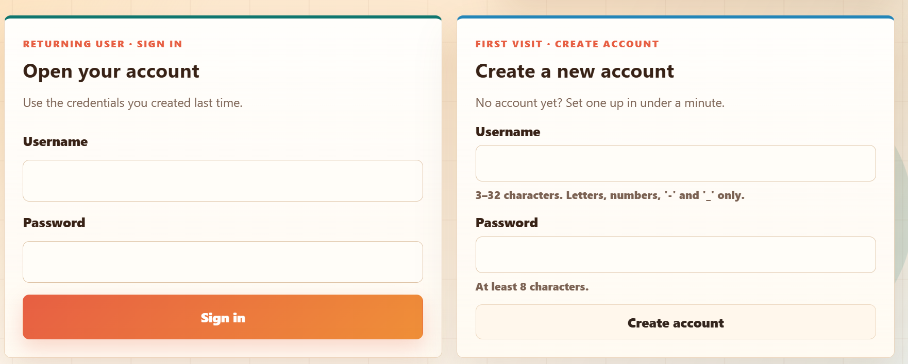
**Nachher:** Beide Bereiche sind visuell klar getrennt, der primäre CTA ist hervorgehoben.

**ISSUE-12 · Einladungsfeedback mit Status** (Schweregrad 1, [#42](https://github.com/difrodar/traveljourneyapp/issues/42))

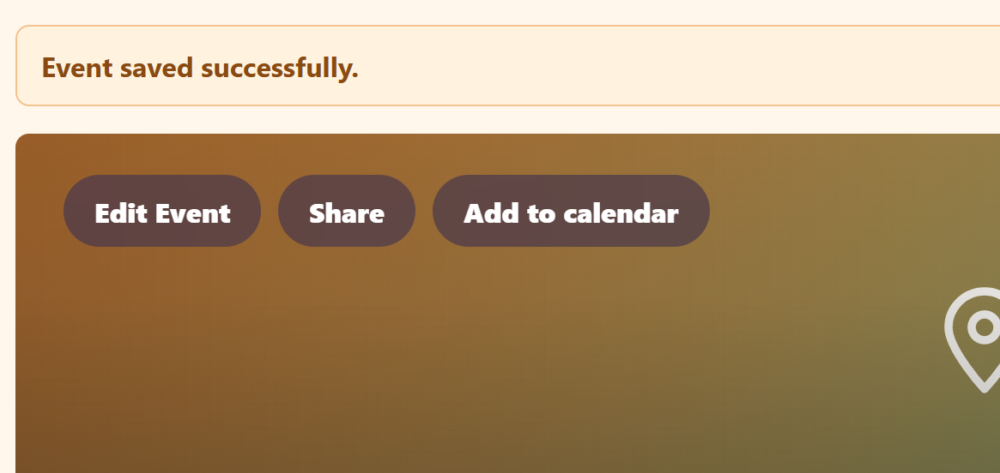
**Vorher:** Nach dem Einladen gab es keine Rückmeldung und keinen sichtbaren Status.

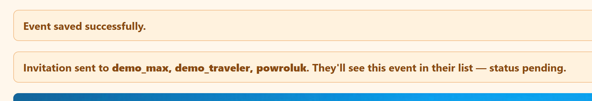
**Nachher (Banner):** Ein Banner bestätigt die Einladung mit Empfängernamen.

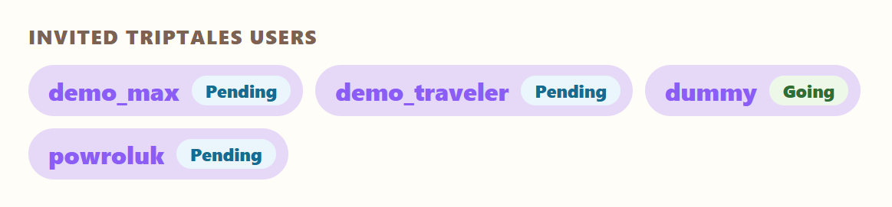
**Nachher (Status):** Die Eingeladenenliste zeigt pro Person den Status („Pending"/„Going").

**ISSUE-18 · Testdaten und Bilder bereinigt** (Schweregrad 2, [#48](https://github.com/difrodar/traveljourneyapp/issues/48)) — *ohne Bildpaar:* Die Seed-Daten wurden bereinigt und alle Bildreferenzen gegen echte, lizenzierte Wikimedia-Commons-Dateien validiert (u. a. Korrektur einer fehlerhaften Geisel-Library-Referenz). Als reine Datenbereinigung ohne aussagekräftigen visuellen Vergleich.

#### 3.5.2 Video-Walkthrough
Gemäss Aufgabenstellung wird ein kommentierter Walkthrough der Kernfunktionalität als separates Abgabeartefakt eingereicht.

- **Datei:** `Walkthrough.mp4` (separate Moodle-Abgabe, nicht im Repository)
- **Dauer:** ca. 8 Minuten
- **Sprache:** Deutsch
- **Inhalt:** Vollständige Demonstration der Workflows (Login/Registrierung, Event erstellen, Memory mit Foto, Idea, Einladung, Trip, Sharing, Journey/Map). Auf Vorgehen und Code wird gemäss Aufgabenstellung nicht eingegangen.

> **Wichtig — Stand-Differenz zur aktuellen Version:** Das Video wurde **bewusst vor** den Usability-Test-Fixes aufgezeichnet und zeigt damit den Stand des Branches `pre_usability`. Dadurch lassen sich die Verbesserungen direkt am Video-Stand ablesen: Die „Vorher"-Bilder in [§3.5.1](#351-vorher-nachher-belege) entsprechen genau dem Video-Inhalt, die „Nachher"-Bilder dokumentieren die aktuelle Version. Alle 18 Issues aus dem Usability-Test sind in der aktuellen Version umgesetzt — die Tabelle in [§3.5](#35-validate) ist die kanonische Übersicht, die Bildpaare in §3.5.1 belegen jeden einzelnen Fix.

## 4. Erweiterungen [Optional]
Dokumentiert Erweiterungen über den Mindestumfang hinaus.
> **Hinweis:** Jede Erweiterung ist separat nach dem folgenden Schema zu beschreiben.

### 4.1 Reiseideen in Events umwandeln
- **Beschreibung & Nutzen:** Ideen können gespeichert, priorisiert und später in konkrete Events umgewandelt werden. Das unterstützt spontane Reiseplanung.
- **Wo umgesetzt:** Frontend und Actions in `/ideas`, Datenbank-Collection `travelIdeas`, Conversion über serverseitige Repository-Funktion.
- **Referenz:** Siehe `/ideas` und Abschnitt 3.4.2.
- **Aus Evaluation abgeleitet?:** Nein, initiale Erweiterung aus Projektidee.
- **Screenshot:**

  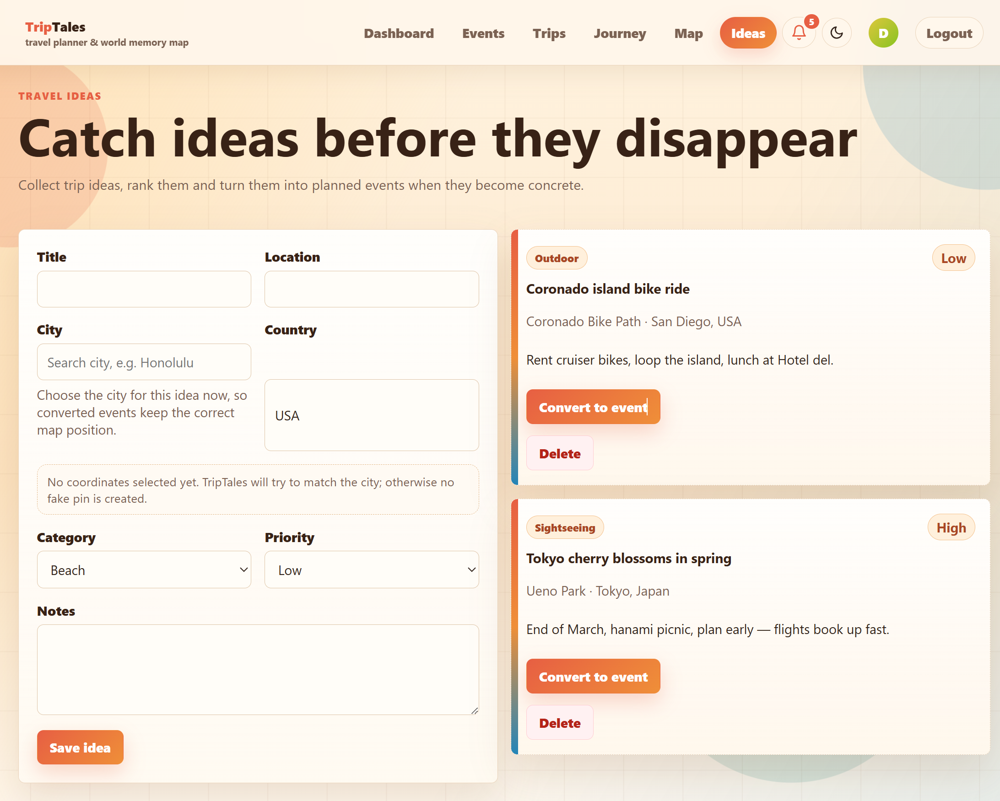
  **Travel-Ideas mit Convert-to-Event.** Spontane Reiseideen werden mit Titel, Stadt, Kategorie, Priorität und Notizen gespeichert. Wenn die Idee konkret wird, übernimmt „Convert to event" alle bekannten Felder ins Event-Formular — nur das Datum muss noch ergänzt werden.

### 4.2 OpenStreetMap mit Pinpoint-Fallback
- **Beschreibung & Nutzen:** Locations werden auf einer interaktiven Leaflet/OpenStreetMap-Karte angezeigt. Zusätzlich bleibt die Seite über eine gruppierte Pinpoint-/Event-Liste nutzbar. Die Map ist nach Land, Stadt, konkretem Ort und zugehörigen Events strukturiert.
- **Wo umgesetzt:** `LeafletMapView`, `LocationPinGrid` und `EventMapPanel`, Daten aus `locations` und den verknüpften `events`.
- **Referenz:** Siehe `/map`.
- **Aus Evaluation abgeleitet?:** Nein, technische Absicherung für stabilen Prototyp.
- **Screenshots:**

  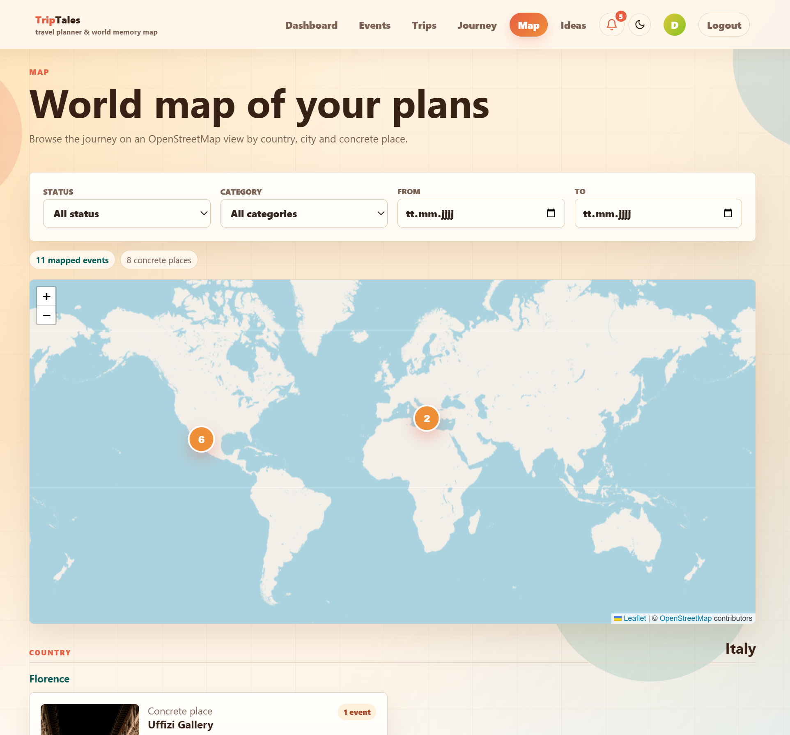
  **Karte mit Markern und Filtern.** Die Leaflet-Karte zeigt alle Orte mit Koordinaten als Pins; bei vielen Pins bündelt die App sie automatisch zu Clustern. Filter für Status, Kategorie und Datumsbereich wirken gleichzeitig auf Marker und Liste.

  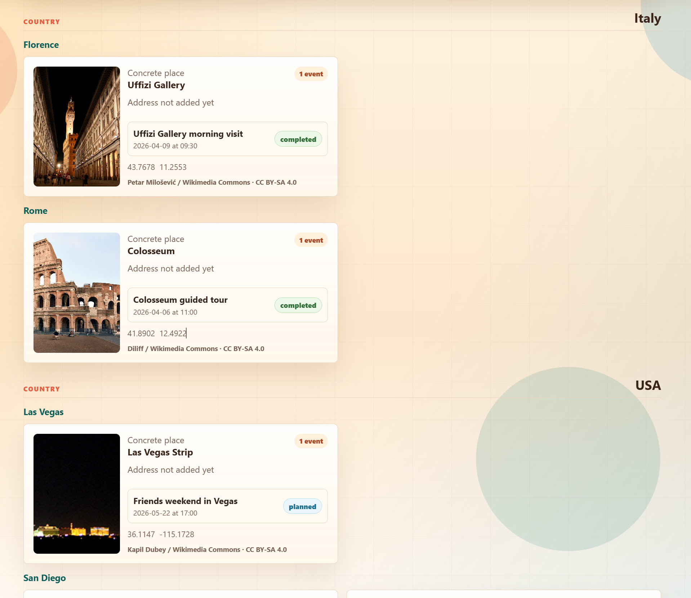
  **Pinpoint-Fallback-Liste.** Direkt unter der Karte zeigt eine hierarchische Liste alle Orte nach Land → Stadt → konkretem Ort gruppiert, jeweils mit Foto, Koordinaten und verknüpften Events. So bleibt die Seite auch dann navigierbar, wenn Kartenkacheln nicht laden.

### 4.3 Share-/Insta-Preview
- **Beschreibung & Nutzen:** Event- und Journey-Daten werden als prototypische Social-Preview visualisiert. Die Vorschau lässt sich zwischen drei Format-Varianten umschalten — Postcard (4∶5), Story (9∶16) und Square (1∶1) — passend zu den gängigen Social-Surfaces. Über einen „Share story"-Button wird ein vorbereiteter Teilen-Text via Web Share API ausgespielt; ohne native Share-Unterstützung fällt der Button auf Clipboard-Kopie zurück. Zusätzlich kann eine schreibgeschützte öffentliche Link-Variante der Journey via `/share/[hash]` geteilt werden — ohne Account-Zugriff für Empfänger:innen. Beim Erstellen wählt man optional einen einzelnen Trip als Scope, sodass z. B. nur die Italien-Erinnerungen sichtbar werden statt der gesamten Journey.
- **Wo umgesetzt:** `SharePreview` auf der Event-Detailseite, der Format-Toggle und der Share-Button leben innerhalb derselben Komponente; der reine Teilen-Text wird über `buildShareText` in `src/lib/utils/event-format.js` deterministisch erzeugt. Öffentliche Share-Links: `src/lib/server/repositories/shares.js`, Route `src/routes/share/[hash]`, Verwaltung auf `/profile` (Trip-Label pro Share), Erstellung auf `/journey` mit Picker für Whole-Journey oder Trip-Scope (Ablauf optional 1/7/14/30 Tage oder nie).
- **Sicherheits-Hinweis:** Die öffentliche Route umgeht bewusst die `userId`-Bindung. Repo-Helfer `getPublicJourneyForShare` filtert über eine Whitelist und entfernt Owner-IDs, Friend-Listen und Invitation-Daten. Bei Trip-Scope wird zusätzlich nach `tripId` gefiltert, sodass nur Memories aus diesem Trip ausgespielt werden. Hashes sind 32 Hex-Zeichen (16 Random-Bytes via `crypto.randomBytes`), Rate-Limit 10 Shares/User/Tag, Widerrufung ist sofort wirksam. Beim Löschen eines Trips werden alle aktiven Trip-Shares automatisch widerrufen. Antworten setzen `Cache-Control: private, no-store`, `Referrer-Policy: no-referrer` und `X-Robots-Tag: noindex`.
- **Referenz:** Siehe `/events/[id]`, `/journey`, `/profile` und `/share/[hash]`.
- **Aus Evaluation abgeleitet?:** Teilweise — die Grundidee stammt aus einem internen UX-Audit (B5); der zentrale Sharing-Bereich, die Scope-Vorschau und der 14-Tage-Ablauf wurden direkt aus dem Usability-Test abgeleitet (Issues #44, #45, #46, #47).
- **Screenshots:**

  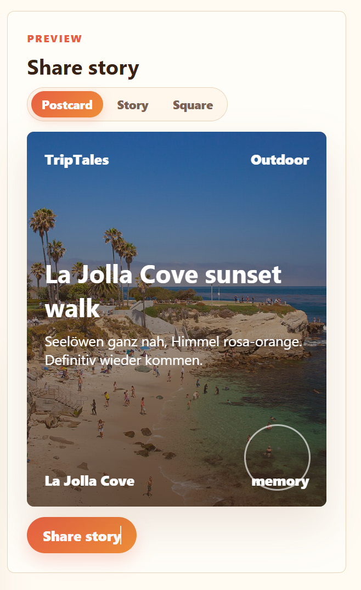
  **Share-Preview — Postcard-Format (4:5).** Die Vorschau zeigt das gewählte Event als Karten-Snapshot mit Cover-Bild, Titel, Memory-Auszug, Ort und Kategorie-Badge. Über den Format-Toggle oben lässt sich live zwischen Postcard, Story und Square umschalten.

  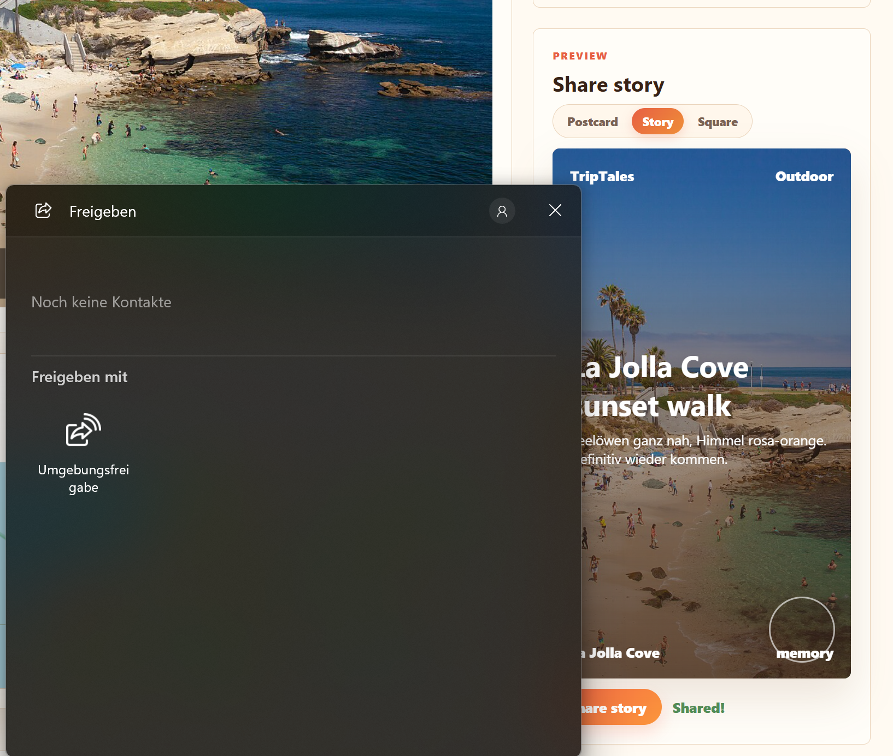
  **Share-Preview — Story-Format (9:16) mit nativem Teilen-Dialog.** Im Hochkant-Format passt sich das Layout an Instagram-/Stories-Proportionen an. Ein Klick auf „Share story" ruft die native Web-Share-API auf (im Bild: Windows-Freigeben-Dialog); Browser ohne Web-Share-Unterstützung kopieren stattdessen den vorbereiteten Text in die Zwischenablage.

### 4.4 Bildwelt für Events und Orte
- **Beschreibung & Nutzen:** Event-, Journey- und Location-Cards zeigen passende Bilder, damit Aktivitäten wie “Balboa Park Museum Day” sofort visuell erkennbar sind.
- **Wo umgesetzt:** Media-Katalog in `src/lib/media.js`, Bildanzeige in Event-, Journey-, Detail-, Share- und Map-/Pinpoint-Komponenten; optionale Upload-Felder im Event- und Memory-Formular.
- **Referenz:** Siehe `/`, `/events`, `/events/[id]`, `/journey` und `/map`.
- **Aus Evaluation abgeleitet?:** Nein, aus Design-Review abgeleitet.

### 4.5 Login und private Accounts
- **Beschreibung & Nutzen:** Nutzerinnen und Nutzer müssen sich einloggen oder registrieren, bevor sie die App verwenden können. Events, Ideen, Freunde, Orte und Erinnerungen sind pro Account getrennt, damit mehrere Personen denselben Prototyp nutzen können, ohne gegenseitig Daten zu sehen.
- **Wo umgesetzt:** `/login`, `src/hooks.server.js`, `src/lib/server/auth.js`, Session-Cookie, MongoDB-Collections `users` und `sessions`, sowie `userId`-Filter im Repository.
- **Referenz:** Siehe `/login` und Abschnitt 3.4.2.
- **Aus Evaluation abgeleitet?:** Nein, Erweiterung zur besseren Datenabgrenzung und realistischeren Nutzung.

### 4.6 Bild-Uploads für Events und Memories
- **Beschreibung & Nutzen:** Beim Erstellen oder Bearbeiten eines Events können bis zu 5 eigene Cover-Bilder hochgeladen werden. Beim Speichern einer Journey Memory können ebenfalls bis zu 5 persönliche Memory-Bilder ergänzt werden. Einzelne Bilder lassen sich bestehender Sets gezielt entfernen; sind alle Bilder weg, werden die automatischen Fallback-Bilder wieder sichtbar. Cards mit mehreren Bildern zeigen einen kleinen Indikator; auf der Eventseite wird unter dem Hero ein horizontaler Swipe-Streifen mit allen Bildern dargestellt.
- **Wo umgesetzt:** Multipart-Forms in `EventForm` und `MemoryForm`, serverseitige Upload-Prüfung in `uploadedImagesFields` (`src/lib/server/repositories/shared.js`), Speicherung als `images: [{ url, alt, credit?, license?, sourceUrl? }]` in `events` beziehungsweise `journeyEntries`. Erlaubt sind JPG, PNG, WebP und GIF; pro Bild maximal 2 MB, pro Event/Memory maximal 5 Bilder mit insgesamt 9 MB. Eine idempotente Migration `npm run normalize:multi-image` überführt bestehende Einzelbild-Felder in den neuen Aufbau. Ungültige Uploads werden verständlich am betroffenen Formularbereich gemeldet.
- **Referenz:** Siehe `/events/new` und `/events/[id]`.
- **Aus Evaluation abgeleitet?:** Nein, Erweiterung zur persönlicheren Dokumentation von Reiseerlebnissen.

### 4.7 Profile-Page
- **Beschreibung & Nutzen:** Die Profile-Page bietet einen ruhigen Überblick über den eingeloggten Account, einfache Kennzahlen und direkte Einstiege in bestehende Workflows. Sie macht private Accounts sichtbarer, ohne komplexe Account-Verwaltung einzuführen.
- **Wo umgesetzt:** `/profile` mit serverseitigem Load aus bestehenden Events, Locations und Travel Ideas; Navigation über die klickbare User-Pill.
- **Referenz:** Siehe `/profile` und Abschnitt 3.4.2.
- **Aus Evaluation abgeleitet?:** Nein, Umsetzung von GitHub Issue #2 als optionale Erweiterung.
- **Screenshots:**

  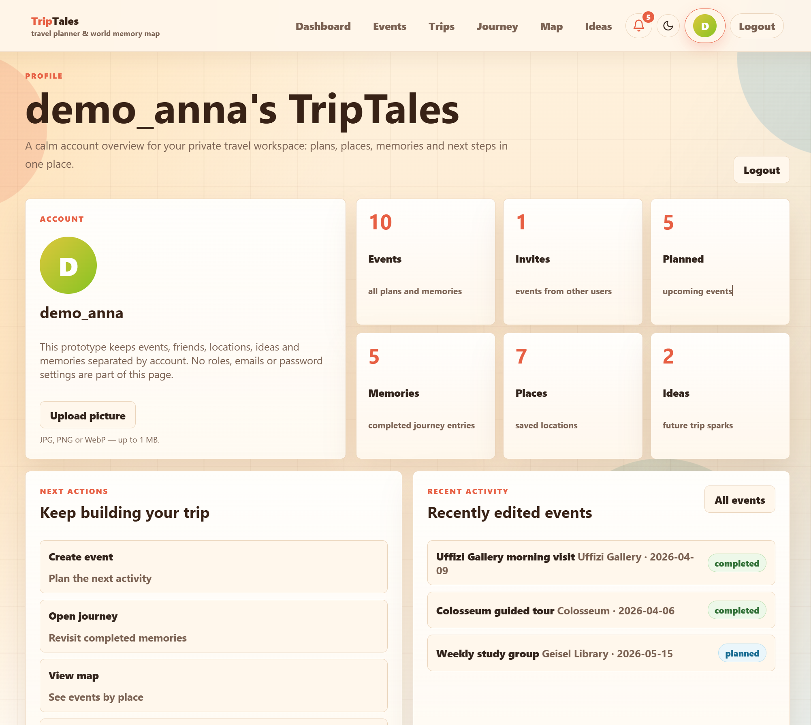
  **Profile — Account und Stats-Grid.** Oben Account-Karte mit Avatar, Username und optionalem Avatar-Upload. Daneben sechs Kennzahlen-Kacheln (Events, Invites, Planned, Memories, Places, Ideas) als ruhige Reise-Statistik.

  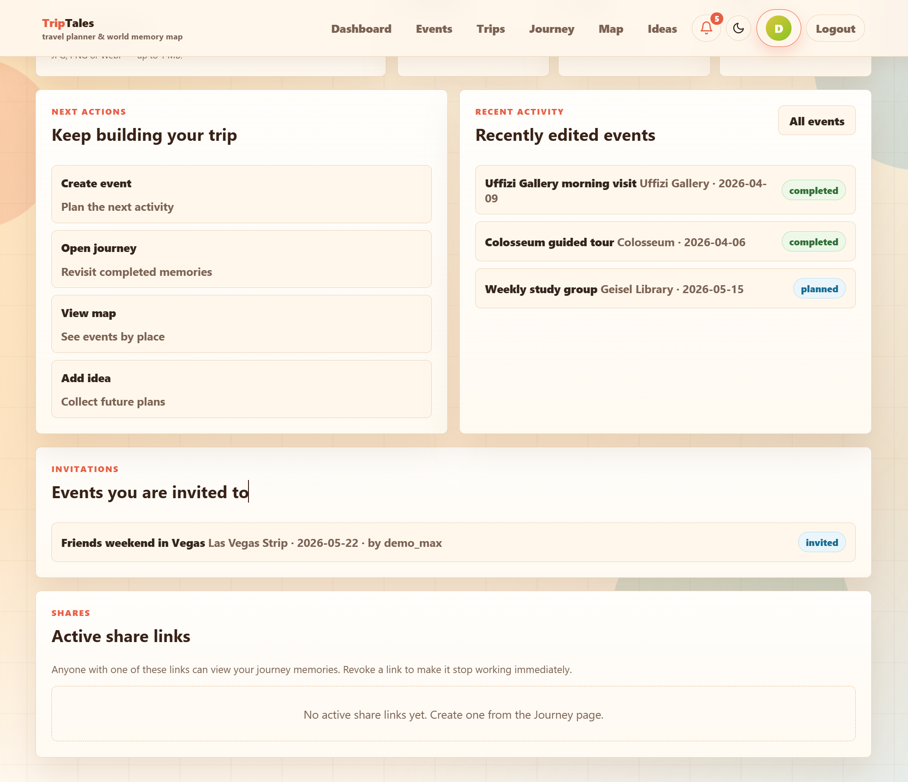
  **Profile — Quick Actions, Activity und Einladungen.** Direkt-Links zu „Create event", „Open journey", „View map" und „Add idea", daneben die zuletzt bearbeiteten Events. Darunter Sektionen „Events you are invited to" und „Active share links" zur Verwaltung von Einladungen und öffentlichen Journey-Links.

### 4.8 Friend Management über Login-User
- **Beschreibung & Nutzen:** Events können nur noch echte TripTales-Accounts einladen. Dadurch entstehen keine Freitext-Friends oder unechten Demo-Personen mehr, und Einladungen bleiben technisch nachvollziehbar. Eingeladene Accounts sehen diese Events in `/events` und auf dem Dashboard mit Status `invited`, können die Detailseite öffnen und die Einladung annehmen oder ablehnen. Angenommene Einladungen bleiben als `accepted` sichtbar; abgelehnte Einladungen entfernen den User aus dem Event. Sobald ein angenommenes Event abgeschlossen ist, kann der eingeladene User eine eigene Journey Memory speichern.
- **Wo umgesetzt:** Event-Formular mit User-Auswahl, serverseitige Validierung gegen `users`, Event-Felder `invitedUserIds` und `invitations`, Event-Liste und Profile-Sektion für eingeladene Events; Legacy-Friends können mit `npm run cleanup:legacy-friends` non-destruktiv entfernt werden.
- **Referenz:** Siehe `/events/new`, `/events/[id]`, `/profile` und Abschnitt 3.4.2.
- **Aus Evaluation abgeleitet?:** Nein, Umsetzung von GitHub Issue #3 zur besseren Datenqualität.
- **Screenshots:**

  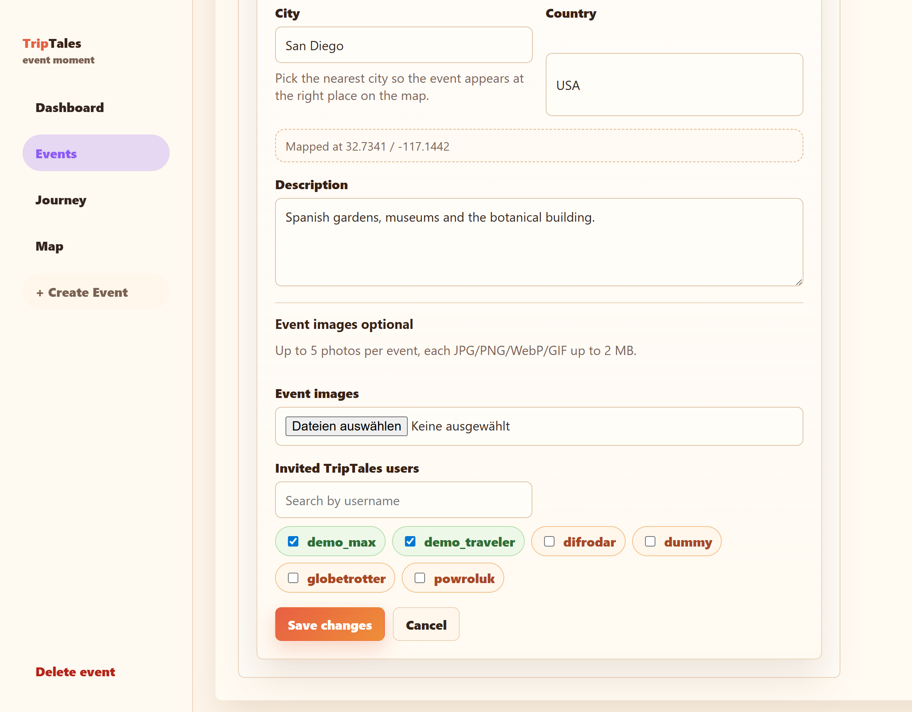
  **Friend-Picker im Event-Formular.** Nur echte TripTales-Accounts können eingeladen werden — die Picker-Komponente filtert nach Username ab dem ersten Buchstaben. Eingeladene User erhalten die Einladung sichtbar in ihrer eigenen Event-Liste mit Status „invited".

  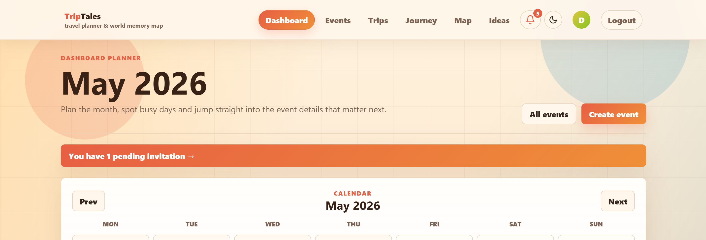
  **Pending-Invitations-Streifen.** Sobald eine offene Einladung vorhanden ist, erscheint oben auf dem Dashboard ein orangener Hinweisstreifen „You have 1 pending invitation →". Ein Klick öffnet die gefilterte Event-Liste, wo Akzeptieren oder Ablehnen erfolgt.

### 4.9 Wiederkehrende Events
- **Beschreibung & Nutzen:** Wiederkehrende Events unterstützen regelmässige Termine wie Lectures oder Studienwochen. Nutzerinnen und Nutzer wählen beim Erstellen eine Wiederholfrequenz (`daily`, `weekly`, `monthly`) und die Anzahl der Termine bis maximal 52. Die App erzeugt daraus normale Einzel-Events, sodass Kalender, Event-Liste, Map, Einladungen und einzelne Bearbeitung stabil bleiben. In der Journey werden gespeicherte Memories derselben Serie gebündelt, damit die Timeline nicht mit fast identischen Karten überfüllt wird.
- **Wo umgesetzt:** `EventForm`, `/events/new`, `/events/[id]`, Repository-Funktionen für Event-Erstellung, Serien-Metadaten und Serienlöschung, `JourneyCard` und Journey-Gruppierung.
- **Referenz:** Siehe `/events/new`, `/events/[id]`, `/journey` und Abschnitt 3.4.2.
- **Aus Evaluation abgeleitet?:** Nein, Umsetzung von GitHub Issue #12.

### 4.10 Trips
- **Beschreibung & Nutzen:** Events können optional zu einer Trip-Entität gruppiert werden (z. B. „Italien April 2026"). Trips bündeln mehrtägige Reisen mit eigenem Header, Datumsbereich, Mini-Map, Statistik und Event-Liste. Marcos mehrtägige Reise (Secondary-Persona, siehe [`docs/personas.md`](docs/personas.md)) wird damit zu einer geschlossenen Storytelling-Einheit, statt über mehrere Monatsüberschriften verteilt zu sein. Events ohne `tripId` verhalten sich unverändert — die Funktion ist rein opt-in.
- **Wo umgesetzt:** Datenmodell + Repo in `src/lib/server/repositories/trips.js`; Routen `/trips` (Liste + Anlegen) und `/trips/[id]` (Detail mit Mini-Map, Stats und Event-Verwaltung); Trip-Auswahl als Dropdown im `EventForm.svelte`; Toggle „By month / By trip" auf `/journey` und passender Gruppierungs-Helper `getJourneyTripGroups`.
- **Migrationspfad:** `npm run migrate:trips` legt Indexe für `trips` und einen sparse Index `events.tripId` an. Schema ist rein additiv — bestehende Events ohne `tripId` bleiben funktional unverändert. Beim Löschen eines Trips wird `tripId` von allen zugeordneten Events entfernt; die Events selbst bleiben erhalten.
- **Referenz:** Siehe `/trips`, `/trips/[id]`, `/journey?groupBy=trip` und `/events/new` (Trip-Auswahl).
- **Aus Evaluation abgeleitet?:** Nein, Erweiterung mit erkennbarem Storytelling-Mehrwert (UX-Audit B1).
- **Screenshots:**

  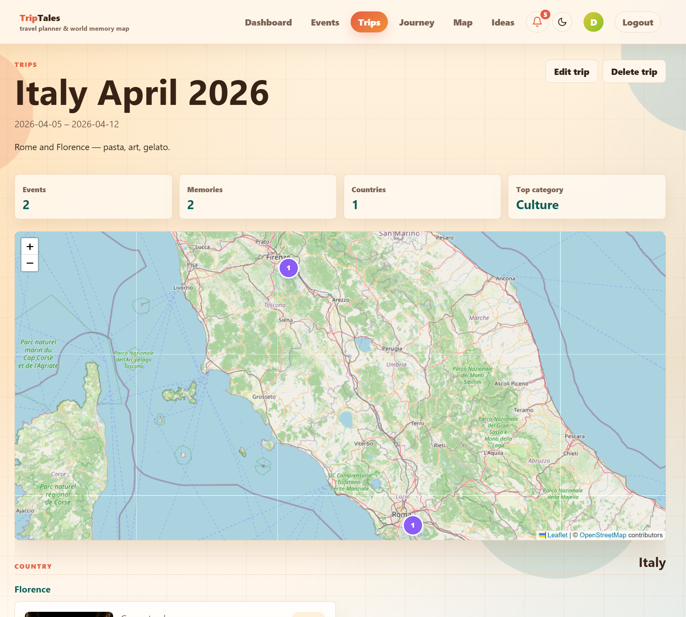
  **Trip-Detail — Header, Statistik und Mini-Map.** Die Trip-Detailseite („Italy April 2026") zeigt Datumsbereich, Beschreibung sowie eine Statistik-Reihe (Events, Memories, besuchte Länder, Top-Kategorie). Direkt darunter eine kompakte Karte aller Orte der Reise.

  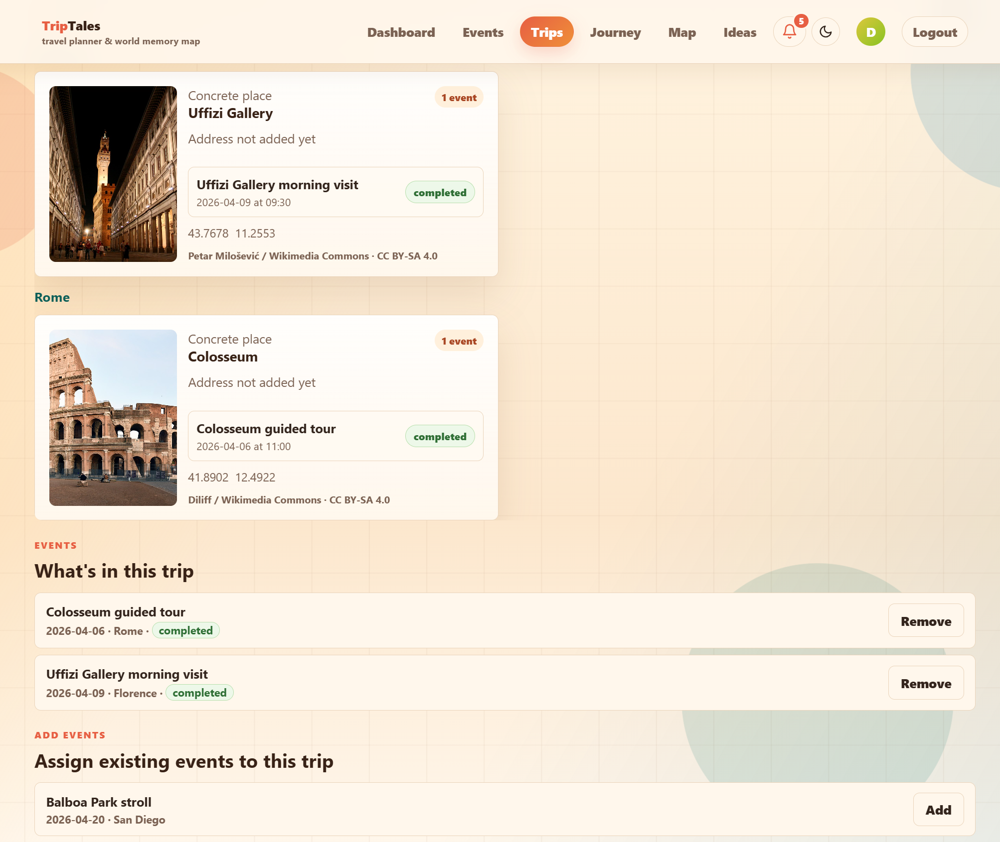
  **Trip-Detail — Event-Karten und Event-Zuordnung.** Unter der Karte werden alle Orte der Reise als Pinpoint-Cards angezeigt. Die Sektion „What's in this trip" listet alle zugeordneten Events mit Status und Datum; „Assign existing events to this trip" erlaubt das nachträgliche Anhängen weiterer Events.

  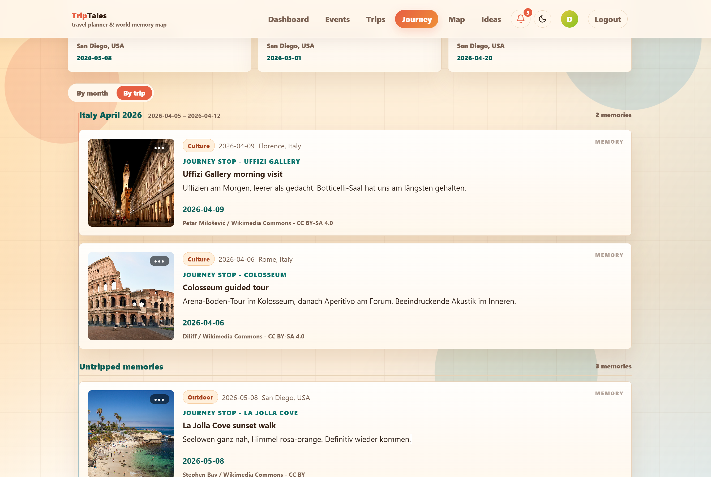
  **Journey gruppiert nach Trip.** Mit dem Toggle „By trip" erscheint die ganze Reise als ein zusammenhängender Block statt verstreut über mehrere Monatsüberschriften — macht längere Reisen erzählerisch runder.

### 4.11 Dark Mode
- **Beschreibung & Nutzen:** Eingeloggte Nutzerinnen und Nutzer können in der Navigation jederzeit zwischen einem hellen Warm-Travel-Look und einem dunklen Modus umschalten. Dark Mode verbessert die Lesbarkeit in dunklen Umgebungen, schont OLED-Displays und folgt der Erwartung an moderne Apps. Die Auswahl wird pro Account in MongoDB gespeichert und ist damit gerätübergreifend verfügbar; neue Accounts starten standardmässig im hellen Modus. Login-Seite und öffentliche Share-Links bleiben bewusst hell, da sie für nicht eingeloggte Besucher:innen einen konsistenten Markenauftritt zeigen sollen.
- **Wo umgesetzt:** Erweiterung der globalen Design-Tokens in `src/app.css` um eine Dark-Palette unter `:root[data-theme="dark"]`; `data-theme`-Attribut am `<html>`-Element in `src/app.html` und serverseitige Injektion ohne Flash via `transformPageChunk` in `src/hooks.server.js`. Persistenz über das neue Feld `themePreference` in der `users`-Collection (`src/lib/server/auth.js`) und einen POST-Endpoint `/api/theme` (`src/routes/api/theme/+server.js`). Toggle-Komponente `ThemeToggle.svelte` mit Sonne/Mond-Icon, in `Navigation.svelte` zwischen NotificationBell und Profile-Link platziert. Hartcodierte Farben in Komponenten und Routen wurden auf semantische Tokens (`--ink`, `--panel`, `--surface-raised`, `--status-completed-bg`, `--category-fg`, …) migriert. Die Leaflet-Karte in `LeafletMapView.svelte` wechselt im dunklen Modus auf den CARTO-Dark-Matter-Tile-Layer und beobachtet `data-theme` per `MutationObserver`, damit Kartenkacheln beim Umschalten ohne Reload mitwechseln.
- **Migrationspfad:** Schema-Änderung ist rein additiv — bestehende User-Dokumente ohne `themePreference` werden über `publicUser` als `"light"` interpretiert. Kein Migrations-Skript notwendig.
- **Referenz:** Siehe Toggle in der Navigation auf allen geschützten Routen, sowie Abschnitt 3.4.2.
- **Aus Evaluation abgeleitet?:** Nein, Umsetzung als Usability-/Accessibility-Erweiterung.
- **Screenshots:**

  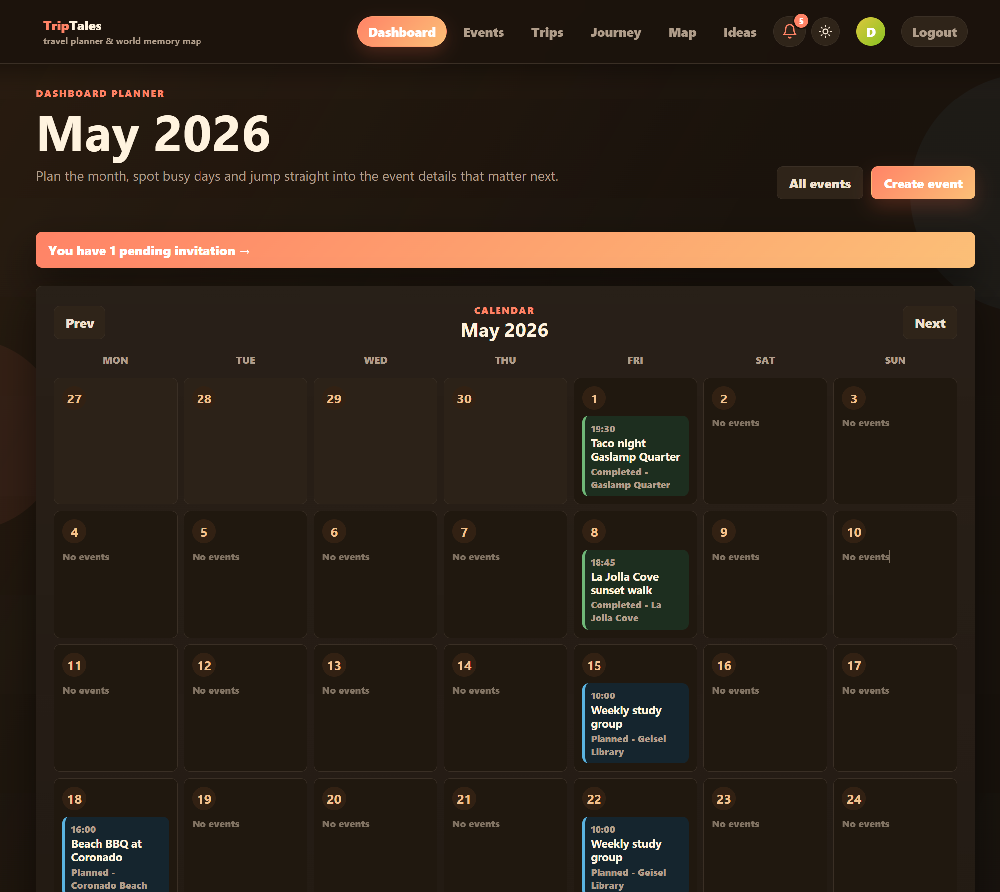
  **Dark Mode — Dashboard.** Identisches Layout wie im hellen Modus, aber mit dunklen Surface-Tokens. Sämtliche Farben (Buttons, Badges, Cards, Status-Indikatoren) wechseln gemeinsam — keine hartcodierten Farbreste.

  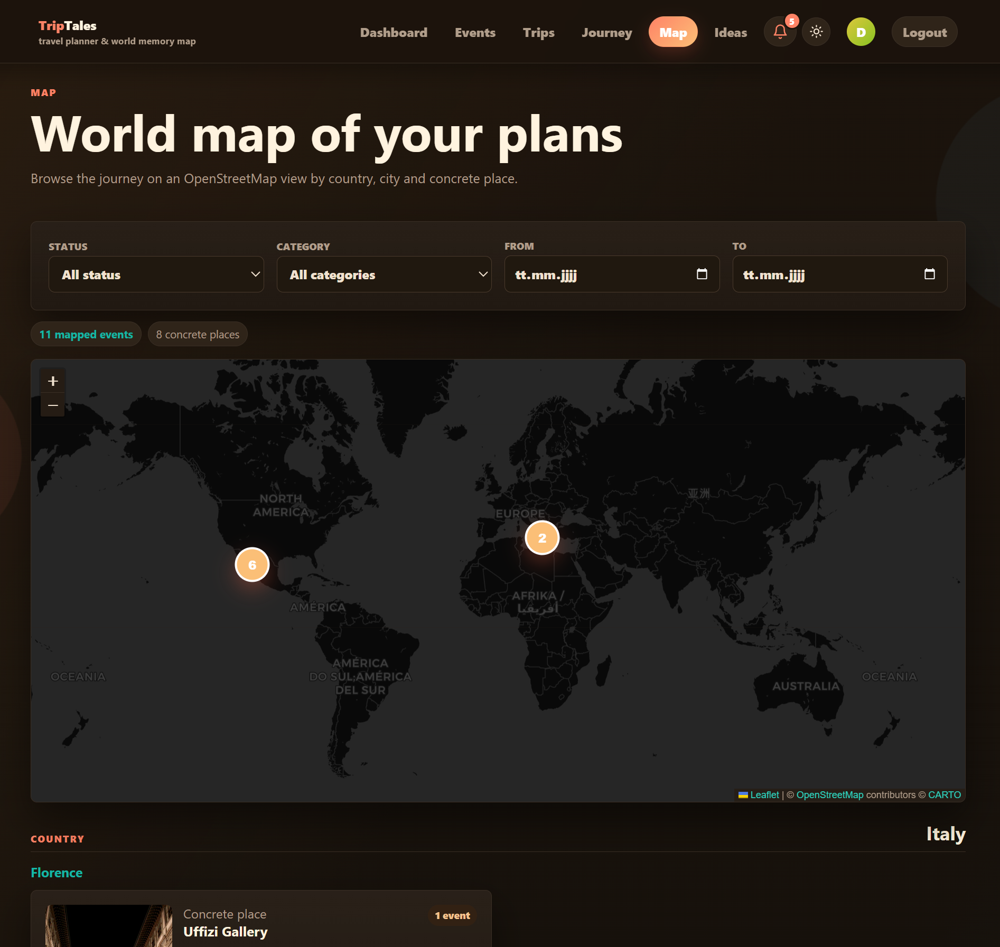
  **Dark Mode — Karte mit CARTO-Dark-Matter-Layer.** Auch die Leaflet-Kacheln wechseln zu einem dunklen Layer (CARTO Dark Matter). Ein `MutationObserver` beobachtet das `data-theme`-Attribut am `<html>`-Element und tauscht den Tile-Layer ohne Reload.

### 4.12 In-App-Reminder mit konfigurierbarer Lead-Time
- **Beschreibung & Nutzen:** Pro Event lässt sich eine Erinnerungs-Vorlaufzeit wählen (No reminder, 1 Stunde, 3 Stunden, 12 Stunden, 1 Tag, 1 Woche vorher). Sobald das Vorlauffenster beginnt und das Event noch nicht gestartet ist, erscheint der Termin in der Notification-Glocke unter „Reminders due" mit dynamischem Countdown („in 30 minutes", „in 2 hours", „in 3 days"); zusätzlich zeigt die Event-Detailseite eine Reminder-Zeile sowie ein „Coming up"-Banner. Das ersetzt den früheren, hartcodierten 7-Tage-Block durch eine echte Opt-in-Nutzerwahl — eine native Erinnerung innerhalb von TripTales, unabhängig vom `.ics`-Kalender-Export.
- **Wo umgesetzt:** Lead-Time-Presets in `src/lib/constants.js` (`reminderLeadOptions`, `reminderLeadHoursAllowed`), neues Feld `reminderLeadHours` am Event-Dokument mit serverseitiger Whitelist-Validierung (`src/lib/server/repositories/events.js`), Auswahl im `EventForm.svelte`, dritte Sektion „Reminders due" in `NotificationBell.svelte`, Reminder-Zeile und „Coming up"-Banner in `/events/[id]`.
- **Referenz:** Siehe `/events/new`, `/events/[id]` und die Notification-Glocke; Vorher-/Nachher-Belege in [§3.5.1](#351-vorher-nachher-belege) (ISSUE-06).
- **Aus Evaluation abgeleitet?:** Ja — direkt aus dem Usability-Test (Issue #36, Schweregrad 3): Die Reminder-Funktion war zuvor mehrdeutig zwischen In-App-Erinnerung und `.ics`-Export und für eine Testperson gar nicht auffindbar.

## 5. Projektorganisation [Optional]
Die Stadt- und Koordinatenauswahl wurde als lokale `CityCombobox` umgesetzt. Sie nutzt eine kuratierte globale Staedte-Liste mit leichtem USA-/San-Diego-Ranking, speichert `city`, `country`, `lat` und `lng` und verhindert falsche Fallback-Pins, indem unbekannte Orte ohne Koordinaten nicht als Kartenmarker erscheinen.
Beispiele:
- **Repository & Struktur:** GitHub Repository mit SvelteKit-Standardstruktur. Wichtige Bereiche: `src/routes` für Pages inklusive `/login` und `/profile`, `src/hooks.server.js` für den Zugriffsschutz, `src/lib/components` für UI, `src/lib/server` für MongoDB-Zugriff und Authentifizierung, `scripts/seed.js` für Seed-Daten, `scripts/upsert-sample-events.js` für non-destruktive Beispiel-Daten, `scripts/cleanup-legacy-friends.js` für die Entfernung alter Freitext-Friends und `scripts/normalize-converted-idea-media.js` für die sichere Korrektur bereits konvertierter Idea-Events.
- **NPM-Scripts:** `npm run dev` startet den lokalen Server, `npm run build` erzeugt das Produktions-Build, `npm run smoke` prüft die zentralen Workflows (Login, Event erstellen, Memory speichern, Journey, Löschen) gegen einen lokalen Dev-Server, `npm run seed` legt Demo-Daten an, `npm run upsert:samples` ergänzt Beispiel-Events non-destruktiv, `npm run normalize:idea-media` korrigiert konvertierte Reiseideen, `npm run normalize:city-coordinates` ergänzt fehlende Koordinaten, `npm run cleanup:legacy-friends` entfernt alte Freitext-Friends und `npm run cleanup:journey-ratings` entfernt nicht mehr genutzte Journey-Ratings.
- **Issue-Management:** Zwei Phasen sind im Repo sichtbar.
  - **Anfangsphase — strukturierte Plan-Issues** für Architektur und Kernworkflows: GitHub Issue #2 wurde als kleine Profile-Page umgesetzt; GitHub Issue #3 stellt Friend Management auf echte Login-User um; GitHub Issue #12 ergänzt wiederkehrende Events inklusive `Education`-Kategorie, Journey-Bündelung und Serienlöschung. Weitere Plan-Themen: Setup, MongoDB Data Layer, Auth/Login, Event Workflow, Journey, Map, Ideas, Profile, README, Deployment, Validate.
  - **Validate-Phase — Usability-Test-Befunde:** Nach dem moderierten Usability-Test wurden alle 18 Befunde als eigenständige GitHub-Issues #31–#48 angelegt (Label [`usability-test`](https://github.com/difrodar/traveljourneyapp/issues?q=label%3Ausability-test)); jedes Issue mit Schweregrad, Aufgabenbezug, Originalzitaten der Testpersonen und Empfehlung. Die Umsetzung erfolgte in vier Batches (klein → gross): Batch 1 #43, Batch 2 #41, Batch 3 #36, Batch 4 #44 + #45 + #47 (Sharing-Cluster, gemeinsam wegen wechselseitiger Abhängigkeit). Frühere Fixes (#31, #32, #33, #34, #35, #37, #38, #39, #40, #42, #46, #48) waren bereits davor einzeln gelandet. Jeder Batch in einem eigenen Commit auf `main` mit `Closes #NN`-Trailer für automatisches Schliessen.
- **Commit-Praxis:** Conventional-Commit-ähnliches Schema mit Type-Präfix nach Bereich:
  - `feat: …` für neue Funktionalität (z.B. `feat: per-event in-app reminders with configurable lead time (#36)`),
  - `ux: …` für reine Usability-/UI-Verbesserungen (z.B. `ux: explain trip ↔ journey relationship in concept guide (#43)`),
  - `docs: …` für Doku-Änderungen (z.B. `docs: document video walkthrough deliverable and pre-fix state disclaimer`),
  - `fix: …` für Bug-Fixes, `refactor: …` für strukturelle Umbauten.
  - Nach dem Usability-Test tragen die Issue-schliessenden Batch-Commits das Issue im Titel-Suffix (`… (#NN)`) und im Body einen `Closes #NN`-Trailer, sodass GitHub diese Issues beim Push automatisch schliesst; einige bereits vorab gelandete Einzelfixes wurden zusätzlich manuell geschlossen.
  - Substantielle KI-unterstützte Commits (siehe [§6](#6-ki-deklaration)) führen zusätzlich einen `Co-Authored-By: Claude`-Trailer.
- **Branch-Strategie:** Solo-Entwicklung mit direkten Commits auf `main` nach grünem `npm run build` + `npm run smoke`. Längere Re-Arbeit am Code (z.B. der `pre_usability`-Branch als Snapshot vor dem Usability-Iterations-Zyklus, siehe §3.5.2) wurde als eigener Branch dokumentiert.
- **Methodische Artefakte über den Unterrichtsumfang hinaus:** Für die in der Rubrik Teil B genannten "zusätzlichen Methoden" wurden folgende Artefakte erstellt, jeweils mit Begründung warum die Methode für TripTales relevant ist:
  - **Personas** ([`docs/personas.md`](docs/personas.md)) — Dario und Marco als Filter für Feature-Entscheidungen (was MVP, was Erweiterung).
  - **Crazy-8s Sketches** ([`docs/sketches/Crazy8s.pdf`](docs/sketches/Crazy8s.pdf)) — acht handgezeichnete Lösungs-Varianten nach der Design-Sprint-Technik (Jake Knapp).
  - **Competitive Analysis** ([`docs/methods/competitive-analysis.md`](docs/methods/competitive-analysis.md)) — Feature-Matrix gegen Polarsteps, Google Calendar, Notion und Wanderlog; schärft das Differenzierungs-Argument.
  - **User Journey Map** ([`docs/methods/user-journey-map.md`](docs/methods/user-journey-map.md)) — End-to-End-Lifecycle "Planen → Erleben → Erinnern" als As-Is- vs. To-Be-Gegenüberstellung; verankert jedes TripTales-Feature an einem konkreten Pain Point.
  - **KI-Workflow-Methodik** ([`docs/prompts/promptsammlung.md`](docs/prompts/promptsammlung.md)) — versionierte Prompt-Rezepte plus Methodik-Sektion (Tool-Stack, Workflow-Patterns, MCP-Integrationen, Verantwortung & Grenzen) als Antwort auf das Rubrik-Beispiel "Anpassung eines KI-Agenten-Workflows in VS Code".
  - **Interne Code-Review-Phase** ([`docs/audit/`](docs/audit/)) — ein systematisches Selbst-Audit (Reconnaissance, Bug-Audit, Dead-Code-Audit) auf Stand Commit `661bf86`; die gefundenen MEDIUM-Befunde wurden anschliessend behoben, die LOW/NIT-Punkte bewusst für den Prototyp-Scope triagiert. Belegt Stabilität und Code-Hygiene nachvollziehbar (Status-Banner pro Datei).

## 6. KI-Deklaration
Die folgende Deklaration ist verpflichtend und beschreibt den Einsatz von KI im Projekt.

### 6.1 KI-Tools
- **Eingesetzte Tools**: Aktuell Anthropic Claude Code in Visual Studio Code; zuvor OpenAI Codex/ChatGPT in Visual Studio Code.
- **Zweck & Umfang**: Das gesamte Projekt wurde durchgängig **KI-unterstützt** entwickelt. Mit AI-Pair-Programming (zunächst OpenAI Codex/ChatGPT in VS Code, später Anthropic Claude Code in VS Code) entstanden konkret: die Projektplanung und technische Architektur, sämtliche SvelteKit-Routen und -Komponenten, der MongoDB-Datenzugriff mit Owner-Scoping pro `userId`, das Auth-Flow (scrypt + salted Passwords, gehashte Session-Tokens, HttpOnly-Cookies), die Form-Validierung und Repository-Layer, alle Migrations-Scripts, jede der 11 Erweiterungen in §4 sowie die README-Strukturierung. Der vollständige Usability-Iterations-Zyklus — **alle 18 Issues #31–#48** (Aufzählung in §3.5) inklusive der Vorher-/Nachher-Belege in §3.5.1 — wurde mit Claude Code in vier Batches geplant, implementiert und mit `npm run build` + `npm run smoke`-Tests verifiziert. Beispielhaft für die technische Tiefe der KI-Unterstützung sei Erweiterung 4.11 (Dark Mode) genannt: Token-Migration in `src/app.css`, SSR-Injektion in `hooks.server.js`, `ThemeToggle.svelte`, `/api/theme`-Endpoint und CARTO-Tile-Wechsel im `LeafletMapView` — alles mit Claude Code geplant und umgesetzt.
- **Eigene Leistung (Abgrenzung):** Projektidee, fachliche Anforderungen und Vorgaben, die Persona- und Evaluations-Inhalte, alle Architektur- und Datenmodell-Entscheide (z. B. MongoDB statt LocalStorage, `userId`-Scoping, opt-in `tripId`), die Plan-Mode-Freigaben sowie Deployment-Ziel und finale Qualitätskontrolle liegen beim Projektverfasser. Jeder KI-Vorschlag wurde geprüft, angepasst, mit `npm run build`/`npm run smoke` getestet und dokumentiert; das Git-Log (Plan-Mode-Reviews, manuelle Commit-Splits) belegt diese Eigenleistung.

### 6.2 Prompt-Vorgehen
Es wurde mit ausführlichen Kontext-Prompts gearbeitet: Projektidee, Bewertungskriterien, gewünschte Pages, Datenmodell, Workflows, README-Vorgaben und technische Entscheidungen wurden explizit beschrieben. Anschliessend wurde zuerst ein Plan erstellt und danach iterativ umgesetzt. Sensible Daten werden nicht in Dateien übernommen. Die aktuellen Arbeitsregeln für Claude Code sind in [`CLAUDE.md`](CLAUDE.md) dokumentiert; die historischen Codex-Regeln sind unter [`docs/legacy/codex_custom_instructions.md`](docs/legacy/codex_custom_instructions.md) archiviert.

Eine vollständige, kommentierte Sammlung der wichtigsten Einstiegs-Prompts liegt unter [`docs/prompts/promptsammlung.md`](docs/prompts/promptsammlung.md). Jeder Prompt ist mit Kontext, erzieltem Resultat und einer kurzen Interpretation versehen, sodass das Prompt-Vorgehen für Dozierende nachvollziehbar bleibt.

**Co-Authoring-Policy:** Substantielle KI-unterstützte Commits führen ab der Prototype-Phase den `Co-Authored-By: Claude`-Trailer. Frühere Commits werden nicht retroaktiv umgeschrieben — das Git-Log soll den realen Entstehungsprozess abbilden. Bei Commits, die mehr als triviale Formatierung enthalten und KI-assistiert sind, wird der Trailer ergänzt; rein menschliche Commits bleiben ohne Trailer.

### 6.3 Reflexion
KI beschleunigt Strukturierung, Boilerplate, Dokumentation und das Finden technischer Risiken. Grenzen bestehen bei fachlicher Bewertung, tatsächlicher Nutzer-Evaluation, Secret-Handling und finaler Qualitätssicherung. Deshalb werden Build-Checks, manuelle Tests, Deployment-Prüfung und echte Evaluation separat durchgeführt.

## 7. Anhang [Optional]
Beispiele:
- **Lizenz:** Der Code dieses Projekts steht unter der MIT License (siehe [`LICENSE`](LICENSE)). Die unten aufgeführten Bilder behalten ihre jeweils dokumentierte Wikimedia-/Creative-Commons-Lizenz.
- **Quellen:** SvelteKit Dokumentation, Netlify SvelteKit Deployment Docs, MongoDB Node.js Driver Docs, Leaflet Dokumentation, OpenStreetMap Tile Usage Policy, CARTO Basemaps (Dark Matter) für Dark-Mode-Kartenkacheln.
- **Bildquellen:** Balboa Park: Hosiyar singh bhambhu / Wikimedia Commons, CC BY-SA 4.0, https://commons.wikimedia.org/wiki/File:Balboa_Park_San_Diego.jpg. La Jolla Cove: Stephen Bay / Wikimedia Commons, CC BY, https://commons.wikimedia.org/wiki/File:La_Jolla_Cove,_San_Diego.jpg. Pacific Beach: Krithika03 / Wikimedia Commons, CC BY-SA 4.0, https://commons.wikimedia.org/wiki/File:Pacific_Beach,_San_Diego.jpg. Gaslamp Quarter: Ekrem Canli / Wikimedia Commons, CC BY-SA 4.0, https://commons.wikimedia.org/wiki/File:San_Diego_Gaslamp_Quarter.jpg.
- **Weitere Bildquellen:** Griffith Observatory: Eric C Gardner / Wikimedia Commons, CC BY-SA 4.0, https://commons.wikimedia.org/wiki/File:Griffith_Observatory,_Los_Angeles_2015-07-19.jpg. Tijuana: Urbaner44 / Wikimedia Commons, CC BY-SA 4.0, https://commons.wikimedia.org/wiki/File:Tijuana_skyline.jpg. Denver: USFWS Mountain-Prairie / Wikimedia Commons, CC BY 2.0, https://commons.wikimedia.org/wiki/File:Denver_Skyline_(15242286069).jpg. San Francisco: Rhasan / Wikimedia Commons, CC BY-SA 3.0, https://commons.wikimedia.org/wiki/File:San_Francisco_golden_gate_bridge.JPG. New York City: Farida Belal / Wikimedia Commons, CC0 1.0, https://commons.wikimedia.org/wiki/File:Iconic_Skyline_of_New_York_City.jpg. Food/Taco: Leo Chiou / Wikimedia Commons, CC BY-SA 4.0, https://commons.wikimedia.org/wiki/File:Fish_taco-1.jpg. Rooftop/Party: Alex Proimos / Wikimedia Commons, CC BY 2.0, https://commons.wikimedia.org/wiki/File:Rooftop_Bar,_Metropolitan_Museum_Of_Art_(5894065780).jpg. Roadtrip: moonjazz / Wikimedia Commons, CC BY-SA 2.0, https://commons.wikimedia.org/wiki/File:California_Road_Trip_(16570143476).jpg. Study: Tulane public relations / Wikimedia Commons, CC BY 2.5, https://commons.wikimedia.org/wiki/File:Tulane_Students_Studying.jpg. Outdoor/Bike: Channel City Camera Club / Wikimedia Commons, CC BY 2.0, https://commons.wikimedia.org/wiki/File:Bicycle_on_the_Beach_(49877305071).jpg. Coronado Beach: Ashley / Wikimedia Commons, CC BY 2.0, https://commons.wikimedia.org/wiki/File:Coronado_beach.jpg.
- **Bildquellen (Demo-/Walkthrough- und Testdaten):** Geisel Library, UCSD: Christian Cordova / Wikimedia Commons, CC BY 2.0, https://commons.wikimedia.org/wiki/File:Geisel_Library,_UCSD.jpg. Colosseo: Diliff / Wikimedia Commons, CC BY-SA 4.0, https://commons.wikimedia.org/wiki/File:Colosseo_2020.jpg. Uffizi Gallery, Florence: Petar Milošević / Wikimedia Commons, CC BY-SA 4.0, https://commons.wikimedia.org/wiki/File:Uffizi_Gallery,_Florence.jpg. Las Vegas Strip: Kapil Dubey / Wikimedia Commons, CC BY-SA 4.0, https://commons.wikimedia.org/wiki/File:Las_Vegas_Strip_at_night.jpg. Galleria Vittorio Emanuele II, Mailand: Jakub Hałun / Wikimedia Commons, CC BY-SA 4.0, https://commons.wikimedia.org/wiki/File:Milano_Galleria_Vittorio_Emanuele_II.jpg. Stadio Giuseppe Meazza (San Siro): Mvtm / Wikimedia Commons, CC BY-SA 4.0, https://commons.wikimedia.org/wiki/File:Stadio_Giuseppe_Meazza_interno.jpg. Lake Como: Stefano Cannas / Wikimedia Commons, CC BY-SA 4.0, https://commons.wikimedia.org/wiki/File:Lake_Como_from_Bellagio.jpg. Trevi Fountain: Diliff / Wikimedia Commons, CC BY-SA 3.0, https://commons.wikimedia.org/wiki/File:Trevi_Fountain,_Rome,_Italy_2_-_May_2007.jpg. St. Peter's Basilica: trolvag / Wikimedia Commons, CC BY-SA 3.0, https://commons.wikimedia.org/wiki/File:Basilica_di_San_Pietro_a_Roma_-_panoramio.jpg. Spanish Steps: Livioandronico2013 / Wikimedia Commons, CC BY-SA 4.0, https://commons.wikimedia.org/wiki/File:Spanish_Steps_in_2022.05.jpg. Zürich (Bürkliplatz, Grossmünster/Limmat, Uetliberg, Opernhaus): Roland Fischer / Wikimedia Commons, CC BY-SA 3.0, https://commons.wikimedia.org/wiki/File:Z%C3%BCrich_-_B%C3%BCrkliplatz_IMG_0524.JPG. Sensō-ji, Tokyo: Eckhard Pecher / Wikimedia Commons, CC BY 2.5, https://commons.wikimedia.org/wiki/File:Senso-ji_main_hall_012006.JPG. Fushimi Inari-taisha, Kyoto: M338 / Wikimedia Commons, CC0 1.0, https://commons.wikimedia.org/wiki/File:Fushimi_Inari-taisha_sembon-torii.jpg. Frauenkirche, München: Martin Falbisoner / Wikimedia Commons, CC BY-SA 3.0, https://commons.wikimedia.org/wiki/File:Frauenkirche_and_Neues_Rathaus_Munich_March_2013.JPG.
- **Testskript & Materialien:** Aufgabenblatt der Testpersonen: [`docs/validate/Usability-Test/Aufgabe_User/TripTales_Usability-Test_Aufgaben_Testperson.pdf`](docs/validate/Usability-Test/Aufgabe_User/TripTales_Usability-Test_Aufgaben_Testperson.pdf); ausgefüllte Moderationsbögen (Lukas, Sandra): [`docs/validate/Usability-Test/Moderationsbogen/`](docs/validate/Usability-Test/Moderationsbogen/).
- **Rohdaten/Auswertung:** Vollständiger Analyse-Report mit Issue-Map und Severity-Ranking: [`docs/validate/Usability-Test/Analyse/TripTales_Usability_Analyse_Report.pdf`](docs/validate/Usability-Test/Analyse/TripTales_Usability_Analyse_Report.pdf); die Auswertung ist in [§3.5](#35-validate) zusammengefasst.
