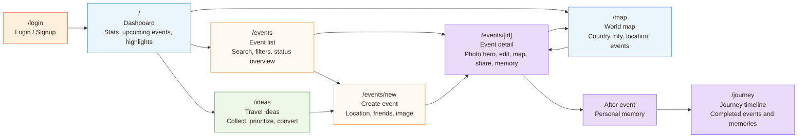

# Projektdokumentation - TripTales

## Inhaltsverzeichnis

1. [Ausgangslage](#1-ausgangslage)
2. [Lösungsidee](#2-lösungsidee)
3. [Vorgehen & Artefakte](#3-vorgehen--artefakte)
    1. [Understand & Define](#31-understand--define)
    2. [Sketch](#32-sketch)
    3. [Decide](#33-decide)
    4. [Prototype](#34-prototype)
    5. [Validate](#35-validate)
4. [Erweiterungen [Optional]](#4-erweiterungen-optional)
5. [Projektorganisation [Optional]](#5-projektorganisation-optional)
6. [KI-Deklaration](#6-ki-deklaration)
7. [Anhang [Optional]](#7-anhang-optional)

> **Hinweis:** Massgeblich sind die im **Unterricht** und auf **Moodle** kommunizierten Anforderungen.

<!-- WICHTIG: DIE KAPITELSTRUKTUR DARF NICHT VERÄNDERT WERDEN! -->

<!-- Diese Vorlage ist für eine README.md im Repository gedacht. Abschnitte mit [Optional] können weggelassen werden, wenn in den Übungen nichts anderes verlangt wird. -->

## 1. Ausgangslage
Kurz beschreiben, welches Problem adressiert wird und welches Ergebnis angestrebt ist. Wem nützt die Lösung, wer ist beteiligt oder betroffen?
- **Problem:** Während eines Auslandssemesters entstehen viele Pläne und Erinnerungen parallel in Kalendern, Gruppenchats, Google Maps, Instagram und Notizen. Dadurch gehen Details zu Events, Orten, eingeladenen Freunden und persönlichen Eindrücken schnell verloren.
- **Ziele:** TripTales soll Aktivitäten in San Diego zentral planbar machen, Orte und Freunde mit Events verknüpfen und vergangene Erlebnisse als Journey dokumentieren. Die App soll als interaktiver, weiterführbarer SvelteKit-Prototyp mit echter Datenhaltung umgesetzt werden.
- **Primäre Zielgruppe:** Studierende im Ausland, Reisende und junge Erwachsene, die mit Freunden Aktivitäten planen und Erinnerungen später wieder ansehen möchten.
- **Weitere Stakeholder [Optional]:** Dozierende und Mitstudierende im Modul Prototyping, da sie Umsetzung, Vorgehen, Evaluation und Dokumentation beurteilen.

## 2. Lösungsidee
Beschreibt die Lösungsidee.
- **Kernfunktionalität:** Nutzerinnen und Nutzer erstellen Events mit Datum, Location, Kategorie, Beschreibung, Freunden und optionalem Event-Bild. Events können als Einzeltermin oder als wiederkehrende Serie für tägliche, wöchentliche oder monatliche Termine erstellt werden, z. B. für Lectures oder Studienwochen in der Kategorie `Education`. Events können bearbeitet, als erlebt markiert und mit Erinnerungstext sowie optionalem Memory-Bild in eine Journey überführt werden. Ergänzend gibt es Dashboard, Event-Liste, OpenStreetMap-/Pinpoint-Ansicht und Reiseideen mit Umwandlung in Events.
- **Annahmen [Optional]:** Eine kombinierte Planungs- und Erinnerungsansicht reduziert die Streuung von Reiseinformationen. Eine echte interaktive OpenStreetMap-Ansicht ist für den Prototyp geeigneter als eine Google-Maps-Abhängigkeit mit API-Key und Billing. Studierende profitieren von wenigen klaren Workflows statt vielen isolierten Tools.
- **Abgrenzung [Optional]:** Login und private Benutzerbereiche sind umgesetzt, jedoch ohne Rollenmodell, E-Mail-Verifikation oder Passwort-Reset. Keine echten Einladungsnachrichten und kein Chat. Bild-Uploads sind als Prototyp-Funktion auf kleine Bilddateien begrenzt; zusätzlich nutzt die App lizenzierte Fallback-Bilder, damit Urheberrecht und Storage-Komplexität kontrollierbar bleiben.

## 3. Vorgehen & Artefakte
Die Durchführung erfolgt phasenbasiert; dokumentieren Sie die wichtigsten Ergebnisse je Phase.

### 3.1 Understand & Define
- **Zielgruppenverständnis:** Proto-Persona: Austauschstudentin in San Diego, 22 Jahre, plant Aktivitäten mit wechselnden Freundesgruppen, möchte Orte und Erinnerungen nicht über mehrere Apps zusammensuchen. Problemraumanalyse: Planung, Location-Infos, soziale Abstimmung und persönliche Erinnerungen sind normalerweise getrennt.
- **Wesentliche Erkenntnisse:** Zentrale Workflows müssen schnell erreichbar sein. Events brauchen Status, Freunde und Location. Erinnerungen sollen direkt nach dem Event ergänzt werden können. Eine visuelle Ortsübersicht erzeugt Mehrwert, darf aber den Prototyp nicht destabilisieren.

### 3.2 Sketch
- **Variantenüberblick:** Variante A war dashboard-zentriert mit schnellen Kennzahlen. Variante B war map-zentriert mit Orten als Einstieg. Variante C war journey-zentriert mit Erinnerungen als Hauptnavigation. Entschieden wurde eine kombinierte App: Dashboard als Einstieg, Events als Arbeitsbereich, Journey und Map als Rückblick/Orientierung.
- **Skizzen:** Platzhalter für Skizzen: `docs/sketch-dashboard.png`, `docs/sketch-event-flow.png`, `docs/sketch-map-journey.png`. Unterschiede: Dashboard priorisiert Überblick, Event-Flow priorisiert CRUD, Map/Journey priorisieren Erlebnisse nach Ort und Zeit.

### 3.3 Decide
- **Gewählte Variante & Begründung:** Gewählt wurde eine Workflow-App mit klarer Navigation: Dashboard, Events, Journey, Map und Ideas. Diese Struktur erfüllt die Anforderungen an mehrere Pages, echte Workflows, Datenbankzugriff und Erweiterbarkeit.
- **End-to-End-Ablauf:** Neues Event erstellen, Freunde hinzufügen, Location speichern, Event später bearbeiten, als completed markieren, Erinnerung und optionales Memory-Bild ergänzen, Journey ansehen, Ort auf Map prüfen. Reiseideen können separat gesammelt und in Events umgewandelt werden.
- **Mockup:** Platzhalter Figma-Link: `[Figma-Link ergänzen]`. Platzhalter Screenshots: `docs/screenshot-dashboard.png`, `docs/screenshot-event-detail.png`, `docs/screenshot-journey.png`, `docs/screenshot-map.png`.

- **Navigationsdiagramm:** Das folgende Mermaid-Diagramm beschreibt die zentrale Navigation und die wichtigsten Page-Wechsel.

### 3.4 Prototype

#### 3.4.1. Entwurf (Design)
Beschreibt die Gestaltung und Interaktion.
> **Hinweis:** Hier wird der **Prototyp** beschrieben, nicht das **Mockup**.
- **Informationsarchitektur:** `/login` öffentlicher Einstieg mit Login/Signup, danach geschützte Bereiche: `/` Dashboard, `/events` Listen- und Filteransicht, `/events/new` Erstellung, `/events/[id]` Detail/Bearbeitung/Memory, `/journey` Timeline, `/map` Orte, `/ideas` Reiseideen und `/profile` als Account-Überblick.
- **User Interface Design:** Das UI nutzt kompakte Cards, klare Formulare, Status-Badges, Kategorie-Badges, Filterleisten, leere Zustände und passende Event-/Location-Bilder. Wiederkehrende Events zeigen Serienhinweise wie `Weekly series 3/14`; beim Löschen eines Serienevents erscheint ein eigenes Dialogformular mit Auswahl zwischen einzelnem Termin und ganzer Serie. Formulare zeigen Pflichtfeldfehler direkt am betroffenen Feld und leere Zustände erklären die nächste sinnvolle Aktion. Der Login-Screen nutzt denselben Warm-Travel-Stil wie die App und bietet Login sowie Signup als direkten Einstieg. Die Bildwelt basiert bewusst nur auf echten, lizenzierten Wikimedia-Commons-Fotos, damit Orte und Events visuell glaubwürdig wirken.
- **Usability-Iteration:** Die Listenansichten wurden um klarere Filter- und Sortiermöglichkeiten erweitert. Events können nach Suche, Status, Kategorie und Zeitraum eingegrenzt sowie nach Datum oder letzter Bearbeitung sortiert werden. Journey-Memories können nach Suche, Kategorie und Zeitraum gefiltert sowie chronologisch gruppiert werden. Filteränderungen werden direkt angewendet; die Suche nutzt eine kurze Verzögerung, damit die Liste nicht bei jedem Tastendruck sofort neu lädt.
- **Designentscheidungen:** Nach einem ersten Review wurde der zunächst eher kühle und funktionale Look in Richtung **Warm Travel** weiterentwickelt. Die Gestaltung nutzt San-Diego-inspirierte Sunset-, Sand-, Ocean- und Palm-Farben, wärmere Flächen, Kategorie-Akzente sowie Postcard-/Ticket-Anmutungen für Journey, Events und Reiseideen. In einer weiteren Designiteration wurde das Dashboard bildreicher gestaltet: Hero-Collage, visueller Journey-Streifen und ein dezenter statischer Map-/Postcard-Hintergrund machen die App emotionaler. San Diego bleibt der konkrete Semester-Kontext, die Sprache und Timeline sind aber bewusst globaler formuliert, damit Events weltweit möglich sind. Die Map wurde anschliessend von einer flachen Ortsliste zu einer strukturierten Reiseübersicht weiterentwickelt: Land, Stadt, konkrete Location und die zugehörigen Events sind nun gemeinsam sichtbar.

#### 3.4.2. Umsetzung (Technik)
Fasst die technische Realisierung zusammen.
- **Technologie-Stack:** SvelteKit mit Svelte 5, JavaScript/TypeScript-nahe Modulstruktur, MongoDB Atlas mit offiziellem Node.js Driver, Netlify Adapter, Leaflet mit OpenStreetMap-Kartenkacheln.
- **Tooling:** Visual Studio Code, Git/GitHub, Netlify, MongoDB Atlas, Codex/ChatGPT als Planungs- und Entwicklungsassistenz.
- **Struktur & Komponenten:** Zentrale Komponenten sind `Navigation`, `DashboardStats`, `EventCard`, `EventForm`, `CityCombobox`, `FriendPicker`, `JourneyCard`, `LeafletMapView`, `LocationPinGrid`, `EventMapPanel`, `TravelIdeaCard` und `SharePreview`.
- **Daten & Schnittstellen:** MongoDB Collections: `users`, `sessions`, `events`, `locations`, `friends` als Legacy-Collection, `journeyEntries`, `travelIdeas`. Datenzugriff erfolgt serverseitig in `src/lib/server`. SvelteKit Server Loads und Form Actions übernehmen Lesen, Erstellen, Aktualisieren, Löschen und Umwandeln. Alle fachlichen Daten werden über `userId` dem eingeloggten Account zugeordnet, sodass Accounts nur ihre eigenen Events, Locations, Journey Entries und Travel Ideas sehen. Event-Einladungen referenzieren keine Freitext-Friends mehr, sondern nur noch echte Login-Accounts aus `users` über `invitedUserIds` und `invitations` mit Status `invited` oder `accepted`. Eingeladene User sehen diese Events in `/events`, auf dem Dashboard und können sie auf der Detailseite annehmen oder ablehnen. Angenommene abgeschlossene Events können später mit einer eigenen Journey Memory gespeichert werden. Wiederkehrende Events werden als normale Einzel-Events gespeichert und über `recurrenceGroupId`, `recurrenceFrequency`, `recurrenceIndex` und `recurrenceCount` verbunden. Dadurch funktionieren Kalender, Listen, Map, Einladungen und einzelne Bearbeitung ohne separates Serienmodell; nur Journey bündelt passende Memories zu einer Serienkarte. Event- und Memory-Formulare werden serverseitig validiert; Pflichtfeldfehler werden strukturiert an die UI zurückgegeben und dort feldnah angezeigt. Bilddaten werden optional als `imageUrl`, `imageAlt`, `imageCredit`, `imageLicense` und `imageSourceUrl` an Events/Locations gespeichert; hochgeladene Event- und Memory-Bilder werden als Base64-Data-URLs in MongoDB abgelegt. Zusätzlich sorgt ein Media-Katalog für automatische Fallback-Bilder. Travel Ideas speichern neben dem konkreten Location-Namen auch optionale `city`- und `country`-Felder, damit die Umwandlung in Events nicht auf falsche Standardorte zurückfällt.
- **Filter & Sortierung:** Die Event- und Journey-Listen nutzen serverseitige Query-Filter für Kategorie, Status, Suche und Zeitraum. Sortierungen nach Datum und letzter Bearbeitung werden im Repository gekapselt; für `updatedAt` existiert ein zusätzlicher MongoDB-Index. Die Journey gruppiert Erinnerungen monatlich, bündelt Memories aus wiederkehrenden Serien und zeigt aktuelle Highlights sowie kleine Reisetagebuch-Statistiken.
- **Authentifizierung:** Der Zugriff auf Dashboard, Events, Journey, Map, Ideas und Profile ist geschützt. `src/hooks.server.js` prüft die Session und leitet nicht eingeloggte Besucher nach `/login` weiter. Accounts werden mit eindeutigen kleingeschriebenen Usernames angelegt. Passwörter werden mit Salt gehasht gespeichert, Session Tokens werden zufällig erzeugt, als HttpOnly-Cookie gesetzt und in MongoDB nur gehasht abgelegt. Logout löscht Cookie und Session. Die Route `/profile` zeigt den eingeloggten Usernamen, abgeleitete Account-Statistiken, Quick Actions und Events, zu denen der Account eingeladen wurde, enthält aber bewusst keine Passwort-, E-Mail- oder Rollenverwaltung.
- **Deployment:** Netlify URL: https://triptales-difrodar.netlify.app/. Benötigte Netlify Environment Variables: `MONGODB_URI`, `MONGODB_DB=triptales`. Lokal kann dieselbe Verbindung über eine nicht versionierte `.env` gesetzt werden; `.env.example` dokumentiert die benötigten Variablen.
- **Besondere Entscheidungen:** Der MongoDB Connection String wird nicht im Repository gespeichert. Die Map nutzt Leaflet und OpenStreetMap, damit keine Google-Maps-Lizenz oder kein API-Key notwendig ist. Die Map gruppiert Orte nach Land und Stadt und zeigt darunter die verknüpften Events, damit konkrete Locations wie Golden Gate Bridge oder Griffith Observatory klarer sind als reine Stadtmarker. Beim ersten Serverstart werden die Prototype-Accounts `difrodar`/`difrodar` und `dummy`/`dummy` angelegt; bestehende Daten ohne `userId` werden `difrodar` zugewiesen, während `dummy` leer startet. Falls die Datenbank leer ist, werden Demo-Daten nur für `difrodar` erzeugt. Bestehende MongoDB-Daten können non-destruktiv per Upsert-Script ergänzt oder präzisiert werden. Für Bilder nutzt die App einerseits echte, lizenzierte Wikimedia-Commons-Fotos als Fallback und andererseits eigene Uploads für Event-Cover und Journey-Memories. Uploads sind bewusst auf JPG, PNG, WebP oder GIF bis 2 MB begrenzt, weil sie für den Prototyp direkt in MongoDB gespeichert werden. Falls für einen unbekannten Ort kein spezifisches Bild vorhanden ist, nutzt die App einen neutralen Travel-/Roadtrip-Fallback statt ein falsches Stadtbild. Auch Kategorie-Fallbacks wie `Sightseeing` sind bewusst neutral gehalten, damit konvertierte Travel Ideas nicht fälschlich ein San-Francisco-/Golden-Gate-Bild erhalten.

### 3.5 Validate
- **URL der getesteten Version** (separat deployt): https://triptales-difrodar.netlify.app/
- **Ziele der Prüfung:** Prüfen, ob Nutzende sich einloggen oder registrieren können, danach ein Event erstellen, Freunde hinzufügen, das Event als erlebt markieren und die Erinnerung in Journey/Map wiederfinden können.
- **Vorgehen:** Geplant: moderierter Usability-Test, remote oder vor Ort, mit Beobachtung und kurzem Interview.
- **Stichprobe:** Platzhalter: `[2-4 Testpersonen, idealerweise Studierende oder junge Reisende ergänzen]`.
- **Aufgaben/Szenarien:** 1. Logge dich als `difrodar` ein und prüfe die vorhandenen Events. 2. Logge dich als `dummy` ein und prüfe den leeren Account. 3. Erstelle einen Strand-Event mit Freunden und lade ein Event-Bild hoch. 4. Teste ein fehlendes Pflichtfeld und prüfe die feldnahe Fehlermeldung. 5. Teste ein ungültiges oder zu grosses Bild und prüfe die verständliche Upload-Meldung. 6. Bearbeite Location, Datum oder Event-Bild. 7. Markiere den Event als erlebt und ergänze Memory-Text sowie optional ein Memory-Bild. 8. Finde die Erinnerung in der Journey. 9. Finde den Ort in der Map. 10. Erstelle eine Reiseidee und wandle sie in ein Event um. 11. Erstelle eine wöchentliche `Education`-Serie für 14 Lectures und prüfe, ob alle Termine im Kalender erscheinen. 12. Lösche bei einem Serienevent einmal nur den einzelnen Termin und einmal die komplette Serie über das Dialogformular.
- **Zusatzszenario Filter/Sortierung:** 11. Filtere Events nach Zeitraum und Kategorie. 12. Sortiere Events nach Datum und letzter Bearbeitung. 13. Suche und filtere Journey nach Zeitraum, Kategorie oder Text und prüfe, ob leere Trefferlisten verständlich bleiben.
- **Kennzahlen & Beobachtungen:** Platzhalter: Erfolgsquote, benötigte Zeit, Rückfragen, Fehlklicks, qualitative Kommentare.
- **Zusammenfassung der Resultate:** Platzhalter: `[nach Durchführung ergänzen, keine erfundenen Resultate]`.
- **Abgeleitete Verbesserungen:** Platzhalter: `[priorisierte Verbesserungen aus Evaluation ergänzen]`.

## 4. Erweiterungen [Optional]
Dokumentiert Erweiterungen über den Mindestumfang hinaus.
> **Hinweis:** Jede Erweiterung ist separat nach dem folgenden Schema zu beschreiben.

### 4.1 Reiseideen in Events umwandeln
- **Beschreibung & Nutzen:** Ideen können gespeichert, priorisiert und später in konkrete Events umgewandelt werden. Das unterstützt spontane Reiseplanung.
- **Wo umgesetzt:** Frontend und Actions in `/ideas`, Datenbank-Collection `travelIdeas`, Conversion über serverseitige Repository-Funktion.
- **Referenz:** Siehe `/ideas` und Abschnitt 3.4.2.
- **Aus Evaluation abgeleitet?:** Nein, initiale Erweiterung aus Projektidee.

### 4.2 OpenStreetMap mit Pinpoint-Fallback
- **Beschreibung & Nutzen:** Locations werden auf einer interaktiven Leaflet/OpenStreetMap-Karte angezeigt. Zusätzlich bleibt die Seite über eine gruppierte Pinpoint-/Event-Liste nutzbar. Die Map ist nach Land, Stadt, konkretem Ort und zugehörigen Events strukturiert.
- **Wo umgesetzt:** `LeafletMapView`, `LocationPinGrid` und `EventMapPanel`, Daten aus `locations` und den verknüpften `events`.
- **Referenz:** Siehe `/map`.
- **Aus Evaluation abgeleitet?:** Nein, technische Absicherung für stabilen Prototyp.

### 4.3 Share-/Insta-Preview
- **Beschreibung & Nutzen:** Event- und Journey-Daten werden als prototypische Social-Preview visualisiert.
- **Wo umgesetzt:** `SharePreview` auf der Event-Detailseite.
- **Referenz:** Siehe `/events/[id]`.
- **Aus Evaluation abgeleitet?:** Nein, Erweiterung mit erkennbarem Storytelling-Mehrwert.

### 4.4 Bildwelt für Events und Orte
- **Beschreibung & Nutzen:** Event-, Journey- und Location-Cards zeigen passende Bilder, damit Aktivitäten wie “Balboa Park Museum Day” sofort visuell erkennbar sind.
- **Wo umgesetzt:** Media-Katalog in `src/lib/media.js`, Bildanzeige in Event-, Journey-, Detail-, Share- und Map-/Pinpoint-Komponenten; optionale Upload-Felder im Event- und Memory-Formular.
- **Referenz:** Siehe `/`, `/events`, `/events/[id]`, `/journey` und `/map`.
- **Aus Evaluation abgeleitet?:** Nein, aus Design-Review abgeleitet.

### 4.5 Login und private Accounts
- **Beschreibung & Nutzen:** Nutzerinnen und Nutzer müssen sich einloggen oder registrieren, bevor sie die App verwenden können. Events, Ideen, Freunde, Orte und Erinnerungen sind pro Account getrennt, damit mehrere Personen denselben Prototyp nutzen können, ohne gegenseitig Daten zu sehen.
- **Wo umgesetzt:** `/login`, `src/hooks.server.js`, `src/lib/server/auth.js`, Session-Cookie, MongoDB-Collections `users` und `sessions`, sowie `userId`-Filter im Repository.
- **Referenz:** Siehe `/login` und Abschnitt 3.4.2.
- **Aus Evaluation abgeleitet?:** Nein, Erweiterung zur besseren Datenabgrenzung und realistischeren Nutzung.

### 4.6 Bild-Uploads für Events und Memories
- **Beschreibung & Nutzen:** Beim Erstellen oder Bearbeiten eines Events kann ein eigenes Cover-Bild hochgeladen werden. Beim Speichern einer Journey Memory kann zusätzlich ein persönliches Memory-Bild ergänzt werden. Eigene Bilder können wieder entfernt werden, wodurch die automatischen Fallback-Bilder sichtbar werden.
- **Wo umgesetzt:** Multipart-Forms in `EventForm` und auf `/events/[id]`, serverseitige Upload-Prüfung im Repository, Speicherung als Base64-Data-URL in `events.imageUrl` beziehungsweise `journeyEntries.imageUrl`. Erlaubt sind JPG, PNG, WebP und GIF bis 2 MB; ungültige Uploads werden verständlich am betroffenen Formularbereich gemeldet.
- **Referenz:** Siehe `/events/new` und `/events/[id]`.
- **Aus Evaluation abgeleitet?:** Nein, Erweiterung zur persönlicheren Dokumentation von Reiseerlebnissen.

### 4.7 Profile-Page
- **Beschreibung & Nutzen:** Die Profile-Page bietet einen ruhigen Überblick über den eingeloggten Account, einfache Kennzahlen und direkte Einstiege in bestehende Workflows. Sie macht private Accounts sichtbarer, ohne komplexe Account-Verwaltung einzuführen.
- **Wo umgesetzt:** `/profile` mit serverseitigem Load aus bestehenden Events, Locations und Travel Ideas; Navigation über die klickbare User-Pill.
- **Referenz:** Siehe `/profile` und Abschnitt 3.4.2.
- **Aus Evaluation abgeleitet?:** Nein, Umsetzung von GitHub Issue #2 als optionale Erweiterung.

### 4.8 Friend Management über Login-User
- **Beschreibung & Nutzen:** Events können nur noch echte TripTales-Accounts einladen. Dadurch entstehen keine Freitext-Friends oder unechten Demo-Personen mehr, und Einladungen bleiben technisch nachvollziehbar. Eingeladene Accounts sehen diese Events in `/events` und auf dem Dashboard mit Status `invited`, können die Detailseite öffnen und die Einladung annehmen oder ablehnen. Angenommene Einladungen bleiben als `accepted` sichtbar; abgelehnte Einladungen entfernen den User aus dem Event. Sobald ein angenommenes Event abgeschlossen ist, kann der eingeladene User eine eigene Journey Memory speichern.
- **Wo umgesetzt:** Event-Formular mit User-Auswahl, serverseitige Validierung gegen `users`, Event-Felder `invitedUserIds` und `invitations`, Event-Liste und Profile-Sektion für eingeladene Events; Legacy-Friends können mit `npm run cleanup:legacy-friends` non-destruktiv entfernt werden.
- **Referenz:** Siehe `/events/new`, `/events/[id]`, `/profile` und Abschnitt 3.4.2.
- **Aus Evaluation abgeleitet?:** Nein, Umsetzung von GitHub Issue #3 zur besseren Datenqualität.

### 4.9 Wiederkehrende Events
- **Beschreibung & Nutzen:** Wiederkehrende Events unterstützen regelmässige Termine wie Lectures oder Studienwochen. Nutzerinnen und Nutzer wählen beim Erstellen eine Wiederholfrequenz (`daily`, `weekly`, `monthly`) und die Anzahl der Termine bis maximal 52. Die App erzeugt daraus normale Einzel-Events, sodass Kalender, Event-Liste, Map, Einladungen und einzelne Bearbeitung stabil bleiben. In der Journey werden gespeicherte Memories derselben Serie gebündelt, damit die Timeline nicht mit fast identischen Karten überfüllt wird.
- **Wo umgesetzt:** `EventForm`, `/events/new`, `/events/[id]`, Repository-Funktionen für Event-Erstellung, Serien-Metadaten und Serienlöschung, `JourneyCard` und Journey-Gruppierung.
- **Referenz:** Siehe `/events/new`, `/events/[id]`, `/journey` und Abschnitt 3.4.2.
- **Aus Evaluation abgeleitet?:** Nein, Umsetzung von GitHub Issue #12.

## 5. Projektorganisation [Optional]
Die Stadt- und Koordinatenauswahl wurde als lokale `CityCombobox` umgesetzt. Sie nutzt eine kuratierte globale Staedte-Liste mit leichtem USA-/San-Diego-Ranking, speichert `city`, `country`, `lat` und `lng` und verhindert falsche Fallback-Pins, indem unbekannte Orte ohne Koordinaten nicht als Kartenmarker erscheinen.
Beispiele:
- **Repository & Struktur:** GitHub Repository mit SvelteKit-Standardstruktur. Wichtige Bereiche: `src/routes` für Pages inklusive `/login` und `/profile`, `src/hooks.server.js` für den Zugriffsschutz, `src/lib/components` für UI, `src/lib/server` für MongoDB-Zugriff und Authentifizierung, `scripts/seed.js` für Seed-Daten, `scripts/upsert-sample-events.js` für non-destruktive Beispiel-Daten, `scripts/cleanup-legacy-friends.js` für die Entfernung alter Freitext-Friends und `scripts/normalize-converted-idea-media.js` für die sichere Korrektur bereits konvertierter Idea-Events.
- **NPM-Scripts:** `npm run dev` startet den lokalen Server, `npm run build` erzeugt das Produktions-Build, `npm run smoke` prüft die zentralen Workflows (Login, Event erstellen, Memory speichern, Journey, Löschen) gegen einen lokalen Dev-Server, `npm run seed` legt Demo-Daten an, `npm run upsert:samples` ergänzt Beispiel-Events non-destruktiv, `npm run normalize:idea-media` korrigiert konvertierte Reiseideen, `npm run normalize:city-coordinates` ergänzt fehlende Koordinaten, `npm run cleanup:legacy-friends` entfernt alte Freitext-Friends und `npm run cleanup:journey-ratings` entfernt nicht mehr genutzte Journey-Ratings.
- **Issue-Management:** Vorgeschlagene Issues: Setup, MongoDB Data Layer, Auth/Login, Event Workflow, Journey, Map, Ideas, Profile, Friend Management, README, Deployment, Validate. GitHub Issue #2 wurde als kleine Profile-Page umgesetzt; GitHub Issue #3 stellt Friend Management auf echte Login-User um; GitHub Issue #12 ergänzt wiederkehrende Events inklusive `Education`-Kategorie, Journey-Bündelung und Serienlöschung.
- **Commit-Praxis:** Sprechende Commits nach Bereichen, z. B. `feat: implement event planning workflows`, `feat: add journey memory workflow`, `docs: complete project documentation`.

## 6. KI-Deklaration
Die folgende Deklaration ist verpflichtend und beschreibt den Einsatz von KI im Projekt.

### 6.1 KI-Tools
- **Eingesetzte Tools**: Aktuell Anthropic Claude Code in Visual Studio Code; zuvor OpenAI Codex/ChatGPT in Visual Studio Code.
- **Zweck & Umfang**: KI wurde für Projektplanung, technische Architektur, Codevorschläge, SvelteKit-Komponenten, MongoDB-Datenzugriff, README-Strukturierung und Qualitätssicherung eingesetzt. Teile der Implementierung und Dokumentation entstanden KI-unterstützt.
- **Eigene Leistung (Abgrenzung):** Projektidee, fachliche Anforderungen, Vorgaben, Deployment-Ziel, MongoDB-Entscheid und finale Kontrolle liegen beim Projektverfasser. KI-Vorschläge müssen geprüft, angepasst, getestet und dokumentiert werden.

### 6.2 Prompt-Vorgehen
Es wurde mit ausführlichen Kontext-Prompts gearbeitet: Projektidee, Bewertungskriterien, gewünschte Pages, Datenmodell, Workflows, README-Vorgaben und technische Entscheidungen wurden explizit beschrieben. Anschliessend wurde zuerst ein Plan erstellt und danach iterativ umgesetzt. Sensible Daten werden nicht in Dateien übernommen. Die aktuellen Arbeitsregeln für Claude Code sind in [`CLAUDE.md`](CLAUDE.md) dokumentiert; die historischen Codex-Regeln sind unter [`docs/legacy/codex_custom_instructions.md`](docs/legacy/codex_custom_instructions.md) archiviert.

### 6.3 Reflexion
KI beschleunigt Strukturierung, Boilerplate, Dokumentation und das Finden technischer Risiken. Grenzen bestehen bei fachlicher Bewertung, tatsächlicher Nutzer-Evaluation, Secret-Handling und finaler Qualitätssicherung. Deshalb werden Build-Checks, manuelle Tests, Deployment-Prüfung und echte Evaluation separat durchgeführt.

## 7. Anhang [Optional]
Beispiele:
- **Lizenz:** Der Code dieses Projekts steht unter der MIT License (siehe [`LICENSE`](LICENSE)). Die unten aufgeführten Bilder behalten ihre jeweils dokumentierte Wikimedia-/Creative-Commons-Lizenz.
- **Quellen:** SvelteKit Dokumentation, Netlify SvelteKit Deployment Docs, MongoDB Node.js Driver Docs, Leaflet Dokumentation, OpenStreetMap Tile Usage Policy.
- **Bildquellen:** Balboa Park: Hosiyar singh bhambhu / Wikimedia Commons, CC BY-SA 4.0, https://commons.wikimedia.org/wiki/File:Balboa_Park_San_Diego.jpg. La Jolla Cove: Stephen Bay / Wikimedia Commons, CC BY, https://commons.wikimedia.org/wiki/File:La_Jolla_Cove,_San_Diego.jpg. Pacific Beach: Krithika03 / Wikimedia Commons, CC BY-SA 4.0, https://commons.wikimedia.org/wiki/File:Pacific_Beach,_San_Diego.jpg. Gaslamp Quarter: Ekrem Canli / Wikimedia Commons, CC BY-SA 4.0, https://commons.wikimedia.org/wiki/File:San_Diego_Gaslamp_Quarter.jpg.
- **Weitere Bildquellen:** Griffith Observatory: Eric C Gardner / Wikimedia Commons, CC BY-SA 4.0, https://commons.wikimedia.org/wiki/File:Griffith_Observatory,_Los_Angeles_2015-07-19.jpg. Tijuana: Urbaner44 / Wikimedia Commons, CC BY-SA 4.0, https://commons.wikimedia.org/wiki/File:Tijuana_skyline.jpg. Denver: USFWS Mountain-Prairie / Wikimedia Commons, CC BY 2.0, https://commons.wikimedia.org/wiki/File:Denver_Skyline_(15242286069).jpg. San Francisco: Rhasan / Wikimedia Commons, CC BY-SA 3.0, https://commons.wikimedia.org/wiki/File:San_Francisco_golden_gate_bridge.JPG. New York City: Farida Belal / Wikimedia Commons, CC0 1.0, https://commons.wikimedia.org/wiki/File:Iconic_Skyline_of_New_York_City.jpg. Food/Taco: Leo Chiou / Wikimedia Commons, CC BY-SA 4.0, https://commons.wikimedia.org/wiki/File:Fish_taco-1.jpg. Rooftop/Party: Alex Proimos / Wikimedia Commons, CC BY 2.0, https://commons.wikimedia.org/wiki/File:Rooftop_Bar,_Metropolitan_Museum_Of_Art_(5894065780).jpg. Roadtrip: moonjazz / Wikimedia Commons, CC BY-SA 2.0, https://commons.wikimedia.org/wiki/File:California_Road_Trip_(16570143476).jpg. Study: Tulane public relations / Wikimedia Commons, CC BY 2.5, https://commons.wikimedia.org/wiki/File:Tulane_Students_Studying.jpg. Outdoor/Bike: Channel City Camera Club / Wikimedia Commons, CC BY 2.0, https://commons.wikimedia.org/wiki/File:Bicycle_on_the_Beach_(49877305071).jpg. Coronado Beach: Ashley / Wikimedia Commons, CC BY 2.0, https://commons.wikimedia.org/wiki/File:Coronado_beach.jpg.
- **Testskript & Materialien:** Platzhalter: `docs/testskript.md`.
- **Rohdaten/Auswertung:** Platzhalter: `docs/evaluation-results.md`.
