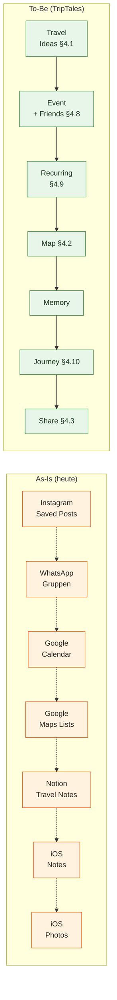

# User Journey Map — Auslandssemester planen, erleben, erinnern

**Ziel:** Den End-to-End-Lifecycle einer Persona-Reise dokumentieren — *vor*, *während* und *nach* dem Auslandssemester — und Pain Points der heutigen fragmentierten Lösung den TripTales-Features gegenüberstellen. Daraus wird sichtbar, an welchen Lifecycle-Punkten TripTales den grössten Mehrwert liefert.

**Methode:** Standard User Journey Map nach dem Schema *Stage → Action → Touchpoint → Pain Point → Emotion → Opportunity*. Persona: **Dario, 24, Wirtschaftsinformatik-Student vor Austauschsemester in San Diego** (siehe [`docs/personas.md`](../personas.md)). Beobachtungen aus eigener Reiseerfahrung sowie aus dem Usability-Test mit zwei Testpersonen (siehe README §3.5).

## As-Is Journey (ohne TripTales)

| Stage | Action | Touchpoints heute | Pain Point | Emotion | Opportunity |
|---|---|---|---|---|---|
| **1. Inspiration** | Idee "Yosemite-Wochenende" entsteht beim Instagram-Scrollen | Instagram-Saved, iOS-Notes | Idee landet in zwei Apps, geht zwischen anderen Notizen unter | 🟡 Neugier, schwach gehalten | Ideen-Pool mit Stadt, Priorität und Notiz an einem Ort |
| **2. Planung** | Datum festlegen, Freunde fragen | WhatsApp-Gruppe, Google Calendar | Termin-Findung über Sprachnachrichten, keiner sieht den finalen Plan zentral | 😤 Frustration durch Ping-Pong | Event mit Datum + Friend-Invites in einem Schritt |
| **3. Detailplanung** | Ort recherchieren, Aktivitäten überlegen | Google Maps Lists, Notion-Doku | Karten-Pins in Google Maps, Notizen in Notion — getrennt | 😕 Mental Overhead | Event mit Standort und Beschreibung; Bilder pro Event |
| **4. Erinnerung** | Reminder am Morgen, Treffpunkt kommunizieren | Google Calendar, WhatsApp | Reminder funktioniert, aber Kontext fehlt | 🙂 Funktioniert, aber Disconnect | Dashboard "Upcoming soon" + Pending-Invites |
| **5. Erleben** | Fotos aufnehmen während des Wochenendes | iPhone Camera | Fotos sammeln in chronologischer Library ohne Event-Kontext | 😊 Im Moment ok | Bilder direkt am Event hinterlegen |
| **6. Sofortige Reflexion** | Auf der Rückfahrt das Erlebnis verarbeiten | iOS-Notes (selten), WhatsApp Voice | Erinnerung wird nirgendwo strukturiert festgehalten | 🟡 Verlust-Angst | Memory-Form direkt nach Event |
| **7. Foto-Sortierung** | Wochen später: "wo war ich da nochmal?" | iOS-Photos | Fotos ohne Event-/Ortskontext — Suche per Zeitachse | 😩 Frustration | Journey zeigt Foto + Memory + Ort + Datum gebündelt |
| **8. Storytelling** | Familie erzählen "was hast du gemacht?" | Instagram-Highlight, WhatsApp-Sprachnachricht | Kein zentraler Überblick, fragmentiertes Erzählen | 😞 "Ich weiss es nicht mehr genau" | Journey + Share-Link |
| **9. Rückblick** | 6 Monate später: Was war das Semester? | Google Photos Suche | Keine kuratierte Übersicht — durch 5'000 Fotos scrollen | 😞 Erinnerung verblasst | Journey gruppiert nach Monat oder Trip |

**Quintessenz As-Is:** Dario nutzt 6–7 verschiedene Apps in einem Lifecycle, jeder Stage-Übergang ist ein Tool-Wechsel. Daten verbinden sich nicht, Erinnerungen werden in den Foto-Berg geschluckt.

## To-Be Journey (mit TripTales)

| Stage | Action | TripTales-Feature | Reduzierter Pain Point | Emotion |
|---|---|---|---|---|
| **1. Inspiration** | Idee speichern | [§4.1 Travel Ideas](../README.md#41-reiseideen-in-events-umwandeln) | Eine App, eine Eingabe | 😊 Festgehalten und gefunden |
| **2. Planung** | Event erstellen + Freunde einladen | Event-CRUD + [§4.8 Friend-Invites](../README.md#48-friend-management-über-login-user) | Ein Workflow, ein Klick pro Freund | 😊 Kontrolle |
| **3. Detailplanung** | Standort + Bilder hinzufügen | City-Combobox + [§4.6 Image Uploads](../README.md#46-bild-uploads-für-events-und-memories) | Standort & Beschreibung beim Event | 😊 Vollständig |
| **4. Erinnerung** | Dashboard zeigt "Upcoming soon" | Dashboard + Pending-Invites-Streifen | Aktive Erinnerung im Tool selbst | 🙂 Im Plan |
| **5. Erleben** | Fotos aufnehmen | Bestehende Camera-App, später Upload | (kein Eingriff in den Moment) | 😊 Im Flow |
| **6. Sofortige Reflexion** | Memory-Form ausfüllen | After-Event Memory-Panel | Direkter Übergang Event → Memory | 😊 Festgehalten |
| **7. Foto-Sortierung** | Nicht mehr nötig | Bilder bereits am Event hinterlegt | Foto-Berg-Sortierung entfällt | 😀 Erleichterung |
| **8. Storytelling** | Share-Link versenden | [§4.3 Share-Preview + Read-only Link](../README.md#43-share-insta-preview) | Eine URL, keine Re-Kuratierung | 😀 Stolz |
| **9. Rückblick** | Journey aufrufen, "By trip" oder "By month" | [§3.4 Journey + §4.10 Trips](../README.md#34-prototype) | Eine Timeline statt 5'000 Fotos | 😀 "Ich erinnere mich" |

## Visualisierung — Lifecycle-Brücken

Die As-Is-Pfeile sind gestrichelt, weil die Daten zwischen den Apps **nicht fliessen** — der Übergang ist immer ein manueller Kopiervorgang. In der To-Be-Welt sind die Pfeile durchgezogen, weil alle Stages auf demselben Datenmodell aufbauen (Event hat Datum, Ort, Bilder, Memory; Trip bündelt Events; Journey aggregiert Memories).

## Pain-Point → Feature-Mapping

| Pain Point | Adressiert durch | Bestätigt im Usability-Test? |
|---|---|---|
| Termin-Findung über Sprachnachrichten | Event-Erstellung + Friend-Invite in einem Flow (§3.4, §4.8) | ✅ Aufgaben 4+6 mit beiden Testpersonen erfolgreich |
| Karten-Pins in Google Maps separat | Standort beim Event + Map-Ansicht (§3.4, §4.2) | ✅ Aufgabe 2 erfolgreich |
| Erinnerung wird nicht strukturiert | After-Event-Memory-Form (§3.4) | ✅ Aufgabe 4 erfolgreich, leichte UX-Hürde (siehe Issue #34) |
| Fotos ohne Event-Kontext | Bilder direkt am Event/Memory (§4.6) | ✅ Aufgaben 3+4 erfolgreich |
| Storytelling fragmentiert | Journey-Timeline + Share-Link (§3.4, §4.3) | ⚠ Aufgabe 8 erfolgreich, aber Share-Bereich schlecht auffindbar (Issues #44, #45) |
| Reiseideen verlieren sich | Travel Ideas + Convert-to-Event (§4.1) | ⚠ Aufgabe 5 erfolgreich, aber Ideas-Sektion mit Trip verwechselt (Issue #40) |

Die ⚠-Markierungen bestätigen, dass die Lifecycle-Brücke an den Stellen Sharing und Idea-Erfassung methodisch funktioniert, die Microcopy/UI-Auffindbarkeit aber noch Iterations-Bedarf hat — exakt die Themen, die als nächste P1-Iteration im Usability-Backlog priorisiert sind.

## Limitierungen dieser Journey Map

- Eine Persona, eine Reise-Variante (Auslandssemester). Reine Wochenendtrips oder Tagesausflüge sind nicht detailliert.
- Touchpoints heute basieren auf typischer Studierenden-Tool-Stack-Annahme; für ältere Zielgruppen (z. B. Persona Marco) wären die heutigen Touchpoints anders (mehr Notion, weniger Instagram).
- Emotions-Spalte ist hypothetisch, nicht empirisch gemessen. Eine kleinere Mood-Tracking-Studie könnte das validieren — ausserhalb des Prototyp-Scopes.
